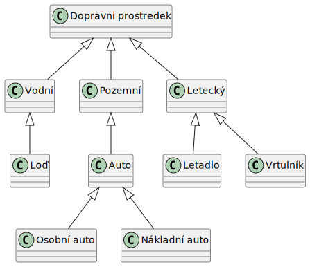
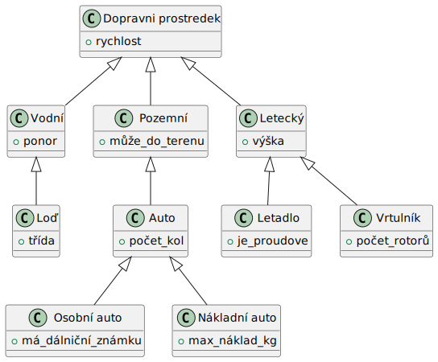

# Dědičnost

Dědičnost je jeden ze základních principů objektově orientovaného paradigmatu. Vychází z předpokladu, že mezi objekty neexistují jen klasické relace reprezentující využívání jednoho objektu druhým (auto má motor, předmět má studenty), ale umožňuje také relace vycházející ze generalizace a specializace objektů - tzv. gen-spec vztah. Obecně lze pro skupinu objektů nalézt obecného předka (také se používá termín _nadtřída_, nebo _superclass_), který určitým způsobem zastřešuje chování svých potomků (zobecnění, generalizace); nebo naopak, pro určitou třídu nalézt skupinu potomků (_podtřída_, _subclass_), které blíže specifikují a rozvíjejí chování předka (specifikace). Příkladem může být například níže uvedená hierarchie.



Je vidět, že dopravní prostředek jako obecný pojem zastřešuje všechno, co se hýbe a umí něco dopravovat. Déle jsou prostředky rozlišeny podle prostředí, ve kterém se pohybují; a hierarchie pokračuje dále, až u silničních prostředků jsou uvedeny konkrétní typy. Při tvorbě hierarchie je třeba si uvědomit několik bodů:

* Nižší úrovně definují specializaci vyšších pojmů. Rozšiřují proto funkcionalitu nebo stavy vyšších pojmů. Obecně lze říci, že „potomek musí umět vše, co umí předek".
* Zejména vyšší úrovně hierarchie reprezentují obecné pojmy, ne konkrétní předměty (na instanci dopravního prostředku, který by zároveň nepatřil do některé z nižších kategorií, nemůžete sáhnout), nižší úrovně již reprezentují typicky odkazy na konkrétní objekty reálného světa (osobní auta můžeme dále dělit na SUV/hatchback/…, ale již na konkrétní osobní auto si sáhnout můžete).
* Hierarchie a vztahy objektů záleží při tvorbě aplikace čistě na programátorovi, který sám usoudí, jakým způsobem bude hierarchie vypadat. Pokud však bude utvořena hierarchie nesprávně, dostanete se do konfliktu při snaze splnit první bod.
* V různých pohledech (např. různých aplikacích) může hierarchie vypadat odlišně.

Podívejme se ještě jednou na stejný, mírně upravený obrázek:



Je vidět, že při průchodu stromem k listům jdeme k více specifickým třídám a tedy máme více specifické vlastnost - například `Auto` má počet kol, ale `Pozemní` vozidlo ještě ne, protože může být pásové. Oproti tomu ale `Auto` má i `rychlost` získanou od `Dopravni prostredek` pomocí dědičnosti, protože při průchodu ke specifičtějším typům se generičtější definice neztrácejí.


Povšimněte si, že ale některé vlastosti definované u určitých tříd lze přenést na jiné třídy - například maximální náklad může mít \`Auto\` i \`Letadlo\`. Znamenalo by to, že \`Auto\` má být potomek letadla? Nikoliv. Je třeba vztahy konstruovat opravdu pečlivě a nehledat ve společných atributech automaticky dědičnost. Pokud bychom opravdu potřebovali říci, že oba tyto typy mají \`max\_náklad\_kg\` ve stejném významu, mohli bychom například využít rozhraní \`Nákladní\`, které bychom k daným třídám přiřadili.


Různé programovací jazyky se k implementaci dědičnosti mohou stavět trochu odlišným způsobem. V jazyce Java je implementována tzv. jednoduchá dědičnost tříd. To znamená, že dědičnost zahrnuje pouze třídy a platí, že každá třída má maximálně jednoho předka. Navíc, v Javě existuje předek, který je nejvyšší třídou a obecným předkem všech ostatních tříd - i pokud své třídě nespecifikujete žádného předka, bude vaše třída dědit automaticky z této třídy. Tato třída se nazývá `Object` (plným názvem `java.lang.Object`). Všechny ostatní třídy jsou tedy přímými nebo nepřímými potomky tohoto typu.

Jak již bylo zmíněno, dědičnost realizuje vztah generalizace-specializace. Potomek je tedy více specifický než předek. Díky tomu **potomek musí** **vždy nabízet veškerou funkcionalitu, kterou nabízí předek**. Navíc ale potomek může:

* přidat vlastní, novou funkcionalitu, a
* změnit existující funkcionalitu (viz polymorfismus).

Dědičnost v kódu jazyka Java vytvoříme jednoduše. Do kódu potomka za název třídy připojíme klíčové slovo `extends` následované názvem třídy, která má být předkem.


```
public class Car extends Vehicle { }
```


Třída `Car` tedy dědí ze třídy `Vehicle`. Uvažujme třídu `Vehicle` takto:


```java
public class Vehicle {
    private int speed;

    public int getSpeed() {
        return speed;
    }

    public void setSpeed(int speed) {
        this.speed = speed;
    }
}
```


Lze si povšimnout, že nad instancí třídy `Vehicle` lze využívat metod `getSpeed()` a `setSpeed()` - tyto jsou veřejné. Naopak se nelze přímo dostat k soukromému členu `speed`. Pokud jsme řekli, že potomek musí vždy nabízet veškerou funkcionalitu, kterou nabízí předek, tak dědičnost způsobí, že i u instancí třídy `Car` můžeme využívat metod `getSpeed()` a `setSpeed()`. Následující kód tedy bude fungovat i přesto, že výše uvedenou třídu `Car` necháme beze změny.


```java
Car c = new Car();
c.setSpeed(50);
```


Třída `Car` tedy získala schopnost udržet informaci o své rychlosti, aniž bychom ji museli do třídy `Car` zapisovat. Pokud od třídy `Vehicle` vytvoříme další potomky (letadlo, loď), tak i tyto třídy budou automaticky mít schopnost uložit a vrátit svou rychlost na základě implementace provedené ve třídě `Vehicle`.

## Generalizace - specializace

Důležitým pojmem dědičnosti je již zmiňovaný vztah generalizace - specializace. Ve většině pokročilejších programovacích technik se používá principu, že se definuje určitý obecný předek, který sice neví, jak přesně se bude určitá funkcionalita realizovat, ale ví, jakým způsobem se bude volat. Od tohoto předka se vytvoří potomci, kteří budou realizovat požadovanou funkcionalitu již nějakým konkrétním způsobem.

Programátor tak v určitých způsobech vůbec nemusí vědět, jak bude daná implementace realizována, ale potřebuje vědět, jakým způsobem bude potřeba danou funkcionalitu volat - konkrétní implementaci může dodat někdo jiný.


```java
public class Radar {
    private int maximalAllowedSpeed;

    public void checkAndReportSpeed (Vehicle v){
        int speedOfVehicle = v.getSpeed();

        if (speedOfVehicle > maximalAllowedSpeed) {
            // save data somehow
        }
    }
}
```


Výše uvedený příklad staví na již definovaném vztahu tříd `Vehicle` a `Car`. Je demonstrována třída `Radar`, u které lze volat metodu `checkAndReportSpeed()`. Jako parametr této metodě přijde vozidlo - radar zkontroluje rychlost, a pokud tato přesahuje určitou maximální povolenou, nějak zapíše informaci o překročení rychlosti.

Zajímavé na tomto volání je, že funkce `checkAndReportSpeed()` přijímá jako parametr typ `Vehicle` - kde je zde vztah generalizace-specializace?

Bylo řečeno, že vlastností dědičnosti je, že potomek umí vše, co umí předek. Tedy pokud předek má určitou funkcionalitu (tedy například umí vrátit svou rychlost), tak tutéž funkcionalitu musí mít i potomek. Jelikož instance třídy `Vehicle` umí vrátit svou rychlost pomocí metody `getSpeed()`, stejnou věc bude umět i instance třídy `Car`, protože třída `Car` dědí ze třídy `Vehicle`. Ve finále tedy může jako parametr metodě `checkAndReportSpeed()` přijít i instance třídy `Car`, protože `Car` je potomek třídy `Vehicle`.


```java
Radar r = new Radar();
Vehicle v = null;
Car c = new Car();
// přiřazení instance potomka do proměnné typu předka
v = c;
// ale naopak to nejde
// c = v; // vyhodí chybu
// proměnnou typu předka mohu předat do funkce
// bez ohledu na to, že je v něm instance potomka,
// protože potomek umí vše co předek
r.checkAndReportSpeed(v);
// stejně tak proměnnou typu potomka mohu předat do funkce
// bez ohledu na to, že funkce chce typ předka,
// protože potomek umí vše co předek
r.checkAndReportSpeed(c);
```


Použití této techniky je v programovacím jazyce Java poměrně běžné - typicky u určité problematiky víte, že budete potřebovat funkcionalitu určité třídy, ale nevíte, jakým způsobem bude tato funkcionalita provedena. Příkladem může být zjednodušeně práce se soubory - víte, že do souboru budete chtít uložit hodnotu, takže budete potřebovat nějakou metodu `save()` a načíst hodnotu, tedy nějakou metodu `load()`. Ale jako programátorovi je vám jedno, jestli metoda `save()` uloží data do souboru jako klasický text, nebo jako sekvenci bytů, nebo nějakým jiným způsobem. Zajímá vás prostředek, ne způsob. Běžně tedy budete mít v jazyce Java vytvořenou proměnnou, která bude deklarována jako typ určitého předka, ale fyzicky budete v této proměnné později mít instanci některého potomka.

Samozřejmě, že pokud jsme řekli, že potomek nabídne vše to, co nabídne předek, tak to nefunguje naopak - tedy, pokud potomek nabízí nějakou funkcionalitu navíc, proměnná deklarovaná s typem předka ale instancí potomka tuto funkcionalitu potomka nebude moci zavolat. Uvažujeme výše uvedenou definici třídy `Vehicle`. Navíc doplníme definici třídy `Car` o nastavení poznávací značky.


```java
public class Car extends Vehicle {
    private String spz;
    public void setSpz(String fullSpz){
        this.spz = fullSpz;
    }
    public void setSpz(String prefix, String number){
        this.spz = prefix + number;
    }
}
```


Následně demonstrujeme chování po přiřazení do proměnné typované na předka.


```java
Vehicle v = null;
Car c = new Car();
// přiřazení instance potomka do proměnné typu předka
v = c;
v.setSpeed(40);
c.setSpeed(40);
// v.setSpz(null); // NELZE, proměnná "v" je typu "Vehicle"
// a typ "Vehicle" nemá metodu setSpz()
c.setSpz("BRA 70-07");
```


Obecně se této technice, kdy využíváte funkcionality předka s tím, že konkrétní způsob provedení operace necháváte instanci, říká _programování proti rozhraní._


Slovo „rozhraní“ zde definuje obecně „definice způsobu, jak se má něco volat“. Nesouvisí se slovem\
„rozhraní“ uvedeným jako konstrukce jazyka Java uvedená dále v této opoře.


Ukázali jsme tedy techniku, jak do proměnné typované na předka vložit instanci potomka. Je třeba však pro úplnost zmínit i způsob, jak provést opačný směr - máme tedy proměnnou typu předka a cílovou proměnnou typu potomka a chceme proměnnou z předka vložit zpět do potomka. Toto již nelze provést automaticky, proto se typicky před převedením musíme přesvědčit, zda opravdu proměnná v instanci předka je správného typu. K tomu slouží klíčové slovo `instanceof`, které se zapisuje do výrazu ve tvaru `<proměnná> instanceof <cílový_typ>` a vlastně říká, zda to, co je v proměnné, lze převést na cílový typ. Výraz vrací `true`/`false` a lze jej jednoduše použít v podmínce.

Pokud jsme si jisti, že přetypování pro konkrétní instanci v proměnné předka provést lze, provedeme jednoduché přetypování pomocí kulatých závorek a názvu typu.


```java
Vehicle v = null;
Car c = new Car();
// přiřazení instance potomka do proměnné typu předka
v = c;
Car d = null;
// pokud je instance v proměnné "v" instancí třídy "Car"
if (v instanceof Car)
// vlož do "d" instanci z "v", ale je nutno ji přetypovat "(Car)"
d = (Car) v;
```


## Modifikátory viditelnosti

V dřívějších kapitolách jste se seznámili s klíčovými slovy `private` a `public` definující soukromé a veřejné členy tříd.

Java má celkem čtyři základní modifikátory viditelnosti - public/veřejný, protected/chráněný, private/soukromý a package-private/soukromý v balíčku. Stručně je lze představit takto:

* Veřejný člen (klíčové slovo public) je viditelný odkudkoliv. Veřejnou třídu může využívat libovolná jiná třída z libovolného jiného balíčku. Veřejné členy třídy lze využít kdekoliv v ostatním kódu.
* Soukromý člen (klíčové slovo `private`) je viditelný pouze v rámci dané třídy. Na soukromé členy třídy lze přistoupit pouze z kódu dané třídy. Ostatní nemají na tyto členy žádný přístup.
* Člen soukromý v balíčku (package-private) se aplikuje, pokud **není uvedeno žádné klíčové slovo**. Třída, která nemá před sebou prefix `public` má tedy tento modifikátor a je viditelná všem ostatním třídám **v rámci stejného balíčku**. Členové třídy s touto viditelností jsou také viditelní pouze v rámci stejného balíčku.
* Chráněný člen (klíčové slovo `protected`) je viditelný pouze pro (přímé i nepřímé) potomky dané třídy. Tento modifikátor nelze použít pro třídu (viz soukromý člen), ale využívá se pro označení členů třídy, kteří pak jsou přístupní pouze pro přímé i nepřímé potomky třídy a navíc je takový člen viditelný v rámci svého balíčku.


Pořád platí pravidla Javy, že třída, která se jmenuje stejně jako soubor, ve kterém je definována, musí být veřejná. Ostatní třídy v tomto souboru musí být v uvedeny bez modifikátoru (jako package-private). Toto se samozřejmě netýká vnitřních tříd (třídě ve třídě). Tam může být modifikátor libovolný.



Pozor, že v jazyce Java je modifikátor `protected` trošku přizpůsobený a umožňuje i viditelnost v rámci balíčku. V čistém OOP přístupu je `protected` viditelnost omezena pouze na přímé i nepřímé potomky. Pro viditelnost v rámci balíčku/jmenném prostoru se používá viditelnost obecně nazývána jako `internal` (nekdy `friend`).


Pro deklarace třídy ukazuje shrnutí následující tabulka.

<table><thead><tr><th width="170">Modifikátor</th><th width="179">Stejný balíček</th><th width="222">Všichni</th></tr></thead><tbody><tr><td><code>public</code></td><td>ano</td><td>ano</td></tr><tr><td>žádný</td><td>ano</td><td>ne</td></tr></tbody></table>

Obdobně, pro deklarace členů tříd platí následující tabulka.

<table><thead><tr><th width="153">Modifikátor</th><th width="108">Svá třída</th><th width="114">Balíček</th><th width="111">Potomek</th><th width="121">Všichni</th></tr></thead><tbody><tr><td><code>public</code></td><td>ano</td><td>ano</td><td>ano</td><td>ano</td></tr><tr><td>žádný</td><td>ano</td><td>ano</td><td>ne</td><td>ne</td></tr><tr><td><code>protected</code></td><td>ano</td><td>ano</td><td>ano</td><td>ne</td></tr><tr><td><code>private</code></td><td>ano</td><td>ne</td><td>ne</td><td>ne</td></tr></tbody></table>

## Polymorfismus

Polymorfismus je jedna z dalších vlastností objektově orientovaného přístupu umožňující, aby se na zdánlivě stejné volání provedli různé operace s možnými různými důsledky a dopady. Java v rámci polymorfismu nabízí techniky přetěžování a překrývání.

### Přetěžování

Přetěžování je základní technika, která umožňuje, aby funkce se stejným názvem měla odlišné parametry. Kompilátor při použití dokáže podle odlišných parametrů funkce správně odvodit, kterou z implementací má zavolat. Pro přetížení funkce není třeba žádné klíčové slovo; stačí pouze definovat opakovaně funkci, vždy s odlišnými parametry.


```java
public class Car extends Vehicle {
    private String spz;
    public void setSpz(String fullSpz){
        this.spz = fullSpz;
    }
    public void setSpz(String prefix, String number){
        this.spz = prefix + number;
    }
}
```


Třída `Car` nabízí dvě metody pro nastavení registrační značky vozidla. První metoda nastavuje SPZ jako celek, druhá metoda nabízí možnost nastavit zvlášť prefix (např. BRA) a zvlášť číselnou část (70‑07). Obě hodnoty sestaví do jednoho bloku (BRA 70-07) a nastaví do proměnné třídy `spz`.

Jak již bylo zmíněno, při použití kompilátor sám pozná, kterou variantu má použít.


```java
Car c = new Car();
c.setSpz("BRA 70-07");
c.setSpz("BRA", "70-07");
```



Metody se musí lišit počtem parametrů nebo jejich datovými typy. Odlišnost pouze návratovým typem funkce nestačí - tam by kompilátor nemusel rozpoznat, kterou z metod má zavolat.


### Překrývání

Další techniku polymorfismu je překrývání (overriding). K využití této techniky dojde pouze při využití vazeb gen-spec představených v kapitole 3.2. Tedy:

* Máme proměnnou deklarovanou na určitého předka, například třídu `Vehicle`;
* Máme instanci třídy `Car`, kde třída `Car` je potomkem třídy `Vehicle`, a
* Tuto instanci vložíme do třídy proměnné uvedené v prvním bodu;
* Zavoláme nějakou funkcionalitu (tj. metodu), která je definována ve třídě `Vehicle`.

Bylo řečeno, že potomek dědí chování od svého předka, tedy že třída `Car` bude nabízet mimo jiné i všechny metody, které nabízí třída `Vehicle`. Třída `Car` však nemusí jen nabízet existující metody od předka v nezměněné podobě, ale může také chování metod definovaných u předka změnit. Této technice, kdy potomek **překryje** chování původní metody, se tedy říká překrývání - anglicky overriding.

Použití překrytí je jednoduché. Potomek ve svém zdrojovém kódu prostě opětovně uvede definici metody, přičemž musí zachovat viditelnost, návratový typ, název metody a počet parametrů (tedy opravdu celou deklaraci), může však uvést libovolné vlastní tělo metody. Toto tělo již může provádět zcela odlišný kód od původního kódu uvedeného v třídě předka.


Později k těmto požadavkům přibudou i dosud nevysvětlené vyhazované výjimky.



```java
public class Vehicle {
    protected int maxSpeed = 100;
    private int speed;
    public int getSpeed() {
        return speed;
    }
    public void setSpeed(int speed) {
        if (speed > maxSpeed)
            this.speed = maxSpeed;
        else
            this.speed = speed;
    }
    public void accelerate (){
        int currentSpeed = this.getSpeed();
        int raisedSpeed = currentSpeed + 4; // výchozí zrychlení o 4
        this.setSpeed(raisedSpeed);
    }
}

public class Car extends Vehicle {
    @Override
    public void accelerate(){
        int currentSpeed = this.getSpeed();
        int raisedSpeed = currentSpeed + 10;
        this.setSpeed(raisedSpeed);
    }
}

Car c = new Car();
System.out.println(c.getSpeed());
c.accelerate();
System.out.println(c.getSpeed());
```


Metoda `accelerate()` se zavolá u potomka a rychlost se zvýší o 10, protože původní kód metody definované ve třídě `Vehicle` byl překryt novým kódem definovaným ve třídě `Car`. Výpis tedy bude:


```
run:
0
10
BUILD SUCCESSFUL (total time: 0 seconds)
```



Všimněte si ve třídě `Vehicle` u metody `accelerate()` předcházející deklarace `@Override`. Tomuto typu deklarace se říká anotace. Budeme ji doplňovat u všech metod, které budeme překrývat a budeme tak informovat vývojové prostředí, že překrýváme metodu. Překrývání v Javě funguje automaticky, zdrojový kód by tak fungoval i bez této anotace, ale takto nám navíc vývojové prostředí zkontroluje, jestli jsme náhodou někde ve zdrojovém kódu neudělali chybu a že provádíme překrytí správně.


Tato technika je ale zvláště zajímavá ve spojení s termínem virtualizace. Virtualizace znamená, že překrytí metody se vztahuje i na případy gen-spec, tedy, pokud budeme mít předpoklady uvedené v bodech na začátku této podkapitoly, a navíc třída `Car` změní implementaci určité metody - překryje ji, tak ono překrytí se projeví **i u proměnných, které jsou deklarované na typ předka**, tedy: i když bude proměnná deklarovaná na typ `Vehicle` (obsahovat bude ale instanci třídy `Car`), tak po zavolání metody se provede implementace uvedená ve třídě `Car`). O toto chování se stará běhové prostředí, které vyhodnocuje, zda je volaná metoda překrytá v některém z potomků a v případě překrytí vykoná upravenou implementaci.


```java
Vehicle v = null;
Car c = new Car();
v = c;
System.out.println(v.getSpeed());
v.accelerate();
System.out.println(v.getSpeed());
```


Změnilo se použití - nyní se metody nevolají nad proměnnou `c` třídy `Car`, ale pomocí vztahu gen-spec se hodnota uložila do proměnné `v` třídy `Vehicle` a veškeré operace se provádějí nad ní. Přestože ve třídě `Vehicle` zvyšuje metoda `accelerate()` rychlost o 4, běhové prostředí zjistí, že v proměnné `v` je ve skutečnosti instance od třídy `Car` a provede funkcionalitu překryté metody definované ve třídě `Car`. Výpis tedy zůstane stejný:


```
run:
0
10
BUILD SUCCESSFUL (total time: 1 second)
```


Vidíme, že toto chování opravdu umožňuje implementaci a programování proti rozhraní, jak je uvedeno v kapitole 3.2 a přetěžování je přesně ta technika, která toto umožňuje. Pokud budu mít proměnnou, která bude deklarována pro obecný soubor, stačí mi nad touto proměnnou volat metody `save()` a `load()` a budu vědět, že provádím uložení/načtení. Samotná instance této proměnné, která bude potomkem třídy obecného souboru, **přetíží** metody `save()` a `load()`, aby prováděli konkrétní funkcionalitu spjatou s daným typem souboru.

Někdy se však stane, že v přetížené metodě (v potomkovi) potřebujete zavolat metodu předka (onu původní metodu, kterou v potomkovi překrýváte. K tomuto volání se využívá klíčové slovo `super`, které funguje stejně jako klíčové slovo `this`, jenom neodkazuje na instanci objektu své třídy (tedy sebe sama), ale na definice uvedené v předkovi dané třídy. Typické použití je v metodě `toString()`, kterou můžete překrýt, aby vracela smysluplné informace o instanci dané třídy. V potomkovi chcete tyto informace rozšířit - tedy ponechat původní řetězec a k němu přidat určitý kód.


```java
class First {
    public String returnSomething(){
        String ret = "This is created by first.";
        return ret;
    }
}

class Second extends First {
    public String returnSomething(){
        String ret;
        ret = super.returnSomething(); // volání metody v předkovi
        ret += "... and this is added by Second.";
        return ret;
    }
}
```


Jak je vidět, chceme-li zavolat implementaci předka v potomkovi, musíme tak učinit explicitně pomocí klíčového slova `super`. **Jinak se implementace v předkovi vůbec nevykoná.** Zvláštním případem odlišného chování je definice konstruktoru v potomkovi. Konstruktor potomka **vždy automaticky volá jako svůj první příkaz konstruktor předka**. Tento příkaz může doplnit explicitně sám programátor. Pokud jej však programátor nenapíše, automaticky se do kódu při překladu doplní. Protože na konstruktor předka se nelze odkázat (nemá název), uvádí se pouze klíčové slovo `super()` se závorkami. Závorky opět reprezentují volání bezparametrického konstruktoru.

## Abstraktní třídy, abstraktní metody

Vidíme, že v předchozím příkladu se soubory máme jako nejvyšší typ „nějaký soubor", který řeší obecně to, že data do souboru půjdou nějak ukládat a načítat. Tento samotný typ vlastně nemusí vůbec vědět, jakým způsobem budou tyto operace prováděny, dokonce pro obecný soubor **tyto operace nelze vůbec specifikovat**.

Stejně jako v našem příkladu s třídami `Vehicle` a `Car`. U auta můžeme (alespoň zhruba) specifikovat hodnotu akcelerace, u třídy `Vehicle` je to nemožné. Přesto ale pořád třída `Vehicle` může poskytovat smysluplně metody `setSpeed()` a `getSpeed()`, a případně i nějaké další. Lze si tedy všimnout, že třída samotná instance od třídy `Vehicle` existovat nemůže (neví, jak by akcelerovala), ale třída může definovat funkcionalitu, kterou potom mohou využívat potomci (již zmiňované metody `getSpeed()` a `setSpeed()`). Dokonce může definovat, že potomci budou nabízet nějakou funkcionalitu, ví, jak bude moci vypadat volání, ale netuší, jak bude takováto funkcionalita realizována (metoda `accelerated()`). Takto nějak lze popsat abstraktní třídu.

Abstraktní třída je běžná třída, která definuje běžnou funkcionalitu. Navíc ale může definovat metody, které ona sama neimplementuje, ale ví, že potomci tyto metody budou muset implementovat. Těmto metodám se říká _abstraktní_ metody, protože nemají tělo, pouze signaturu.


V dobře postaveném modelu dědičnosti abstraktní třídu často poznáte tak, že u ní _nemá smysl vytvářet instanci_, protože by tato instance automaticky spadala do některého z potomků. Naopak, pokud se to stane (že je vhodné/třeba vytvořit instanci předka), je chvíle se zamyslet, zda je hierarchie dědičnosti navržena správně.

Třeba v našem příkladu na začátku kapitoly nemá smysl dělat instanci od třídy `Dopravní prostředek`, protože jakákoliv jeho instance bude automaticky nějakým jeho potomkem. Naopak například od třídy `Pozemní` instanci chtít vytvořit můžeme, protože potřebujeme udělat například tank.



A pokud s předchozím tvrzením po zamyšlení nesouhlasíte, je to taky správně. Navržení hierarchie dědičnosti (a obecně tříd a vazeb mezi nim) je velmi závislé na modelu - na realitě, kterou chcete zachytit. Například pokud vím, že budu ve svém modelu potřebovat tanky, nebudu kvůli nim dělat instance třídy `Pozemní`, ale prostě na vhodné místo v hierarchii udělám novou třídu `Tank`.


Abstraktní metodu definujete pomocí klíčového slova `abstract` uvedeným před návratovým typem metody. Navíc - protože abstraktní metoda nedefinuje, jak se bude provádět, nemá tělo - za parametry metody nenásleduje blok kódu {}, ale pouze středník. Další vlastností je, že abstraktní metody **musí** implementovat potomek, proto abstraktní metody nemohou být soukromé (s modifikátorem `private`).

Pokud třída realizuje alespoň jednu abstraktní metodu, již od ní nelze vytvořit instanci, protože vytvořená instance by nevěděla, jak má danou abstraktní metodu provést - abstraktní metoda nemá kód. Proto třída, která obsahuje alespoň jednu abstraktní metodu, musí být také upravena - deklarována jako _abstraktní třída_ přidáním klíčového slova `abstract` před název třídy. Následující kód ukazuje, jak bude změněna definice třídy `Vehicle`, pokud bychom ji chtěli definovat jako abstraktní (důležité bloky jsou podtrženy).


```java
public abstract class Vehicle {
    protected int maxSpeed = 100;
    private int speed;
    public int getSpeed() {
        return speed;
    }
    public void setSpeed(int speed) {
        if (speed > maxSpeed)
            this.speed = maxSpeed;
        else
            this.speed = speed;
    }
    public abstract void accelerate ();
}
```


Nezapomeňte - od této třídy již nemůžete vytvořit instanci - nelze zavolat `new Vehicle()`, ale pořád lze vytvořit proměnnou tohoto typu a vložit do ní instanci potomka abstraktní třídy.

## Rozhraní

Abstraktní třída je speciálním typem třídy, ale pořád se jedná o třídu - tedy v rámci dědičnosti můžete definovat pouze jednoho předka. Někdy ale nastane situace, kdy je vhodné mít předků více - například právě proto, že existuje skupina různých funkcionalit, které by měli implementovat (například datum by se mělo umět porovnat - fiktivní třída `Comparable`, mělo by se umět duplikovat - fiktivní třída `Cloneable` a ještě vypsat do řetězce - nějaká fiktivní třída definující operaci `toString()`). I kdyby byly tyto bloky realizovány jako samostatné třídy, stejně by je nebylo možno podědit do jednoho potomka. Proto existuje pojem rozhraní - _interface_.

Rozhraní je v mnohém podobné jako abstraktní třída - může definovat proměnné a abstraktní metody, u metod však, stejně jako abstraktní třída, nemůže definovat tělo - pouze signaturu. Rozhraní však funguje tak, jak říká český význam tohoto slova - pouze říká „co bude možno volat a jak", ale už nemůže říkat „jak se bude daná operace provádět". Rozhraní již proto nemůže definovat (neabstraktní) metody, které obsahují kód k vykonání (tím se liší od abstraktních tříd). Protože v rozhraní nemůže žádná metoda obsahovat definovaný kód, neříká se metodám, že jsou abstraktní. Rozhraní tedy může definovat pouze:

* Proměnné, které ale navíc musí mít explicitně definovanou výchozí hodnotu;
* Metody, které nesmí obsahovat vykonávané tělo - po parametrech se stejně jako abstraktní metody ukončují přímo středníkem.

Navíc - protože rozhraní definuje „jaká bude nabízená funkcionalita", tedy co bude možno volat, musí být členové deklarovaní v rámci rozhraní uvedeni s modifikátorem _package-private_ nebo `public`. Kdyby měli soukromého nebo chráněného člena, stejně by ho nikdo mimo implementující třídu nemohl volat. Na to pozor u definice proměnných uvnitř rozhraní - tyto proměnné jsou vždy viditelné v rámci balíčku (_package-private_) nebo všem (`public`) a nedodržují tak pravidlo, že třídní proměnné mají být soukromé a přistupovat se na ně má pomocí metod get/set.

Rozhraní samo se definuje pomocí klíčového slova `interface`, navíc stejně jako třídy může mít nastavenu viditelnost (`public` / `package-private`).


```java
public interface Moveable {
  public boolean isMoving();
}
```


Výše uvedený příklad definuje rozhraní pro pohybující se objekt (nemusí mít nic společného s dopravními prostředky, pohybovat se může i zvíře). Definuje, že vše, co bude pohybující se (`Movable`), bude mít metodu `sMoving()`, která bude říkat, zda se daný objekt pohybuje nebo ne.

Rozhraní lze následně využít v rámci gen-spec vztahu při využívání definovaných funkcionalit, které definuje rozhraní. Nejdříve je tedy třeba rozšířit definici třídy o implementaci rozhraní.


```java
public abstract class Vehicle implements Moveable {
    protected int maxSpeed = 100;
    private int speed;
    public int getSpeed() {
        return speed;
    }
    public void setSpeed(int speed) {
        if (speed > maxSpeed)
            this.speed = maxSpeed;
        else
            this.speed = speed;
    }
    public abstract void accelerate ();
    @Override
    public boolean isMoving() {
        return this.speed != 0;
    }
}
```


Výsek z výše uvedeného kódu ukazuje, jakým způsobem byla rozšířena deklarace třídy o implementaci rozhraní. Protože rozhraní specifikuje, že ve třídě také musí existovat implementace metody `isMoving()`, musíme do třídy tuto metodu s jejím kódem doplnit, aby šel zdrojový kód přeložit.

**Poznámka:** Všimněte si odlišného použití slov - třída dědí třídu (klíčové slovo extends), ale třída implementuje rozhraní (klíčové slovo implements). Podle klíčových slov poznáte, zda je za ním uvedena třída, nebo rozhraní.

**Poznámka:** Implementace rozhraní se samozřejmě přenáší i v rámci dědičnosti. I potomci výše uvedené třídy Vehicle tak budou implementovat rozhraní Moveable.

Instanci třídy implementující rozhraní lze samozřejmě využít i v rámci gen-spec vztahu a proměnných. Můžeme tedy vytvořit proměnnou, jejímž typem bude právě _rozhraní_ a vložit do ní instanci třídy implementující rozhraní; a následně lze samozřejmě volat metody implementované daným rozhraním.


```java
Vehicle v = new Car();
Moveable m = v;
if (m.isMoving())
    System.out.println("Pohybuje se.");
else
    System.out.println("Nepohybuje se.");
```


Ve výše uvedeném příkladu nemůžeme vytvořit instanci třídy `Vehicle` (třída `Vehicle` byla přeměněna na třídu abstraktní), takže vytvoříme instanci některého z jejich potomků, například instanci třídy `Car`. V rámci gen-spec vztahu můžeme uložit instanci třídy `Car` do proměnných typu `Vehicle` i rozhraní `Moveable`. Můžeme také vyvolat odpovídající metodu rozhraní.

## Finální členové tříd

Posledním konceptem, který se týká jazyka Java, a který bude v této studijní opoře vysvětlen, je použití klíčového slova `final`. Toto klíčové slovo označuje definici, která se již později nelze změnit - přesný význam ale záleží na definici, u které se použije. `final` lze použít ve třech případech

* U deklarace třídy;
* U deklarace metody;
* U proměnné
  * Proměnné třídy
  * Proměnné metody

Nyní budou tyto případy vysvětleny.

### **Finální třída**

Pokud k definici třídy připíšeme klíčové slovo `final`, označujeme, že tuto **třídu nebude možno dědit**. Taková třída je finální a nikdo od ní nemůže vytvořit potomka. Třída samotná samozřejmě může dědit a implementovat rozhraní běžným způsobem.


```java
public final class Car extends Vehicle {  }
```


Tato definice se používá zřídka, typicky jsou k tomuto použití dvě základní motivace:

* Třída realizuje problematiku, která už nelze (nebo nemá smysl ji) dále rozšiřovat nebo upravovat. Programátor se tak i pojistí, že použité mechanismy (tj. metody) někdo nemůže změnit a nemusí se tak moc starat o zajištění vnitřní konzistence (smysluplnosti) instance třídy. Příkladem může být třída `java.lang.String`.
* Jak bylo řečeno, pokud je třída označena jako finální, nelze od ní vytvořit potomka. To ale také znamená, že neexistuje potomek, který by mohl překrýt vykonání existujících metod - metody finální třídy tedy již nemohou být nijak překryty. Toho může využít kompilátor a použití těchto metod optimalizovat[\[9\]](https://word2md.com/#footnote-9) a výsledný kód tak může být výrazně rychlejší než u klasické nefinální třídy.

### **Finální metody**

Další použití klíčového slova `final` se váže pro označení metod. Stejně jako u tříd se jedná o spojení s konceptem dědičnosti, navíc poměrně obdobným způsobem: **finální metodu nelze překrýt v potomkovi** novou implementací. Pokud tedy předek definuje určitou funkci (tj. konkrétní název, návratovou hodnotu a parametry) jako finální, žádný potomek tohoto předka (přímý ani nepřímý) již nemůže definovat metodu se stejným názvem a parametry, aby původní metodu překryl.


```java
public class MySomeClass {
    public void normalMethod (){
        // nějaké příkazy
    }
    public final void finalMethod() {
        // nějaké příkazy
    }
}
class MyDerivedClass extends MySomeClass {
    @Override
    public void normalMethod(){
        // nějaké jiné příkazy
    }
    // @Override
    // public void finalMethod(){
    //     // nějaké jiné příkazy
    // }
}
```


Tučně označený blok v příkladu nelze okomentovat, protože by způsobil chybu - metoda `finalMethod()` je v předkovi finální a potomek ji tedy nemůže překrýt.

Tohoto přístupu lze využít, pokud programátor nechce, aby určitou metodu někdo překryl - tedy aby někdo specifikoval jiné operace, které se při volání konkrétní metody mají provést. Tím může zajistit, že potomek nemůže změnit stav předka do nesmyslného stavu nebo zajistit pořadí volání jiných (typicky soukromých) metod.

Jelikož statické metody nelze překrývat v potomcích, statickou metodu nelze označit jako finální.

### **Finální proměnné**

Posledním případem je možnost definovat finální proměnné. Toto slovíčko se u proměnných může vyskytovat ve dvou kontextech - u lokálních proměnných metod a u proměnných tříd.

V prvním případě uvažujeme příklad běžné funkce, ve které definujeme nějakou proměnnou, kterou později používáme. Nyní před tuto proměnnou můžeme dopsat klíčové slovo `final` a proměnná se tak stane finální. To znamená, že do této proměnné lze přiřadit hodnotu pouze jednou a po přiřazení se již tato hodnota nedá změnit.


```java
public void normalMethod (){
    final int x;
    x = 5;
    // x = 6; // druhé přiřazení již nelze provést
}
```


Toto chování lze využít u proměnných, které chcete na začátku funkce nastavit a chcete se pojistit, že ani vlastní chybou této proměnné nevložíte jinou hodnotu, než je hodnota původní.

Druhou variantou je označení instanční proměnné třídy pomocí klíčového slova `final`. Chování je obdobné - hodnotu této proměnné již po nastavení nelze změnit. Navíc ale lze hodnotu finální třídní proměnné nastavit pouze na dvou místech - buď přímou inicializací, nebo v konstruktoru. Kdekoliv jinde přiřazení do proměnné provést nelze.


```java
public class Speed {
    private final int MINIMUM_SPEED;
    private Speed (int minimumSpeed){
        this.MINIMUM_SPEED = minimumSpeed;
    }
}
```


Jak jde vidět z kódu, jelikož již jednou nastavenou hodnotu nelze změnit, chová se tato proměnná vlastně jako konstanta.

Následující příklad ukazuje nastavení a využití finálních proměnných. Příklad ukazuje třídu `Speed`, která reprezentuje rychlost. Metody `getXXX()` reprezentují získání rychlosti v KPH - kilometrech za hodinu, nebo MPS - metrech za sekundu.


```java
public class Speed {
    // instanční finální proměnná
    // reprezentuje minimální rychlost
    // nastavuje se v konstruktoru
    private final int MINIMUM_SPEED;
    
    // statická finální proměnná
    // nastavuje konstantu převodu KPH do MPS
    public static final double KPH_PER_MPS = 3.6;
    
    // běžná proměnná reprezentující aktuální hodnotu
    private double valueInMph;
    
    // konstruktor provede nastavení minimální hodnoty
    // rychlosti, kterou lze následně nastavit
    private Speed (int minimumSpeed){
        this.MINIMUM_SPEED = minimumSpeed;
    }
    
    // vrátí rychlost v m/s
    public double getValueInMps() {
        return valueInMph;
    }
    
    // vrátí rychlost v km/h
    public double getValueInKph(){
        double ret = valueInMph * KPH_PER_MPS;
        return ret;
    }
    
    // nastavuje aktuální rychlost
    // proběhne kontrola, za nastavovaná hodnota
    // není menší, než minimum
    public void setValueInMps(double valueInMph) {
        if (this.MINIMUM_SPEED > valueInMph)
            this.valueInMph = this.MINIMUM_SPEED;
        else
            this.valueInMph = valueInMph;
    }
}
```


V kódu si lze povšimnout použití kombinace klíčových slov `final` a `static` u proměnné `KPH\_PER\_MPS`. Takováto proměnná je vlastně **statickou finální proměnnou třídy**. Tato proměnná se však po nastavení chová jako klasická konstanta. Jazyk Java však nepodporuje klasické konstanty, jak je lze znát z jiných programovacích jazyků. Chceme-li vytvořit hodnotu, která je chápána jako konstanta a navíc je dostupná odkudkoliv, spojíme možnost finální a statické proměnné, a vytvářenou proměnnou ihned inicializujeme na požadovanou hodnotu.

Opět, hodnotu takovéto proměnné lze nastavit pouze při deklaraci proměnné, nebo v bloku, který slouží k inicializaci statických proměnných (představeno v kapitole 2.5.1).

Přestože se nejedná o „konstantu" ve smyslu jiných programovacích jazyků, dále v této studijní opoře budeme pojmem konstanta označovat všechny statické finální proměnné tříd. Navíc, je běžným zvykem, že tyto hodnoty, které mají sloužit jako konstanty, se pojmenovávají pomocí velkých písmen; slova jsou oddělena podtržítkem.

Příklad ukazuje existující třídu `java.util.Calendar` starající se o reprezentaci kalendáře a její veřejné konstanty (jedná se zkrácený původní kód).


```java
public abstract class Calendar implements … {
    public final static int ERA = 0;
    public final static int YEAR = 1;
    public final static int MONTH = 2;
    public final static int WEEK_OF_YEAR = 3;
    public final static int WEEK_OF_MONTH = 4;
    public final static int DATE = 5;
    public final static int DAY_OF_MONTH = 5;
    public final static int DAY_OF_YEAR = 6;
    public final static int DAY_OF_WEEK = 7;
    public final static int DAY_OF_WEEK_IN_MONTH = 8;
    …
}
```


Hodnotu libovolné konstanty lze následně získat přístupem přes název třídy.


```java
int value = java.util.Calendar.ERA;
```

