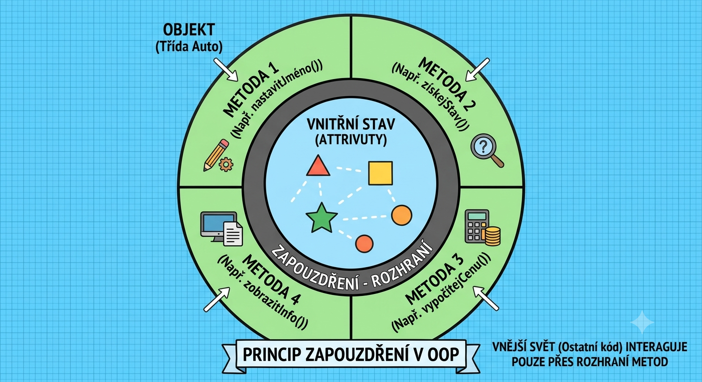

# Základní pojmy

## Základní pojmy

### Objekt

Objekt si na počátku můžete představit jako určitou věc, kterou se snažíte v programu zachytit. Běžně se může jednat o fyzickou věc, na kterou si můžete ukázat či se jí dotknout. Příkladem může být třeba auto (ale určité, konkrétní, na nějakém místě zaparkované, s danou SPZ), nebo třeba rodič (opět konkrétní osoba) a podobně. Objektově orientované programování je založeno právě na reprezentaci těchto objektů.

Pozor ale, že onen konkrétní objekt nemusí být vždy fyzický. Příkladem je například určitá choroba (například mor), která není fyzická, ale přesto ji lze v programu reprezentovat, nebo výukový předmět (ale opět **konkrétní**, například Matematika) a další.


Ve dvou různých aplikacích se mohou tyto pohledy lišit. Záleží vždy na problematice, kterou se daná aplikace snaží zachytit. Ve výsledku v některé aplikaci určitá věc může být chápána jako objekt, ale z pohledu druhé aplikace se již o objekt jednat nemusí - bude se jednat o datový typ (viz níže).


### Datový typ

Velmi často se stane, že lze skupina objektů zařadit pod nějaký pojem, který ji reprezentuje. Taková skupina objektů má typicky určité společné vlastnosti a také společné chování. Příkladem takové skupiny objektů mohou být (vzhledem k výše uvedenému) například auta (skupina aut zaparkovaných před domem) nebo lidé (opět skupina fyzických osob). Obě tyto skupiny mají své společné vlastnosti a chování - společnou vlastností aut může být výrobní číslo, barva, maximální povolená rychlost, množství PHM v nádrži a podobně; jejich společným chováním je, že mohou jezdit a přepravovat jiné objekty z jednoho místa na jiné. Obdobně, lidé mají jako společné vlastnosti jméno, datum narození, výšku nebo barvu očí, a poskytují společné chování - mohou mezi sebou komunikovat, vykonávat nějaké činnosti a podobně.

Pro takovou skupinu objektů lze vytvořit určitou definici (nebo šablonu), která bude říkat, jaké vlastnosti a jaké chování každý objekt z této skupiny umožňuje. Tato šablona v OOP vystupuje jako _datový typ_. Příkladem datového typu pro auta na parkovišti bude právě typ `auto`, který bude říkat, že všechna auta na parkovišti mají barvu a výrobní číslo.

Objekt je potom chápán jako **instance** datového typu. Sousedovo auto bude instancí datového typu `auto`, a protože datový typ `auto` říká, že všechna auta mají barvu a výrobní číslo, i sousedovo auto bude mít nějakou barvu (například červenou) a nějaké výrobní číslo.

**Každý objekt musí mít všechny vlastnosti a chování, které mu určuje jeho datový typ**. Ne vždy je ale hodnota vlastnosti nebo způsob chování známý. Potom můžeme říci, že sousedovo auto jistě nějaké výrobní číslo má, jenom my jej nevíme.

### Třída

Jelikož je Java objektově orientovaným programovacím jazykem, musí poskytovat techniky pro vytváření objektů a tedy umožňovat definici jejich datových typů. Na rozdíl od jiných OOP jazyků Java programátorovi umožňuje vytvářet pouze jeden druh datových typů, a to jsou právě třídy. Proto se taky v jazyce Java běžně pojem _datový typ_ nepoužívá a nahrazuje se právě pojmem _třída_.

Aby programátor nemusel vše vytvářet sám ručně, jazyk Java mimo jiné obsahuje knihovnu již vytvořených tříd, které naimplementoval (naprogramoval) někdo dříve a nyní je možno je využívat. Ale samozřejmě, programátor si může vytvořit svou vlastní třídu, kterou může dále v programu využít.

V programovacím jazyce Java třídu vytvoříte pomocí klíčového slova `class` následovaného názvem třídy. Za názvem třídy jsou složené závorky, do nichž se zapisuje obsah třídy.

```java
public class Demo {
// tělo třídy
}
```

V jazyce Java platí, že **každá třída musí být povinně v souboru, který se bude jmenovat stejně jako daná třída**. Soubory mají příponu Java. Z toho vyplývá omezení, že:

* každá třída je definována právě v jednom soubor, kde název třídy odpovídá názvu souboru, a naopak
* každý soubor s příponou .java obsahuje právě jednu třídu, která se jmenuje stejně jako soubor (bez přípony.

Proto před samotným přidáním třídy musíme ve vývojovém prostředí vytvořit nový soubor s příponou .java, do kterého třídu vytvoříme.

### Instance třídy

Jak bylo zmíněno výše, datový typ, potažmo třída, definuje šablonu, podle které se vytvářejí objekty. Pokud se vytváří již konkrétní „kus" reprezentující něco vytvořené podle šablony, nazývá se tento konkrétní objekt také pojmem _instance_. Instance je tedy objekt vytvořený podle konkrétní šablony.

Instance od konkrétního datového typu se vytvoří v kódu jazyka Java pomocí klíčového slova `new` následovaného názvem třídy a kulatými závorkami. Závorky reprezentují volání konstruktoru, tento pojem bude vysvětlen později.

```java
new Demo();
```

Typicky se ale instance nevytvářejí jen tak, ale chceme s nimi později nějakým způsobem pracovat. Proto vytvořenou instanci přiřadíme do určité proměnné, která bude na námi vytvořenou instanci odkazovat. Tato proměnná musí být datového typu instance, která se do dané proměnné přiřazuje.

```java
Demo d = new Demo();
```


Později uvidíme, že tvrzení _"Tato proměnná musí být datového typu instance, která se do dané proměnné přiřazuje."_ není úplně přesné. Dědičnost umožňuje odlišné chování. Toto však bude představeno později.


### Primitivní datový typ

Jazyk Java obsahuje ještě jednu zvláštní skupinu datových typů (nejsou to ale třídy), které programátor běžně využívá. Označují se jako primitivní datové typy a reprezentují „základní" množinu datových typů, které se nejčastěji používají. Nejčastěji reprezentují nějaký formát čísla - pokud si představíme skupinu objektů { 5; 7; 102; -142; 14,534, …}, jedná se o objekty, které mají určité společné vlastnosti a chování. Společnou vlastností je to, že mají nějakou hodnotu. Společným chování může být, že je lze sčítat, odčítat, převádět na záporné hodnoty a další.

Číselné primitivní datové typy se liší svým rozsahem (tj. minimální a maximální hodnotou, případně rozsahu desetinné části čísla), proto jich je několik a programátor si může vybrat, který mu nejvíce vyhovuje při konkrétním použití - například pro známky na vysvědčení stačí datový typ, který umí reprezentovat celá čísla, pro hmotnost osoby již potřebujeme čísla desetinná, ale není nutný velký rozsah (cca < 300, pokud budeme uvádět hmotnost v kilogramech), pro zachycení částky na účtu již ale někteří z nás mohou potřebovat i poměrně velké hodnoty.

Vedle číselných primitivních datových typů existují ještě typy pro práci se znaky (např. A, B, C, …) a pro reprezentaci stavů pravdy/nepravdy (true/false).

Pozor ale, že primitivní datové typy nejsou třídami, nechovají se jako klasické třídy; navíc, jejich názvy jsou klíčovými slovy jazyka Java. A ještě jedno omezení je v jazyce Java pro programátory - programátor si nemůže vytvořit vlastní primitivní datový typ, může pouze využívat ty již existující.

## Členové datových typů

Jak již je z výše uvedeného zřejmé, programátor si v jazyce Java může vytvářet vlastní třídy. Třída definuje vlastnosti a chování dané skupiny objektů, pro kterou je navržena - programátor tedy musí i specifikovat jaké vlastnosti a chování bude daná třída podporovat. Obecně se definicím uvnitř datových typů říká _členové datových typů_, nebo v Javě stačí _členové tříd_. V jazyce Java může mít třída pouze dva typy členů:

* proměnné, které reprezentují daný stav objektu (např. hmotnost je 400 kg, nebo délka je 3 metry) a
* metody, které reprezentují operace proveditelné s objektem (například „spočítej svůj objem" nebo „převeď kilogramy na tuny".



### Instanční proměnná

Instanční proměnná je vlastně klasická proměnná, která je ale definována pro instanci třídy a její hodnota je dostupná kdekoliv uvnitř této instance. V různých zdrojích se těmto definicí říká také vlastnosti třídy, atributy třídy nebo pole třídy (z anglického _field_). Protože ale tyto pojmy mohou být v konfliktu s jinými pojmy týkajícími se OOP, bude dál používán pojem instanční proměnné.

Minimální definice každé instanční proměnné je shodná s definicí klasické proměnné například ve funkci - tedy musí mít datový typ a název proměnné.

Datový typ říká, jakých hodnot může daná proměnná nabývat, název proměnné potom říká, jak se na tuto proměnnou budeme odkazovat, abychom získali nebo nastavili její hodnotu.

Při deklaraci nové proměnné třídy lze také specifikovat, jakou bude mít výchozí hodnotu.

```java
public class Demo {
    private int hodnota = 6;
}
```

Třída `Demo` tedy má jednu instanční proměnnou nazvanou `hodnota` s deklarovaným datovým typem `int`, bude tedy nabývat číselných hodnot. Navíc, tato proměnná bude mít při vytvoření instance nastavenu hodnotu 6.


Nevysvětleno zůstalo klíčové slovo `private`. Podrobně se této problematice bude věnovat kapitola o dědičnosti, nyní ale stačí stručně říci, že jedním ze základních vlastností objektově orientovaného přístupu je zapouzdřenou - tedy že objekt (respektive třída, které pro něj slouží jako šablona) může některé definice schovat před vnějším světem. Běžný program se sestává z několika tříd, které mezi sebou navzájem komunikují - vyvolávají si metody nebo si čtou/nastavují třídní proměnné. Někdy však chceme, aby k určitým proměnným nebo metodám neměla přístup jiná třída. S takovýmito schovanými proměnnými (nebo metodami) může tedy pracovat pouze libovolná instance dané třídy. Java odlišuje 4 úrovně viditelnosti, stručně si představíme zatím pouze dvě:

* `private` - soukromá - definice uvozena klíčovým slovem private je viditelná pouze pro instance dané třídy; přistupovat se tedy k ní může pouze ze bloku kódu dané třídy, a
* `public` - veřejná - definice uvozena klíčovým slovem public je viditelná všem; přistupovat k ní tedy lze i z bloku jiných tříd.

Lze si všimnout, že samotná třída Demo má jako první klíčové slovo uvedeno `public`. Tato třída tedy bude viditelná všem a všichni mohou pracovat s třídou `Demo` (ale pouze s těmi definicemi třídy,které jsou v ní uvedeny také jako veřejné - public).

Zjednodušeně lze zatím říci, že **byste měli uvádět všechny instanční proměnné jako soukromé, pokud nebude opravdu závažný důvod udělat to jinak.**


Pokud přesto zůstane instanční proměnná viditelná jako veřejná, lze se na ni odkázat přes běžnou tečkovou notaci nad instancí třídy.

```java
Demo d = new Demo();
int i = d.hodnota; // získání hodnoty
d.hodnota = 5; // nastavení hodnoty
```

### Instanční metoda

Instanční metoda (nebo možná lépe metoda instance třídy) je opět běžná metoda zapsaná do těla třídy. Instanční metoda může využívat instanční proměnné (protože je v těle třídy, tak včetně soukromých třídních proměnných) a ostatní instanční metody (opět bez ohledu na jejich viditelnost).

Instanční metoda v Javě funguje jako klasická (programovací) funkce. Může (ale nemusí) do ní vstupovat několik hodnot (tzv. parametry metody), a může vracet svůj výsledek jako návratovou hodnotu. Na `0..N` vstupů tedy může funkce vrátit `0..1` výstup.

Instanční metoda se deklaruje pomocí zápisu sestávajícího z:

* Identifikátoru viditelnosti (stejně jako u instančních proměnných);
* Návratového typu funkce - zde funkce definuje datový typ, jehož instanci funkce vrací jako výsledek. Pokud funkce nebude vracet žádnou hodnotu, použije se klíčové slovo `void`;
* Názvu funkce - tento název rozlišuje velká/malá písmena. V Javě funkce začínají malým písmenem a dále se používá syntaxe camelCase.
* Otevírací kulaté závorky;
* Seznamu parametrů, oddělených čárkou, uvedených ve tvaru `datovýTyp názevProměnné`;
* Uzavírací kulaté závorky.

Příklady funkcí definovaných v rámci třídy ukazují následující výpisy.

```java
public class Demo {
    public void funkceA() {
        // tělo funkce
    }
    public int funkceB() {
        // tělo funkce
        return 6; // vrácení výsledku pomocí klíčového slova "return"
    }
    public void funkceC(int a, int b){
        // tělo funkce
    }
}
```

Pokud má funkce definovaný jiný návratový typ než `void`, musí vracet hodnotu. Vrácení hodnoty se provede pomocí klíčového slova `return` následovaným vracenou hodnotou - typicky názvem proměnné, která obsahuje hodnotu, jež se má vrátit z funkce jako výsledek. U funkce, která má návratový typ `void` lze samotné klíčové slovo `return` použít k opuštění funkce. Platí, že ve funkci může být libovolný počet klíčových slov `return`. Pokud má však funkce definovanou návratovou hodnotu, musí vždy nějakou hodnotu vrátit - musí obsahovat klíčové slovo `return` následované vracenou hodnotou.

Instanční funkce, na rozdíl od proměnných instancí tříd, se již běžně vyskytují jako soukromé i veřejné - záleží na tom, zda programátor chce danou funkcionalitu nabízenou funkcí poskytnout i objektům zvenčí, či ji chce nechat pouze pro volání v rámci metody. Blíže použití ukazuje následující příklad.

```java
public class Demo {
    private int hodnota = 1;
    private int jinaHodnota = 1;
    public void setHodnotaAsPositive(int value){
        value = convertToPositiveIfRequired(value);
        hodnota = value;
    }
    public void setJinaHodnotaAsPositive(int value){
        value = convertToPositiveIfRequired(value);
        jinaHodnota = value;
    }
    private int convertToPositiveIfRequired(int value) {
        if (value <= 0)
            value = 1;
        return value;
    }
    public int getHodnota(){
        return hodnota;
    }
}
```

Máme třídu `Demo`, která definuje dvě soukromé instanční proměnné. Pro jejich nastavení lze využít dvou veřejných metod. Obě veřejné metody ale při nastavení musí zajistit (jak vyplývá z jejich názvu), že nastavovaná hodnota do instanční proměnné bude vždy kladná (bez ohledu na to, jaký parametr do funkce vstupuje). Obě metody tedy využívají metodu `convertToPositiveIfRequired()`, která, pokud je vstupní parametr menší roven 0, vrací hodnotu 1; v opačném případě vrací původní (tedy nutně kladnou) hodnotu. Tato funkce je využívána instančními funkcemi. Programátor tak nemusí tuto funkcionalitu psát na dvou různých místech, ale zavolá si tuto funkci a ona zajistí kontrolu parametru a jeho případnou změnu na kladné číslo. Na druhou stranu, metoda `convertToPositiveIfRequired()` není určena pro přístup zvenčí. Ulehčuje pouze programování ostatních metod. Proto je určena jako soukromá, protože ji budou využívat pouze ostatní metody třídy, ale už nikoliv objekty zvenčí.

Další zajímavou věcí je práce s proměnnou `hodnota` a s metodami `setHodnotaAsPositive()` a `getHodnota()`. Samotná proměnná `hodnota` je soukromá, takže k její hodnotě se objekty zvenčí nedostanou. Ale obě výše zmiňované metody jsou veřejné; přitom metoda `getHodnota()` nedělá nic jiného, než že získá hodnotu z lokální proměnné `hodnota` a vrátí ji. Zvenčí tak kdokoliv hodnotu soukromé proměnné `hodnota` získá voláním metody `getHodnota()`. Tento koncept - zapouzdření přístupu k soukromým třídním proměnným pomocí veřejných metod - je v Javě velmi často využíván. Veřejné metody se pro soukromou proměnnou nazvanou XXX pojmenovávají jako `getXXX()` a `setXXX()` a říká se jim get-set metody, nebo také gettery a settery. Speciálním případem jsou proměnné typu boolean (pravda/nepravda), kde getter nepoužívá prefix „get" ale „is". Blíže vše ukazuje následující příklad.

```java
public class Demo {
    private int hodnotaA;
    private boolean hodnotaB;
    public int getHodnotaA() {
        return hodnotaA;
    }
    public void setHodnotaA(int hodnotaA) {
        this.hodnotaA = hodnotaA;
    }
    public boolean isHodnotaB() {
        return hodnotaB;
    }
    public void setHodnotaB(boolean hodnotaB) {
        this.hodnotaB = hodnotaB;
    }
}
```

V rámci metod je třeba definovat ještě pojem signatura funkce. **Signatura funkce** pro každou funkci definuje počet parametrů a jejich typy a návratové hodnoty funkcí. Tohoto pojmu se později využívá při srovnání funkcí - zda mají stejnou signaturu. Následuje příklad funkcí, které mají stejnou signaturu.

```java
public int secti(int a, int b){/* tělo funkce */}
public int odecti(int a, int b){/* tělo funkce */}
public int vynasob(int a, int b){/* tělo funkce */}
```


Všímněte si, že závorky za názvem metody `setHodnotaAsPositive()` neodpovídají definici v kódu, kde je uvedeno `setHodnotaAsPositive(int value)`. Závorky zde totiž pouze slouží ke zdůraznění faktu, že se jedná o metodu a nikoliv pro uvedení přesné signatury. I dále v textu se takto budeme odkazovat pro ujasnění pojmu, že daný identifikátor reprezentuje metodu. Tato metoda však může mít uvnitř další parametry, které již do závorek nebudeme zapisovat.


### Konstruktor

Speciálním typem metody je konstruktor. Konstruktor je metoda volaná při vytváření nové instance objektu - tento postup byl popsán v kapitole 2.3.2. Zde je uvedeno, že nová instance se vytváří voláním s klíčovým slovem `new`, následovaným názvem třídy a kulatými závorkami. Právě kulaté závorky reprezentují volání metody - a tou je konstruktor.

Nejdříve je konstruktor třeba v těle třídy nadefinovat. Konstruktor má definici stejnou jako každá funkce (viz kapitola 2.4.2), s následujícími omezeními:

* Návratovou hodnotou funkce je povinně instance třídy, kterou konstruktor vytváří, návratovým typem je tedy třída, ve které je konstruktor definován;
* Konstruktor nemá název; za návratovou hodnotou se ihned uvádí seznam parametrů v závorkách (nebo prázdné závorky).

Konstruktorů lze pro konkrétní třídu definovat více. Jednotlivé konstruktory se mohou lišit počtem parametrů a jejich viditelností. Následující příklad ukazuje ukázku konstruktorů pro třídu `Demo`.

```java
public class Demo {
    private int hodnotaA;
    private boolean hodnotaB;
    private Demo() {
        hodnotaB = true;
    }
    public Demo(int hodnotaA){
        this(); // volání výše uvedeného soukromého konstruktoru
        this.hodnotaA = hodnotaA;
    }
    public Demo (int hodnotaA, boolean hodnotaB){
        this(hodnotaA); // volání výše uvedeného soukromého konstruktoru
        this.hodnotaB = hodnotaB;
    }
}
```

V příkladu jsou definovány tři konstruktory.

* První je soukromý. Tento konstruktor lze volat pouze z těla třídy. Zvenku není dostupný, vně třídy tedy nelze pomocí tohoto konstruktoru vytvořit novou instanci.
* Druhý konstruktor `Demo (int hodnotaA)` je veřejný a může ho volat kdokoliv. Pomocí něj tedy může vytvořit kdokoliv instanci třídy `Demo`. Jeho tělo obsahuje dva příkazy. Příkaz `this();` odkazuje svým voláním na **bezparametrický konstruktor téže třídy**, tedy na první uvedený. Zavolat jej můžeme, přestože je privátní, protože jsme v těle vytvářené třídy. Další příkaz obsahuje klíčové slovo `this`. Pomocí tohoto slova se explicitně odkazujeme na instanci právě zpracovávaného objektu. Zde je to důležité, protože parametr konstruktoru `hodnotaA` se shoduje s názvem proměnné třídy `hodnotaA`. Kompilátor si vždy vybere „bližší" definici, proto se řetězcem `hodnotaA` vždy bude odkazovat na parametr metody. Kdybychom zapsali jednoduše „`hodnotaA = hodnotaA;`", přiřazovali bychom hodnotu parametru zpět do parametru (což nedává smysl). Abychom se byli schopni explicitně odkázat na instanci třídy a její třídní vlastnost, využijeme právě klíčové slovo `this`. Proto `this.hodnotaA` odkazuje na proměnnou třídy a `hodnotaA` odkazuje na parametr konstruktoru.
* Třetí konstruktor `Demo(int hodnotaA, boolean hodnotaB)` je také veřejný a může ho volat kdokoliv. V rámci něj provádíme opět volání jiného konstruktoru - `this(hodnotaA);` - ale tentokrát se jedná o volání konstruktoru s jedním parametrem (tedy druhý uvedený).

Další příklad ukazuje možnosti volání a vytvoření instance třídy `Demo` **vně** této třídy. První volání nelze použít vně třídy `Demo`, protože bezparametrický konstruktor je soukromý.

```java
// Demo a = new Demo(); // <-- nelze veřejně použít
Demo b = new Demo(4);
Demo c = new Demo(6, false);
```

Ve třídě však nemusíte nutně vždy vytvářet konstruktor. V případě, že pro třídu nevytvoříte sami žádný konstruktor, jazyk Java vám pro ni automaticky vygeneruje **bezparametrický veřejný konstruktor**. Pokud však již jakýkoliv konstruktor vytvoříte a chcete mít zároveň k dispozici bezparametrický veřejný konstruktor, musíte jej do kódu explicitně zapsat sami.

## Statičtí členové tříd

V předchozích kapitolách jsme představili, že ve třídě se mohou vyskytovat třídní proměnné a třídní metody. Na třídní proměnné a třídní metody jsme se vždy odkazovali pomocí instancí proměnných. Potřebujeme tedy nejdříve získat instanci třídy (například vytvořením pomocí volání konstruktoru) a teprve potom s ní můžeme pracovat.

```java
public class Demo {
    private int hodnotaA;
    private boolean hodnotaB;
    private Demo() {
        hodnotaB = true;
    }
    public Demo(int hodnotaA){
        this(); // volání výše uvedeného soukromého konstruktoru
        this.hodnotaA = hodnotaA;
    }
    public Demo (int hodnotaA, boolean hodnotaB){
        this(hodnotaA); // volání výše uvedeného soukromého konstruktoru
        this.hodnotaB = hodnotaB;
    }
}
```

Zde sice voláme uvnitř metody třídy `setHodnotaAsPositive()` jinou metodu třídy, ale aby někdo mohl zavolat metodu `setHodnotaAsPositive()`, musí stejně existovat instance třídy, nad kterou bude tato metoda zavolána. Proto lze ještě přesněji říci, že tyto třídní proměnné jsou instanční proměnné třídy a třídní metody jsou instanční metody třídy - potřebujeme instanci.

U některých metod a proměnných však nemusíme nutně potřebovat instanci. Typicky se jedná o stavy a operace, které jsou společné pro všechny instance - u proměnných se může jednat o různé konstanty (například přepočet m/s na km/h vyžaduje vždy konstantu 3,6 pro všechny instance, nebo maximální hodnota proměnné typu `int` je vždy stejná), u metod se obdobně může jednat o operace, které jsou společné pro všechny instance - například převést m/s na km/h lze kdykoliv a není k tomu třeba instance třídy `Demo`, protože se jedná o jednoduchou matematickou funkci, která nemusí využívat žádné třídní proměnné - stačí ji vstup a vrátí výstup. Takovým členům se říká statičtí členové tříd. Statické členy definujeme přidáním klíčového slova `static`.

```java
public class Demo {
    private static int maxHodnotaA = Integer.MAX_VALUE;
    private static double MPS2KPH = 3.6;
    public static int convertMPStoKPH(int speedInMPS){
        int ret = (int) (speedInMPS * MPS2KPH);
        return ret;
    }
    (...)
}
```

Třída `Demo` nyní obsahuje dvě statické soukromé třídní proměnné - jedna definuje maximální hodnotu pro proměnnou `hodnotaA`, druhá definuje určitou hodnotu, která se dále využívá v následující statické metodě. Statická metoda provádí převod číselné hodnoty rychlosti v m/s (meters per second - MPS) na km/h. Metoda může být statická, protože bude fungovat bez ohledu na instanci, která by ji volala.

Zbývá problematika vyvolání statických členů. Na statické členy se ohledně viditelnosti aplikují stejná pravidla jako na instanční členy třídy - tzn. mimo třídu jsou viditelné pouze veřejné definice, tj. ty, které jsou uvozeny klíčovým slovem `public`. Protože k vyvolání statického člena ale nepotřebujeme (a typicky ani nemáme) instanci, provedeme jeho vyvolání adresováním přes tečkovou notaci přímo nad názvem třídy - jak ukazuje následující příklad.

```java
int speed = Demo.convertMPStoKPH(50);
// vyvolání statického člena přes název třídy
```

Uvnitř statických metod při definicích také nelze používat klíčové slovo `this`, které ukazuje na aktuální instanci. Protože však u statické metody pracujeme bez instance, příkaz využívající klíčové slovo `this` nemůžeme v rámci těla statické metody využít.

### Inicializace statických členů tříd

Jak bylo zmíněno, statickým členům tříd lze nastavit hodnotu běžným voláním pomocí tečkové notace. Navíc lze ale tyto členy inicializovat - hodnotu jim můžeme nastavit buď přímo u deklarace, nebo pomocí speciálního bloku `static`, který se volá automaticky někdy před prvním použitím třídy tak, aby byla třída programu k dispozici. Všechny tři případy možnosti nastavení hodnoty ukazuje následující příklad.

```java
public class StaticsExample {
    // přímá inicializace hodnoty
    private static int a = 1;
    private static int b;
    private static int c;
    static {
        // inicializace pomocí statického bloku
        StaticsExample.b = 2;
    }
    public void someMethod(){
        // nastavení hodnoty kdekoliv v kódu
        StaticsExample.c = 3;
    }
}
```


Blok `static { }` je vlastně variantou variantu pojmu „statický konstruktor“ známého z jiných programovacích jazyků.


## Balíčky (package)

Posledním základním pojmem programování v jazyce Java, který je třeba objasnit, jsou balíčky. Samotných tříd je i v základním bloku knihoven pro vývoj Java aplikací velké množství (stovky). Při programování by se tak vývojáři velmi brzy dostali do úzkých:

* Když se potřebují orientovat ve velkém množství na stejné úrovni definovaných tříd;
* Když by chtěli vytvořit vlastní třídu, ale již by existovala dříve vytvořená třída stejného názvu.

(Nejen) proto se třídy v Javě dělí do větších stavebních bloků, kterým se říká balíčky - packages. Platí, že každá třída může být umístěna právě v jednom balíčku, ale naopak, že jeden balíček může mít více tříd. Navíc, v rámci názvů balíčků lze využívat tečkové notace a tak lze vytvořit iluzi hierarchie zanoření balíčků. Plný název třídy tak lze získat složením názvu balíčku a názvu třídy. Plný název třídy je důležitý, protože v různých balíčcích mohou existovat stejně pojmenované třídy.


Na tuto problematiku je třeba si dávat pozor. Velmi často se lze setkat s nechtěnou záměnou stejně pojmenovaných tříd, například třídy java.util.Date a java.sql.Date, což může působit na první pohled nevysvětlitelné problémy a chyby při kompilaci.


Třídu do balíčku umístíme pomocí klíčového slova `package` následovaného názvem balíčku. Příkaz `package` je neblokový (nenásledují za ním žádné složené závorky) a platí pro celý následující soubor. Navíc, tento příkaz **musí být uveden jako první příkaz v rámci .java souboru**.

```java
package eng.opora;

public class Demo {
}
```

Výše definovaná třída tak má svůj plný název `eng.opora.Demo`. Kdykoliv se chceme na třídu odkázat z jiného balíčku než aktuálního, musíme se na ni odkazovat pomocí plného jména. To znamená, že ostatní třídy definované ve stejném balíčku mohou využívat zkrácený název `Demo`, ale třídy z jiných balíčků již musí používat plný název `eng.opora.Demo`.

S pojmem balíčků se váže ještě klíčové slovo `import`. Často se stane, že je plný název určité třídy moc dlouhý a jeho časté opakování ve zdrojovém kódu jiné třídy způsobí, že kód je nepřehledný. Proto lze definovat, že se v rámci určité třídy chceme odkazovat pouze pomocí jejího názvu bez názvu balíčku. Tehdy musíme nahoru, před definici třídy (ale až za příkaz `package`) umístit sekvenci `import` příkazů, ve tvaru `import plný_název_třídy;`. Místo názvu konkrétní třídy můžeme použít znak \* (hvězdičky) a tehdy se lze odkazovat bez prefixu na všechny třídy v daném balíčku.

```java
package eng;
import java.util.*;
import eng.opora.Demo;
public class Opora {
    eng.opora.Demo e = null;
    Demo d = null;
}
```

Výše uvedený zdrojový kód definuje třídu `Opora` v balíčku `eng`. Navíc připojuje všechny třídy z balíčku `java.util` a třídu `eng.opora.Demo`. Díky tomu lze využívat jak odkaz přes plný název třídy (`eng.opora.Demo` - funguje vždy), tak pouze název třídy (`Demo` - funguje právě kvůli výše uvedenému příkazu `import`).

**Poznámka.** Pouze zajímavost. Příkaz import má ještě jednu syntaxi. Pomocí sekvence `import static` plný\_název\_třídy\_a\_statické\_metody lze připojit přímo statickou metodu pro volání bez tečkové notace a prefixu názvu třídy. Lze navíc využít opět i hvězdičky namísto názvu metody. Tehdy se připojí všechny veřejné statické metody třídy. Například pro kód v kapitole 2.5 lze vložit kód „`import static eng.opora.Demo.*;`". Potom lze kdekoliv v takové třídě volat „`convertMPStoKPH()`" a kód bude fungovat a vyvolá statickou metodu třídy `eng.opora.Demo`.

Na závěr je třeba zmínit, že určité třídy jsou dostupné programátorovi ihned, aniž by musel používat `import`. Kompilátor totiž každé třídě automaticky připojí import balíčku `java.lang`.
