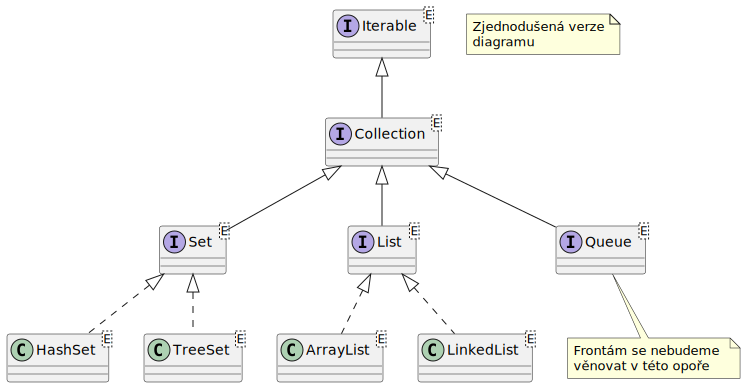
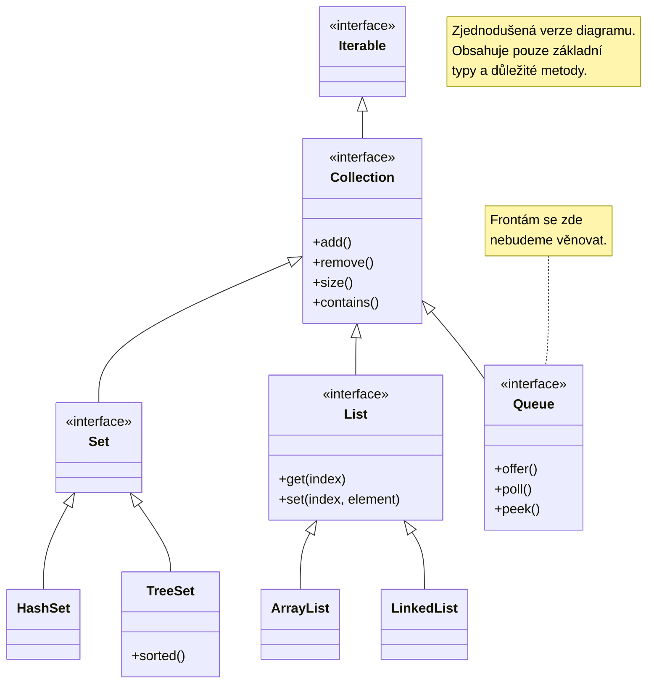

# Kolekce

Kolekce jsou první skupinou typů v _Java Collection Framework_. Reprezentují je třídy, které jsou určeny k uchovávání více instancí v jené proměnné.

Následující obrázek ukazuje rozdělení základních představených typů v JCF.






Samotná knihovna _Java Collection Framework_ je rozsáhlejší a obsahuje více typů. My budeme představovat pouze základní z nich, se kterými se při programování běžně setkáte. Na výše uvedeném obrázku se navíc soutředíme pouze na kolekce. Pro úplný list například viz [https://miro.medium.com/v2/resize:fit:720/format:webp/1\*vGt4ZxCjUhiyeEHFFwkujw.png](https://miro.medium.com/v2/resize:fit:720/format:webp/1*vGt4ZxCjUhiyeEHFFwkujw.png).


Lze si povšimnout, že kolekce lze rozdělit do dvou základních skupin podle nadřazeného rozhraní:

* Potomci/implementace třídy `Set` - reprezentují _množiny_;
* Potomci/implementace třídy `List` - reprezentují _seznamy_.
* Potomci/implementace třídy `Queue` - reprezentují _fronty_.

Následně budou skupiny (vyjma front) podrobně vysvětleny.


Fronty přeskočíme, protože jejich problematika je složitější a pro jejich pochopení je nejdříve třeba se seznámit s množinami a listy.


## Množiny

Množiny reprezentují sadu prvků - lze do nich také přidávat prvky, odebírat prvky a procházet je pomocí cyklu _for-each_. Jedná se ale o volné uskupení prvků (jako bychom je naházeli do pytle). Na rozdíl od seznamu nemají žádné garantované pořadí (není-li dále určeno jinak) a další vlastnosti:

* Každá hodnota může být v množině pouze jednou.
* Prvky nemusí být vráceny v pořadí, ve kterém byly do množiny vloženy.
* Na jednotlivé prvky se nelze dostat pomocí indexu a nelze tedy ani použít cyklus _for_.

Základní rozhraní množiny `Set` implementuje několik metod určených pro práci s prvky.

<table><thead><tr><th width="249">Signatura funkce</th><th>Popis</th></tr></thead><tbody><tr><td>boolean add(E e)</td><td>Vloží do množiny prvek. Pokud již prvek v množině existuje, nic se neprovede.</td></tr><tr><td>void clear()</td><td>Odstraní všechny prvky z množiny.</td></tr><tr><td>boolean contains(Object o)</td><td>Vrací true, pokud prvek předaný jako parametr v množině existuje.</td></tr><tr><td>boolean isEmpty()</td><td>Vrací true, pokud je množina prázdná.</td></tr><tr><td>boolean remove(Object o)</td><td>Odstraní prvek z množiny.</td></tr><tr><td>int size()</td><td>Vrací počet prvků v množině.</td></tr></tbody></table>

Lze si povšimnout, že opravdu chybí jakákoliv metoda pro získání prvku z množiny. Prvky množiny lze procházet pomocí cyklu _for-each_, který postupně projde všechny prvky, ale žádná metoda, která by vrátila prvek pomocí indexu, v množině neexistuje.

Existují dvě základní implementace pro množiny:

* HashSet - základní množina udržující prvky v nějakém interním pořadí;
* TreeSet - množina udržující prvky seřazeně.

Typy množin se liší tedy podle toho, jakým způsobem si do sebe ukládají jednotlivé prvky.

Obě třídy budou představeny blíže. Opět je vhodné se v ukázkových zdrojových kódech povšimnout, že v ideálním případě konkrétní typ množiny (`HashSet` nebo `TreeSet`) určujeme pouze při vytváření nové instance (tedy za klíčovým slovem `new`), ale proměnnou typujeme na obecného předka `Set` - programujeme tedy opět proti rozhraní.

```java
Set<String> emails = new HashSet<>();
// proměnná je typu Set, ale instance je HashSet
```

### Identifikace jedinečnosti prvku

Jak bylo zmíněno, do množiny nelze vložit vícekrát stejný prvke. Jak ale množina pozná, že už prvek existuje?

Nepoužívá se porovnání pomocí operátoru „==" - tehdy by se například v množině mohly vyskytovat dva stejné řetězce, umístěné na různých místech v paměti. Množiny namísto toho využívají již dříve představené metody `hashCode()` a `equals()` - [todo-object.md](../zakladni-datove-typy/todo-object.md "mention"). Programátor může pomocí přetížení těchto metod u každé třídy specifikovat, jak bude porovnání probíhat.

Pozor tedy, že při výchozím chování se bere, že každá instance je jedinečná (výchozí chování funkcí `equals()` a `hashcode()` pro třídu `Object`). Programátor ale toto chování může upravit přetížením těchto metod ve vlastní třídě.

### **HashSet**

Už podle názvu, třída `HashSet` pracuje s hash kódem a má tedy souvislost s metodou `hashCode()` (viz kapitola 5.3.2), kterou má každý objekt. Jak bylo zmíněno, do instance takové množiny lze vložit instance libovolné třídy, vyjma hodnoty null. Instance se navíc nesmí opakovat.

Výhoda typu `HashSet` je v rychlosti přidávání prvků (konkrétně v testování, zda již existující prvek v množině není). Pokud chceme rychle vytvořit skupinu prvků a zároveň zajistit, že každý prvek se vyskytuje v množině pouze jednou, použijeme právě `HashSet`. Opakované přidání existujícího prvku ale nezpůsobí žádnou chybu; pokud přidávaný prvek již existuje, prostě se jeho opětovné přidání neprovede.

```java
java.util.Set<String> hs = new java.util.HashSet();
hs.add("c");
hs.add("b");
hs.add("a");
hs.add("a");
hs.add("b");
hs.add("c");
for(String item : hs)
  System.out.println(item);
System.out.println("Celkem: " + hs.size());
```

Jak bylo zmíněno, použitá kolekce je typově bezpečná (pro typ `String`), lze ji procházet pomocí cyklu _for-each_ a ve výsledku výše uvedený kód vrátí následující výsledek:

```
run:
b
c
a
Celkem: 3
BUILD SUCCESSFUL (total time: 0 seconds)
```

Přestože jsme tedy do množiny přidali 6 prvků, duplicitní vložení se neprovedlo a množina tedy obsahuje pouze tři prvky. Tyto prvky jsou navíc **v nespecifikovatelném pořadí** odlišném od pořadí, ve kterém byly do množiny vkládány!

### **TreeSet**

Druhým (běžným) typem množiny je stromová množina - `TreeSet`. V této množině oproti `HashSet` platí, že:

* jednotlivé vložené prvky jsou vždy seřazeny vzestupně **podle jejího nativního řazení**,
* nelze do nich vložit prvek s hodnotou `null`.


Problematika nativního řazení bude představena v [todo-comparable.md](todo-comparable.md "mention"). Aktuálně si ale prostě představte, že se prvky nějak umí seřadit - například čísla podle velikosti a řetězce podle abecedy.


Tento typ množiny tedy vždy zachovává pořadí prvků, jak stručně představuje jen velmi mírně upravený výpis. Prvek `null` nelze vložit, protože by `TreeSet` nevěděl, kam jej v pořadí zařadit.

```java
java.util.Set<String> hs = new java.util.TreeSet(); // <-- jediná změna zde
hs.add("c");
hs.add("b");
hs.add("a");
hs.add("a");
hs.add("b");
hs.add("c");
for (String item : hs)
  System.out.println(item);
System.out.println("Celkem: " + hs.size());
```

Zde je vidět výhoda programování proti rozhraní - programátor se může kdykoliv rozmyslet a nahradit původní množinu jinou implementací bez dopadu na okolní zdrojový kód. Následuje výsledek výše uvedeného výpisu.

```
run:
a
b
c
Celkem: 3
BUILD SUCCESSFUL (total time: 0 seconds)
```

Je vidět, že prvky jsou opravdu seřazeny.

Při práci však můžeme chtít do množiny vložit instanci libovolné třídy. Uvažujme například velmi jednoduchou třídu `Person`.

```java
class Person {
    private String name;
    private int age;
    public Person(String name, int age) {
        this.name = name;
        this.age = age;
    }
}
```

Výše uvedený příklad `TreeSet` upravíme pro vložení instancí třídy `Person`.

```java
java.util.Set<Person> hs = new java.util.TreeSet();
hs.add(new Person("Petra", 20));
hs.add(new Person("Iva", 18);
System.out.println("Celkem: " + hs.size());
```

Po spuštění však kód nebude fungovat a vrátí chybu (zkráceno).

```
run:
Exception (…): eng.demos.collectionFramework.Person cannot be cast to java.lang.Comparable
(…)
BUILD SUCCESSFUL (total time: 2 seconds)
```

Řekli jsme totiž, že `TreeSet` seřazuje do něj vložené objekty podle nativního řazení, ale prostředí jazyka Java netuší, jakým způsobem má porovnávat instance naší třídy `Person`. Pro další práci s typem `TreeSet` je tedy třeba se seznámit s mechanismem, který definuje, jakým způsobem lze mezi sebou porovnávat instance vlastní třídy.

Tento přístup bude představen za chvilku.

## Seznamy

Seznam je typ kolekce, který obsahuje sadu do něj vložených prvků s daným pořadím. Prvky lze postupně po jednom nebo hromadně přidávat, lze je odebírat, a hlavně - lze na ně přistupovat pomocí pořadí, tedy indexu. Prvky se v seznamu mohou vyskytovat vícekrát, seznam může i obsahovat hodnotu `null`.

Rozhraní `List` nabízí tedy sadu metod pro práci s jednotlivými prvky. Některé z operací lze také provádět hromadně pro více prvků najednou. Seznam lze také (stejně jako množinu) procházet pomocí cyklu for-each.

<table><thead><tr><th width="255">Signatura funkce</th><th>Popis</th></tr></thead><tbody><tr><td>boolean add(E e)</td><td>Přidá prvek na konec seznamu.</td></tr><tr><td>void add(int index, E e)</td><td>Přidá prvek na pozici v seznamu definovanou parametrem <em>index</em>.</td></tr><tr><td>void clear()</td><td>Odstraní všechny prvky ze seznamu.</td></tr><tr><td>boolean isEmpty()</td><td>Vrací true, pokud je seznam prázdný.</td></tr><tr><td>boolean contains(Object o)</td><td>Vrací true, pokud seznam obsahuje prvek předaný jako parametr.</td></tr><tr><td>E get(int index)</td><td>Vrací prvek na pozici parametru <em>index</em>.</td></tr><tr><td>int indexOf(Object o)</td><td>Vrací index prvního výskytu prvku předaného jako parametr.</td></tr><tr><td>int lastIndexOf(Object o)</td><td>Vrací index posledního výskytu prvku předaného jako parametr.</td></tr><tr><td>E remove(int index)</td><td>Odstraní prvek ze zadaného indexu a vrací odstraněný prvek jako výsledek volání.</td></tr><tr><td>boolean remove(Object o)</td><td>Odstraní prvek předaný jako parametr.</td></tr><tr><td>E set(int index, E element)</td><td>Nahradí prvek na indexu novou hodnotou. Nahrazovanou hodnotu vrací jako výsledek volání funkce.</td></tr><tr><td>int size()</td><td>Vrací počet prvků v seznamu.</td></tr></tbody></table>

Nejčastěji používanou implementací je třída `ArrayList`, která již podle názvu reprezentuje „chytré" pole - objekt, který se chová jako pole, u kterého se ale programátor nemusí starat o kontrolu délky při operaci s prvky, zejména při přidávání nového prvku.


Stejně jako u množin se i u listů používá programování proti rozhraní, kdy proměnná je typu rozhraní, ale kvládáme do ní instanci implementační třídy, tedy:

```java
List<String> items = new ArrayList<>();
```


### ArrayList

Třída `ArrayList` patří mezi nejpoužívanější kolekce v Javě. Reprezentuje takzvané dynamické pole. Na rozdíl od běžného pole, jehož velikost musíte pevně stanovit při vytvoření a už ji nelze změnit, se `ArrayList` dokáže automaticky zvětšovat nebo zmenšovat podle toho, kolik prvků do něj přidáváte nebo odebíráte. Poskytuje nám tak flexibilitu seznamu, ale zároveň si uchovává rychlý přístup k prvkům pomocí indexů.

Pod kapotou (v interní implementaci) přitom `ArrayList` nevyužívá žádnou magickou datovou strukturu, ale zcela obyčejné standardní pole objektů (`Object[]`). Když `ArrayList` vytvoříte, alokuje se v paměti pole s určitou výchozí kapacitou, což bývá standardně 10 prvků. Dokud pole nezaplníte, přidávání nových prvků na konec seznamu je extrémně rychlé, protože se pouze zapíše hodnota na další volný index.

Problém nastane v okamžiku, kdy je interní pole zcela plné a vy se pokusíte přidat další prvek. V ten moment `ArrayList` zahájí proces nafouknutí (resize). Interně vytvoří zcela nové, větší pole – v moderní Javě bývá nové pole zhruba o polovinu větší než to původní. Následně se všechny prvky ze starého pole překopírují do nového, staré pole se zahodí a nový prvek se uloží na uvolněné místo. Kvůli tomuto kopírování může být přidání prvku v momentě zaplnění kapacity o něco pomalejší, ale jelikož k němu dochází zřídka, je průměrná rychlost této operace stále velmi vysoká.

Z hlediska výkonu je důležité zmínit, že čtení libovolného prvku pomocí indexu je okamžité, protože se přistupuje přímo do pole. Naopak velmi neefektivní je vkládání nebo mazání prvků uprostřed `ArrayListu`. Pokud totiž smažete prvek z indexu 2, všechny následující prvky se musí v paměti posunout o jedno místo doleva, aby v poli nezůstala prázdná mezera.

V běžném kódu se `ArrayList` používá velmi snadno. Vytvoříme jej s definicí typu v generických závorkách a pro manipulaci s daty využíváme metody jako `add` pro přidání, `get` pro čtení, `remove` pro smazání a `size` pro zjištění počtu prvků.

```java
// Vytvoření ArrayListu pro textové řetězce
ArrayList seznamAut = new ArrayList<>();

// Přidávání prvků na konec seznamu
seznamAut.add("Škoda");
seznamAut.add("Volkswagen");
seznamAut.add("BMW");

// Čtení prvku na základě indexu (indexuje se od nuly)
String prvniAuto = seznamAut.get(0);
System.out.println("První auto v seznamu: " + prvniAuto);

// Odstranění prvku (buď podle indexu, nebo podle hodnoty)
seznamAut.remove("Volkswagen");

// Zjištění aktuální velikosti seznamu
int pocetAut = seznamAut.size();
System.out.println("Počet aut po smazání: " + pocetAut);

// Procházení celého seznamu pomocí for-each cyklu
System.out.println("Aktuální auta v seznamu:");
for (String auto : seznamAut) {
    System.out.println("- " + auto);
}
```

### LinkedList

Třída `LinkedList` (lineární obousměrně vázaný seznam) je další klíčovou kolekcí z balíčku `java.util`. Na rozdíl od `ArrayListu`, který je postaven na kontinuálním poli, přistupuje `LinkedList` k ukládání dat v paměti jako oboustranně zřetězený seznam.

Interní implementace `LinkedListu` nespoléhá na jedno velké pole, ale na řetězec samostatných objektů nazývaných uzly (Nodes). Každý uzel v sobě nese dva typy informací: samotnou hodnotu (data), kterou do seznamu ukládáme, a dva referenční ukazatele (odkazy). Jeden ukazatel směřuje na předchozí uzel v seznamu a druhý na uzel následující. Samotný `LinkedList` si pak v paměti pamatuje pouze odkaz na úplně první uzel (hlavu – head) a úplně poslední uzel (ocas – tail). Uzly nemusí v paměti ležet na adresách vedle sebe, mohou být rozeseté na různých místech a propojuje je právě tato síť odkazů.

Tato architektura zásadně ovlivňuje rychlost jednotlivých operací a činí z `LinkedListu` přímý protiklad k `ArrayListu`. Výhodou `LinkedListu` je extrémně rychlé vkládání a mazání prvků na začátku nebo na konci seznamu. Když chcete přidat nový prvek na začátek, nemusíte nic v paměti posouvat. Pouze vytvoříte nový uzel, propojíte jeho ukazatel s dosavadní hlavou seznamu a označíte ho za hlavu novou. Tato operace má konstantní časovou složitost. Výborně se proto hodí pro implementaci front (`Queue`) nebo zásobníků (`Stack`).

Nevýhodou je naopak přístup k prvkům pomocí indexu. Pokud chcete získat prvek například na indexu 50, Java nemůže jednoduše skočit na konkrétní místo v paměti. Musí začít od prvního uzlu a po odkazech se prokousat („přeručkovat“) přes padesát uzlů až k cíli. Čtení náhodných prvků je proto pomalé. `LinkedList` má navíc kvůli ukládání ukazatelů u každého prvku o něco vyšší paměťovou náročnost.

V kódu se `LinkedList` používá velmi podobně jako `ArrayList`, protože obě třídy implementují stejné rozhraní `List`. `LinkedList` však implementuje i rozhraní `Deque`, což mu dává metody navíc pro práci s oběma konci seznamu.

Pokud programujete proti rozhraní, je záměna `LinkedList` a `ArrayList` velmi jednoduchá - prostě se změní typ instance. Proto lze jako ukázku zcela použít předchozí příklad s jedinou změnou:

```java
// ArrayList seznamAut = new ArrayList<>();
ArrayList seznamAut = new LinkedList<>();
```

## **Další operace s kolekcemi - třída Collections**

Rozhraní `java.util.List` ani `java.util.Set` neobsahují téměř žádné operace, které by byly běžné a bylo je možné s danou kolekcí provádět, jako například řazení, kopírování, otáčení apod. Všechny tyto operace lze nalézt v další třídě z Java Collection Frameworku, nazvané `Collections`. Tato třída obsahuje statické metody umožňující provádět operace s kolekcemi, zejména:

* **binarySearch()** - pro vyhledání indexu určitého prvku v seznamu prvků. Pozor, jedná se (už podle názvu) o vyhledávání binární a proto musí být seznam nejdříve setřízen (pomocí metody **sort()**);
* **copy()** - zkopíruje všechny prvky z jednoho seznamu do seznamu druhého;
* **max()** - vrací největší prvek seznamu podle nativního řazení (kapitola 7.2.4);
* **min()** - vrací nejmenší prvek seznamu podle nativního řazení;
* **replaceAll()** - nahradí v seznamu všechny výskyty určitého prvku prvkem jiným;
* **reverse()** - otočí pořadí prvků v seznamu;
* **shuffle()** - náhodně zpřehazuje prvky v seznamu;
* **sort()** - setřídí seznam podle parametrů (ukázka použití viz kapitola 7.2.6);
* **swap()** - přehodí prvky na dvou indexech.

Jak bylo zmíněno, všechny metody jsou statické a vyžadují tak typicky jako první parametr seznam (instanci libovolného potomka třídy `java.util.List`), nad kterým se daná operace bude provádět.


Pro úplný výpis operací viz dokumentace: [https://docs.oracle.com/javase/8/docs/api/java/util/Collections.html](https://docs.oracle.com/javase/8/docs/api/java/util/Collections.html)


Následuje velmi krátký příklad demonstrující seřazení seznamu čísel od největšího k nejmenšímu s použitím třídy `Collections`.

```java
List<Integer> lst = new ArrayList();
lst.add(5);
lst.add(8);
lst.add(3);
lst.add(1);

// seřazení od nejmenšího k největšímu
// pomocí nativního řazení a metody "sort()"
Collections.sort(lst);

// otočení pořadí prvků, čímž bude list
// seřazen od největšího k nejmenšímu
Collections.reverse(lst);

for(Integer value : lst)
  System.out.println(value);
```

A očekávaný výstup:

```
run:
8
5
3
1
BUILD SUCCESSFUL (total time: 24 seconds)
```

