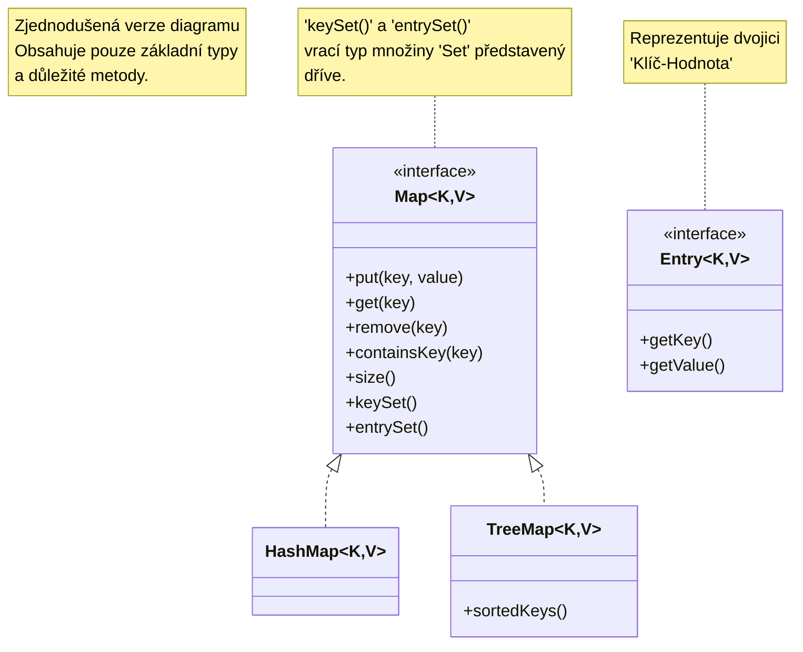

# Mapy

Dalším typem tříd definovaných v Java Collection Framework, jsou mapy. Cílem map je propojit (namapovat) k určitému klíči určitou hodnotu. Jedná se opravdu o zavedené pojmy, kdy klíč a hodnota spolu vytváří uspořádanou dvojici hodnot \<key, value> - tzv. pár. Pro klíč platí, že musí být jedinečný pro každý objekt a nemůže nabývat hodnoty `null`. Oproti tomu hodnota různých klíčů může být shodná a dokonce pro určitý klíč může hodnota nabývat `null`. Typickým příkladem mohou být tedy libovolné dvojice, kde jedna z hodnot je jednoznačným klíčem a druhá hodnotou - například číselný (třeba čárový) kód zboží a jeho cena. Obchod má definované prodávané zboží, kde každé zboží má svůj jedinečný číselný kód (a mít jej musí, zboží bez kódu nepůjde prodat). Oproti tomu cena se u různých kódů může opakovat, nebo dokonce u zboží, které není určeno k prodeji, může mít hodnotu `null`.

V takovém případě se dostaneme do situace, kdy potřebujeme nějakou třídu, která bude tyto hodnoty uchovávat a navíc **v nich bude schopna rychle vyhledávat** prvky **podle klíče**.

Z popisu je zřejmé, že nelze očekávat, že bude existovat více položek se stejným klíčem (takové položky jsou považovány za shodné). Proto je vhodné si ihned uvědomit, že chování klíčů je velmi podobné chování, které nabízejí množiny [#mnoziny](kolekce.md#mnoziny "mention") . Podle implementace (analogicky k množinám) lze použít v Javě dvě základní třídy pro reprezentaci map:

* `HashMap` - kde se pro přístup a vyhledávání přes klíče používá hashe (srovnej s `HashSet`, včetně výhod z toho vyplývajících); používá se tedy v případech, kdy do mapy potřebujeme rychle přidávat či editovat hodnoty, nebo rychle v mapě vyhledávat podle klíče;
* `TreeMap` - kde jsou klíče vždy seřazeny podle přirozeného řazení (srovnej s `TreeSet`, včetně výhod z toho vyplývajících); používá se v případech, kdy potřebujeme, aby byly klíče v mapě seřazeny podle nativního řazení.

Společným předkem obou tříd je obecné rozhraní `java.util.Map`.




Obrázek je opět zjednodušen pro potřeby této studijní opory. Skutečná hierarchie tříd je drobně složitější.


Při práci s mapami se typicky využívají základní metody:

* `put()` - pro vložení páru; funkce má jako argumenty dvě hodnoty - klíč a hodnotu. Pokud klíč neexistuje, bude do mapy vložen s hodnotou. Pokud již klíč v mapě existuje, původní hodnota klíče se nahradí hodnotou novou;
* `get()` - pro získání hodnoty odpovídajícího klíče. Funkce má jako argument hodnotu klíče. Pokud klíč neexistuje, vyhodí běhové prostředí chybu;
* `size()` - pro získání počtu vložených párů do mapy;
* `clear()` - pro smazání obsahu mapy;
* `keySet()` - pro získání všech klíčů ve formě množiny.

Před uvedením příkladu je ještě třeba zmínit poznámku k definici, s jakými typy bude Mapa pracovat. U seznamů a množin bylo uvedeno, že v deklaraci lze explicitně zmínit, pro jaký typ bude daný/á seznam/množina určen/a, a to uvedením typu v lomených závorkách. U map bude použití stejné, ale hodnoty v závorkách budou dvě - první hodnota reprezentuje datový typ klíče, druhá hodnota reprezentuje datový typ hodnoty. Opět, nelze použití primitivní typy a je nutno povinně použít typy wrapovací.

```java
java.util.Map<String, Double> prices = new java.util.HashMap();

// vložení páru: klíč-hodnota
prices.put("RX2948", 23.40);
prices.put("BY2340", 55.60);

// procházení cyklem for-each přes množinu všech klíčů
for(String key : prices.keySet())
  // výpis všech dvojic
  System.out.println("Key: " + key + ", value: " + prices.get(key));
```

Tento kód poskytuje výstup:

```
run:
Key: RX2948, value: 23.4
Key: BY2340, value: 55.6
BUILD SUCCESSFUL (total time: 1 second)
```

Pokud nahradíme při vytváření proměnné s mapu typ `HashMap` za typ `TreeMap`, lze si povšimnout, že stejný výpis bude vypisovat klíče seřazené podle abecedního pořadí.
