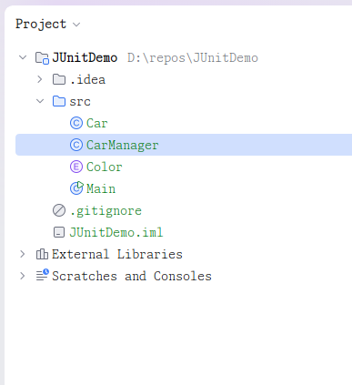
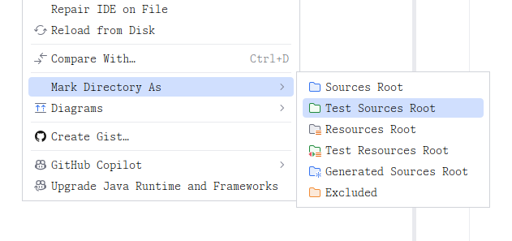
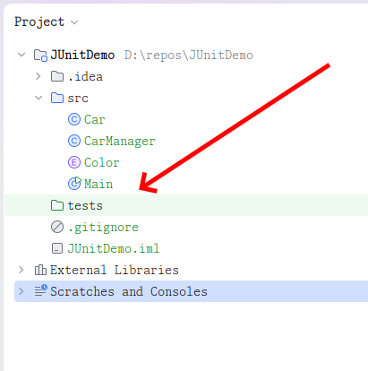
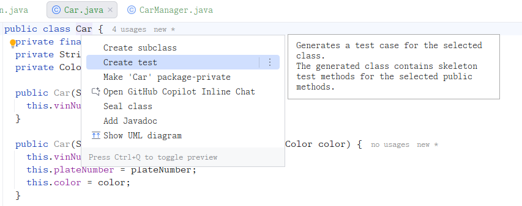
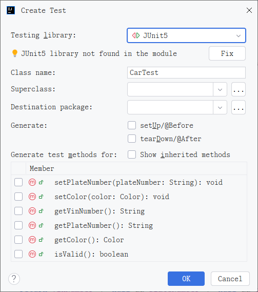
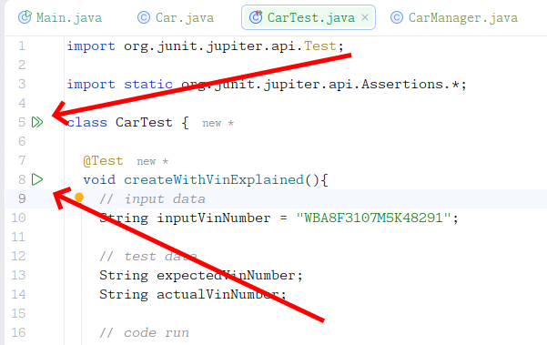
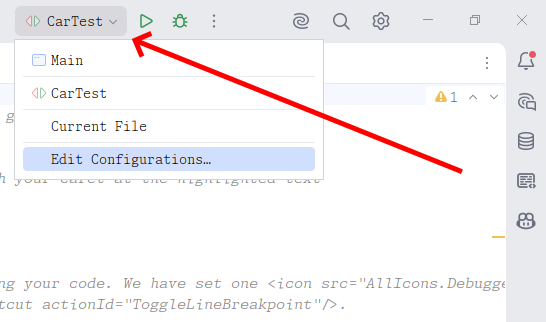
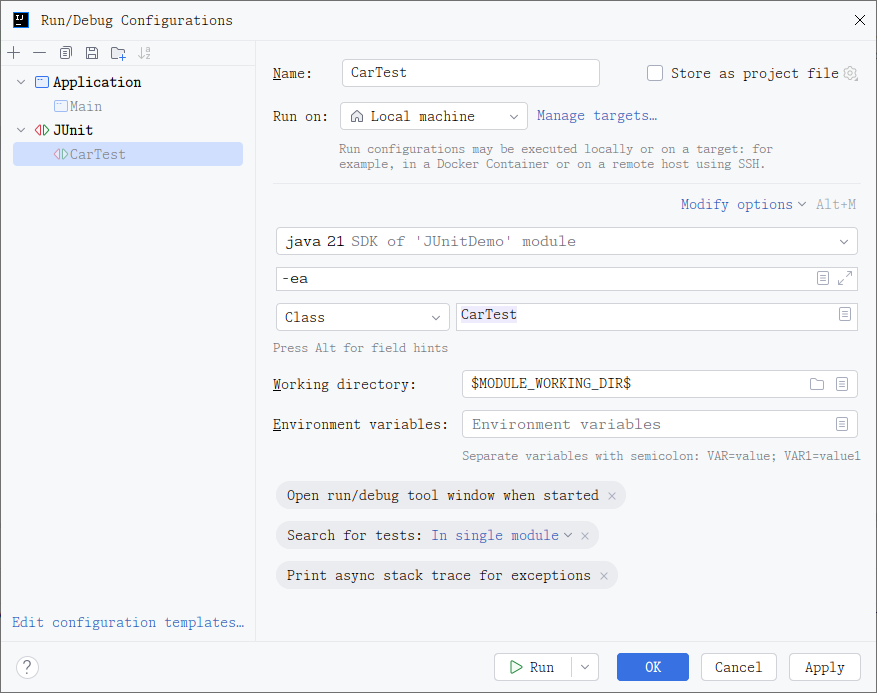
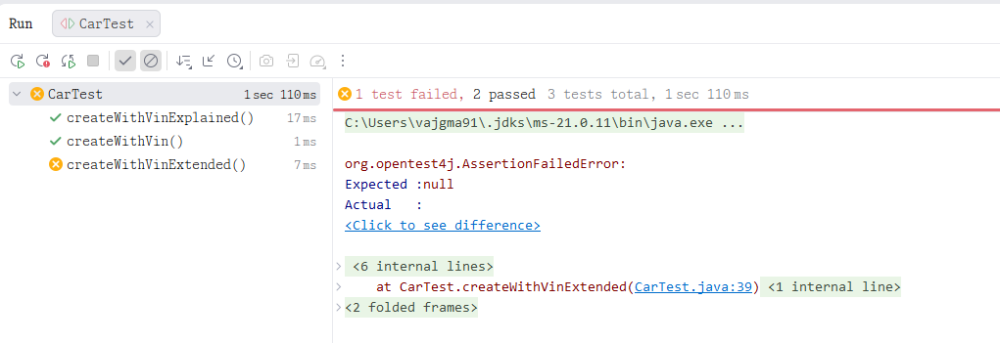

# TODO Testování aplikací

## Testování aplikací

Při vývoji aplikaci musí programátor neustále kód, který vytvoří, kontrolovat na výskyt chyb. V praxi to znamená, že vytvoří nejen implementaci, která provádí požadovanou funkcionalitu, ale také vytvoří zdrojový kód, který tuto funkcionalitu otestuje. V ideálním případě by programátor měl testovat nejen to, že kód pro správné vstupy vykoná požadovaný výsledek, ale také to, jak se bude daný program chovat pro vstupy nesprávné - tedy například zadání data ve špatném formátu, zadání prázdné hodnoty místo očekávané hodnoty textu a podobně. Programátor **nikdy nesmí předpokládat**, že jeho zdrojový kód bude použit pouze správně, a vždy se musí věnovat i případu ošetření chyb. V programovacím jazyce Java je situace o to důležitější, že jazyk Java podporuje kontrolovaný výjimky (viz kapitola Výjimky a jejich zpracování).

Samozřejmě je možné veškeré funkcionality testovat tak, že po jejich napsání upravíme například metodu _main()_ tak, aby nově vytvořenou funkcionalitu spustila a vyzkoušeli tak požadované chování. Tím samozřejmě ověříme, zda všechno funguje tak, jak má, nicméně při vytvoření další části kódu se typicky původní ověřovací kód původní implementace smaže a nahradí se blokem novým, testujícím nový kód.

Vždy tak je aktivní pouze blok, který testuje nově vytvořenou část aplikace, a původní testovací bloky jsou smazány. Tím však nejen že programátor přichází o testovací kód, který dříve vytvořil, přichází také o mechanismus, který je schopen zkontrolovat, že **původně vytvořený kód funguje v pořádku** **i poté, co bylo přidáno či změněno něco jiného**. To je velmi důležité, protože dřívější testy jsou v dalším vývoji schopny zkontrolovat, zda se při změně či rozšíření kódu nezpůsobila omylem chybovost některého z původních bloků kódu.

Je proto vhodné mít možnost testy realizovat systematicky, ponechávat je a moci je automatizovaně spouštět hromadným způsobem, aby se podařilo zjistit, zda po změnách i všechny původní bloky fungují v pořádku. Takový mechanismus přináší knihovna _JUnit_ a princip testy řízeného vývoje, tzv. _TDD_.

### Obecný princip TDD

TDD je obecně technika vývoje softwaru, která spočívá na základě, že nejdříve se naprogramuje test, který ověřuje danou funkcionalitu, teprve potom se provede požadovaná implementace (typicky co nejjednodušším způsobem, aby to „nějak fungovalo" a teprve po ověření se výsledný kód opravuje. Zjednodušeně to lze popsat pomocí bodů:

* Vytvořit test, který ověřuje zatím nefungující funkcionalitu.
  * Tato část je důležitá, protože umožňuje, aby si programátor rozmyslel, **jak** bude daný kód používat, namísto toho **co** bude daný kód dělat. Typickou (špatnou) vlastností programátora je vymýšlení, co to bude dělat - a po implementaci programátor zjistí, že daná metoda/třída funguje správně, leč neposkytuje přesně to, co od ní potřebuje, a musí výsledný kód opravit.
* Spuštěný testu, který **musí selhat**, protože daná funkcionalita ještě vůbec nebude vytvořena.
* Vytvoření nějaké, co nejjednodušší implementace, který by měla způsobit úspěšné spuštění testu.
  * Cílem není napsat dokonalý kód, ale kód, který bude fungovat. Jedná se vlastně o nějaké prototypové ověření, že požadovaná funkcionalita jde vytvořit, že ji lze napsat.
* Spuštění testu, který by měl projít. Pokud test neprojde, vracíme se k bodu 3.
* Refaktoring - to je metoda, kdy se programátor dívá na hotový kód (v daném případě na naprogramovanou implementaci) a vymýšlí, jak jej vyčistit a zlepšit, aby byl čitelnější. Typickými úlohamy je přejmenování proměnných na smysluplnější, dekompozice funkcí na menší, odstranění zakomentovaných bloků kódu a další.
* Spuštění testu, který by měl projít i na refaktorovaném řešení.
* Dokud není programátor spokojený s vytvořenou funkcionalitou, vrací se k bodu 5. V opačném případě je daná funkcionalita implementovaná. **Test se neodstraňuje**, zůstává v balíku testů, které se budou nadále pouštět vždy s přidanou novou funkcionalitou. Pokud nějaký test v budoucnosti neprojde, znamená to, že se podařilo změnit i něco, co bylo naprogramováno dříve a některá část aplikace nyní nemusí fungovat korektně.

Tento princip je obecný, slouží jako motivace k řešení projektů s využitím TDD vývoje.

## Realizace v IntelliJ Idea

### Složka pro testy

Aby mohl testovací framework JUnit i samotné vývojové prostředí správně fungovat, nemůžeme testovací třídy ukládat na libovolné místo v projektu. **Čistá architektura softwaru vyžaduje striktní oddělení produkčního kódu od kódu testovacího.** V praxi to znamená, že testy nikdy nebalíme do výsledného programu (např. do souboru JAR) určeného pro koncové uživatele. Testy potřebujeme pouze během vývoje a v nástrojích pro kontinuální integraci. Z toho důvodu vzniká v projektu paralelní adresářová struktura.

Většina moderních javových projektů postavených na nástrojích Maven nebo Gradle používá standardizované uspořádání. Zatímco produkční zdrojové kódy se nacházejí v adresáři `src/main/java`, pro testy se zakládá sesterská složka `src/test/java`. Pokud student vytváří projekt od nuly ručně nebo pracuje na specifickém zadání, může se stát, že tuto složku (např. s jednoduchým názvem `test` nebo `tests`) musí vytvořit sám. Samotná existence složky na disku však vývojovému prostředí nestačí. IntelliJ IDEA totiž ke každému adresáři v projektu přistupuje na základě jeho specifické role.


Pokud jste projekt zákládali jako klasiký Java projekt v IntelliJ Idea, budete mít vytvouřenou pouze složku na zdrojové kódy - `src`.




V takovém případě do projektu musíme vytvořit novou složku (ideálně na úrovni složky `src`), kterou můžeme nazvat libovolně, ale běžně se používají názv jako `tst` , `test` nebo `tests`.

Pokud nově vytvořené složce pro testy neexplicitně nedefinujeme její význam, IntelliJ IDEA ji považuje za běžný adresář s textovými soubory. IDE v této složce nebude správně doplňovat kód Javy, nebude nabízet automatické importy pro knihovnu JUnit a především u testovacích tříd vůbec nezobrazí zelené spouštěcí šipky.

Proto musíme složku označit jako takzvaný _Test Sources Root_. V IntelliJ IDEA toho docílíme kliknutím pravým tlačítkem myši na danou složku v levém panelu projektu, navigováním na položku _Mark Directory as_ a zvolením možnosti _Test Sources Root_. Jakmile tento krok provedeme, ikona složky v prostředí IntelliJ IDEA změní barvu ze standardní žluté na specifickou zelenou.



Tímto vizuálním tahem dáme vývojovému prostředí najevo, že soubory uvnitř této složky jsou plnohodnotné javové třídy, které mají přístup ke všem produkčním třídám v `src/main/java`, ale zároveň jsou izolovány pro účely testování. IntelliJ IDEA okamžitě přepne daný adresář do režimu plné podpory Javy – začne hlídat syntaktické chyby, správnost balíčků, umožní refaktorizaci a hlavně aktivuje spouštěč testů JUnit. Při automatickém generování testů pomocí klávesové zkratky pak IDE bude přesně vědět, kam má nově vznikající testovací třídy ukládat, a automaticky v zelené složce replikuje balíčkovou strukturu z produkční části projektu.



### Vytvoření vlastního testu

Test můžeme vytvořit dvěma způsoby:

* necháme si ho vygenerovat přes prostředí IntelliJ, které samo vytvoří potřebný soubor a případně nageneruje další kód,
* vytvoříme si ho ručně a kód budeme implmentovat sami.

#### Vytvoření testu ručně

Pro vytvoření testu ručně stačí do složky **s testy** vložit novou třídu (jako klasickou třídu do projektu) a do ní doplnit požadovaný kód. V základu se může jednat o úplně jednoduchou třídu.


Testovací třídy mají typicky postfix `Test`.


```java
public class CarTest {
}
```

Do takové třídy budeme dále psát kód dle potřeby. Je důležité si povšimnout, že třída se opravdu musí vytvořit do testové složky.

#### Vytvoření testu automaticky

Automatické vytvoření testu může být výhodnější - jednak proto, že nemusíme psát potřebný kód, ale také proto, že u nového projektu většinou chybí předinstalovaná knihovna pro testování a automatický proces nám pomůže knihovnu do projektu připojit.

V IntelliJ Idea umístíme kurzur nad název třídy, pro kterou chceme dělat test (v našem případě do názvu `Car`) a otevřeme kontextové menu (Alt+Enter). Z nabídky vybereme položku "Create test".


Pozor, i v tomto případě již musíme mít v projektu vytvořenou a nastavenou testovací složku. V opačném případě nám bude protředí testovací třídy dávat mezi běžné třídy projektu, což je nechtěné chování.




Po potvrzení volby se otevře dialog "Create Test" pro vytvoření testu. V tomto dialogu:

* Můžeme vybrat testovací knihovnu. Pro javu je k dispozici několik testovacích frameworků, my si budeme ukazovat framework "JUnit"; vybereme odpovídající verzi (aktálně verzi 5 nebo 6).
* Můžeme doplnit chybějící knihovnu - symbol 💡 říká, že v projektu chybí odpovídající knihovna. Stiskem tlačítka "Fix" ji do projektu můžeme nechat automaticky přidat (pouze potvrdíme následně otevřený dialog).
* Class Name - udává, jak se bude naše testovací třída jmenovat. Typicky se jmenuje jako původní třída s přidaným postfixem `Test`.
* Superclass - chceme-li, můžeme definovat předka pro naši testovací třídu, který už může obsahovat nějakou předdefinovanou funkcionalitu.
* Destination package - můžeme definovat balíček, do kterého se třída bude vytvářet.



* Varianty `setUp`/`@Before` a `tearDown`/`@After` slouží k vytvoření metod, které se volají před a po testech. Bližší vysvětlení bude uvedeno dále.
* Poslední část okna nabízí zašktávací pole pro automatické generování **koster** testů pro vybrané metody. Můžeme je zvolit a nechat si testy vygenerovat; v našem případě si však testy napíšeme sami.

Po potvrzení dostaneme vytvořenou testovací třídu se základním obsahem a případně vygenerovaným kódem:

```java
import org.junit.jupiter.api.Test;
import static org.junit.jupiter.api.Assertions.*;

class CarTest {
}
```

### Spuštění testu v Idea

Poslední lehce komplikovanou oblastí pro neznalé je spuštění testu. Testy lze spustit:

* Přímo ze zdrojového kódu pomocí zelených šipek
* Vytvořením tzv. konfigurace a spouštěním konfigurace

#### Spuštěním ze zdrojového kódu

Test lze spustit přímo ze zdrojového kódu pomocí zelených šipek. Šipka u názvu třídy spouští všechny testy v rámci dané třídy, šipka u samotného testu spouští konkrétní test.

<figure><figcaption></figcaption></figure>

#### Spuštění přes konfigurace

Když v IntelliJ IDEA klikneme na onu známou zelenou šipku vedle testovací třídy nebo metody, na pozadí se odehraje proces, který vývojové prostředí před uživatelem částečně skrývá. IDE nespouští testy „jen tak“. Pro každý takový klik vytvoří takzvanou spouštěcí konfiguraci (_Run/Debug Configuration_). Spouštěcí konfigurace je v podstatě předpis, recept nebo sada instrukcí, která říká, jakým způsobem, s jakými parametry a v jakém prostředí se má daný kód vykonat.


Spouštěcí konfigurace vlastně říkají, co má Idea spustit v okamžiku, kdy uživatel obecně zvolí položku "Run" či "Debug".

U nových projektů se typicky spouští "Current File" — současný soubor — pokud obsahuje metodu `main()` (a tedy lze spustit).


Princip spouštěcích konfigurací vychází z toho, že spuštění testu v Javě je ve skutečnosti komplexní záležitost. Aby se test vykonal, musí IntelliJ IDEA na pozadí sestavit složitý příkaz pro příkazovou řádku operačního systému. Tento příkaz musí obsahovat přesnou cestu k Java Development Kitu (JDK), nastavení classpath (seznam adresářů a JAR souborů, kde se nachází produkční kód, testovací kód a knihovna JUnit) a samotné argumenty pro spouštěč JUnit. Ruční psaní takového příkazu by bylo pro programátora extrémně zdlouhavé a náchylné k chybám. Spouštěcí konfigurace tento proces plně automatizuje.

V IntelliJ IDEA najdeme správu těchto konfigurací v pravém horním rohu obrazovky, vedle hlavního tlačítka Play. Jakmile klikneme na šipku u konkrétního testu v editoru, IDE automaticky vytvoří _dočasnou_ spouštěcí konfiguraci. Ta dostane název podle testované třídy nebo metody a v seznamu konfigurací se objeví se zašedlou ikonkou. Dočasných konfigurací může mít IntelliJ IDEA uloženo jen omezené množství a ty nejstarší postupně maže, jakmile se spouští nové testy. Pokud však uživatel ví, že určitý test či celou sadu testů bude spouštět velmi často a chce si u nich upravit specifické parametry, může dočasnou konfiguraci jedním kliknutím uložit jako trvalou.



Trvalá konfigurace (a vůbec správa konfigurací) se provádí přes kontextové menu "Edit Configurations".  Otevře se dialogové okno, kde uživatel může pomocí šipky "+" přidat další konfiguraci, nebo v levém menu zvolit existující konfiguraci a upravit její parametry.



Výše uvedený obrázek ukazuje konfiguraci JUnit, která:

* se spouští na lokálním počítači přes javu 21
* má dodatečné parametry `-ea` (pokud znáte v Javě assertions, tak víte, co toto znamená)
* Budet testovat pouze jednu třídu "Class" a to tu uvedenou hned za tímto parametrem - `CarTest`.
* Dalšími parametry lze změnit chování testu.

U testů je běžné, že se nespouští jen jeden konkrétní test nebo jedna třída, ale typicky všechny testy v balíku nebo složce. Proto lze upravit rozbalovací seznam s položkou "Class" a vybrat tam "All in package" nebo "All in directory" a v pravém textovém poli zadat vybranou hodnotu. Potom se bude spouštět celá skupina testů najednou.

Pro uložení konfigurace jako permamentní lze vybrat symbol diskety 💾 napravo od symbolu "+" vlevo nahoře.

Po potvrzení a uložení dialogu pak stačí pouze v rozbalovacím seznamu konfigurací vybrat požadovanou konfiguraci a v IntelliJ Idea vybrat volbu Spustit/Run.



## Tvorba vlastních JUnit testů

### Základy testování

asf


Všechny příkazy _assert….()_ mohou mít jako první, nepovinný, textový parametr, který říká, jaká chybová hláška se má vypsat, pokud test selže.

@Test\
public void testOwnMessage() {\
assertEquals("Toto je vlastní zpráva.", 5, 7);\
}

Tento test selže (5 != 7) a vypíše se vlastní chybová zpráva.

### Testování instancí

asfe

### Testování listů, polí a kolekcí

aslefj

Pole nelze porovnávat jako _assertEquals_, protože dvě pole se mohou v paměti nacházet na odlišných místech a funkce _assertEquals()_ porovnává adresy jejich uložení. Pokud tedy budou dvě pole, obě obsahovat stejné hodnoty, ale budou se nacházet na různých místech v paměti, metoda selže a bude tvrdit, že pole se liší.

@Test\
public void testArray() {\
int \[] a = new int \[]{ 1, 2, 3};\
int \[] b = new int \[] { 1, 2, 3};\
assertEquals(a,b);\
}

Takový test se vrátí s chybou, že očekávaná hodnota byla \[I&53431, ale nalezená hodnota \[I@8674 - tedy, že pole nejsou shodná. Přitom však lze vidět, že pole obsahují stejné hodnoty. Pokud je třeba porovnávat pole (a kolekce) na rovnost jejich jednotlivých prvků, je třeba využít funkce _assertArrayEquals()_.

@Test\
public void testArray() {\
int \[] a = new int \[]{ 1, 2, 3};\
int \[] b = new int \[] { 1, 2, 3};\
assertArrayEquals(a, b);\
}

### Nucené selhání testu

Je-li třeba v určitou chvíli nechat test selhat, lze využít volání příkazu _fail()_. Ten může brát jako parametr informaci o selhání testu. Test je chápán jako úspěšný, **pokud neselhal**, a test může selhat buď při volání funkce _assert…()_, nebo příkazem _fail()_. Pokud tedy vytvoříme prázdnou metodu, ve které se žádné vyhodnocení neprovede, bude tato metoda chápána jako úspěšné projití testu.

Bude-li jednoduchý příklad třídy, která vrací konstantní hodnotu:

public class GetNumber {\
public int getZero(){\
return 0;\
}\
}

Jednoduchý test, který toto ověřuje, může mít klasický výraz _assertEquals(result, 0)_, ale také jej lze zapsat jako:

@Test\
public void testGetZero() {\
System.out.println("getZero");\
GetNumber instance = new GetNumber();\
int result = instance.getZero();\
if (result != 0)\
fail();\
}

Příkaz _fail()_ způsobí selhání testu. Jiné vyhodnocení testu se nevyskytuje, takže v opačném případě bude test chápán jako úspěšný. Tato technika se používá ve složitějších případech, kdy je složité, nebo nemožné napsat ohodnocení pomocí metody _assert…()_.
