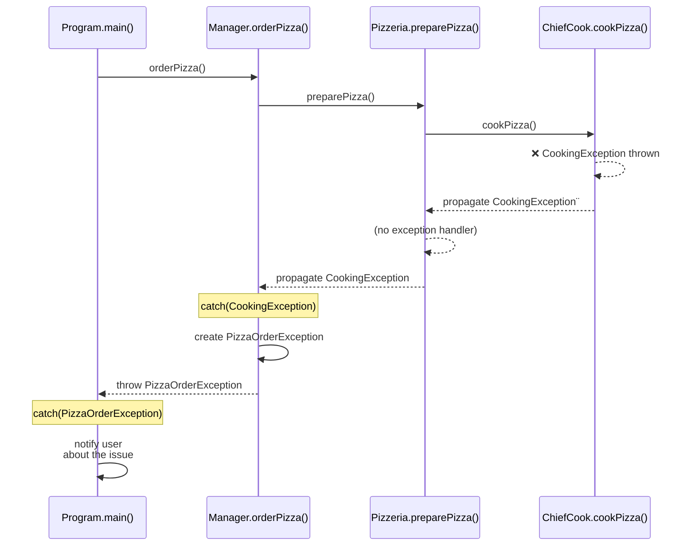
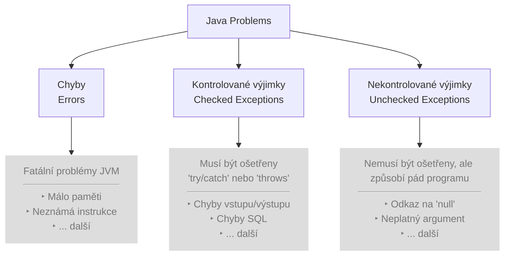
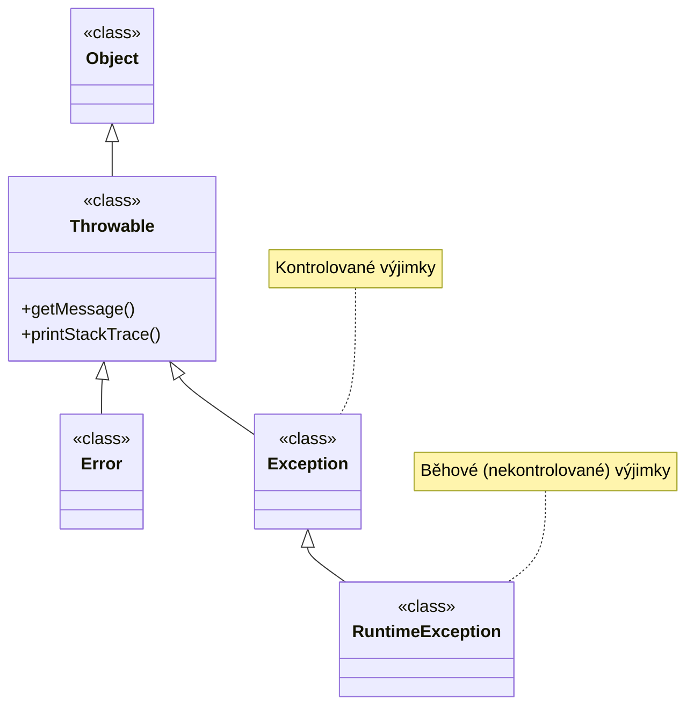
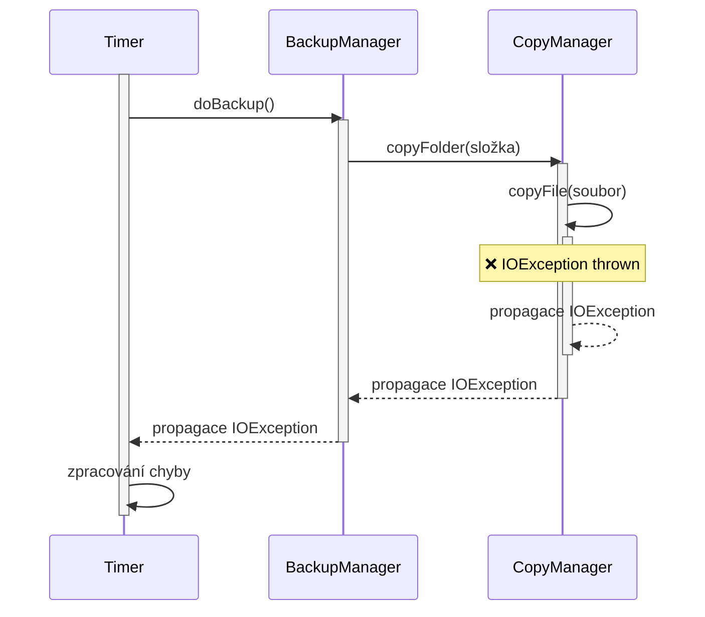
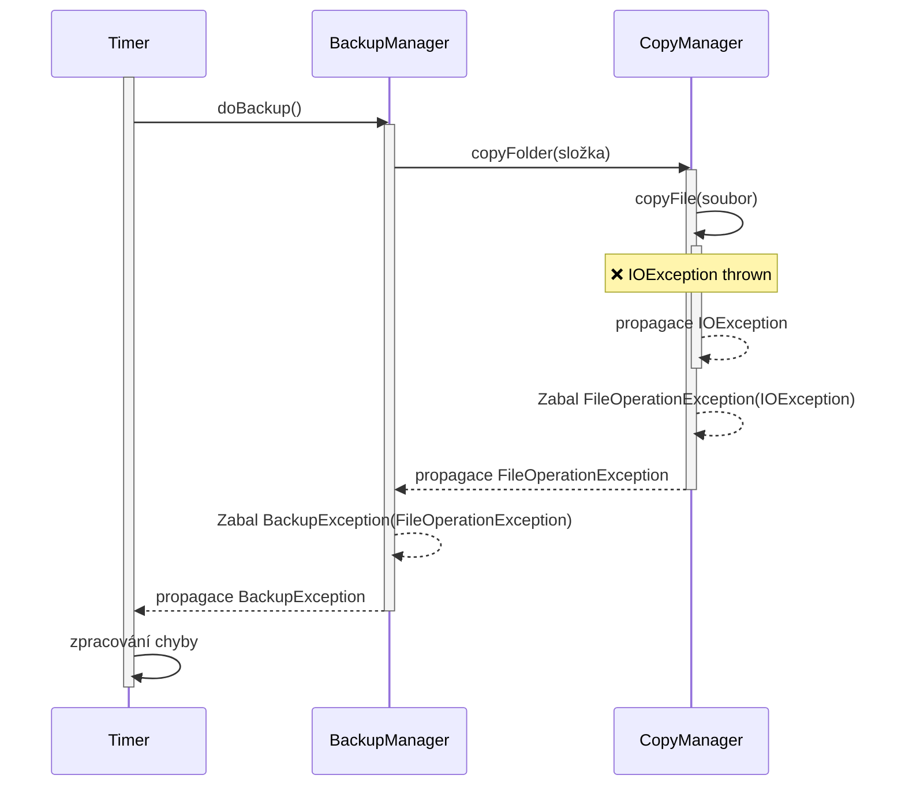

# Výjimky

Výjimky jsou základním mechanismem v Jazyce java pro zpracování chybových stavů. Protože při programování běžných aplikací se jejich použití nikdy nelze vyhnout, je třeba důkladně a dokonale porozumět principu jak vznikají a jak se zpracovávají.

Dle definice je výjimka „_událost, která nastane při zpracování programu a která přeruší běžný tok instrukcí programu_".

Každý program běží jako vykonávaná metoda (typicky `main()`), která následně volá další a další metody ostatních objektů. Tyto metody po provedení svého kódu předají vykonávání zpět nadřazené metodě. Seznamu aktuálně do sebe zanořených metod se říká _zásobník volání_ (call stack).

Pokud v určité metodě dojde k chybě, která způsobí vyvolání výjimky, běhové prostředí v metodě vytvoří objekt popisující tuto chybu a místo vzniku. Tento objekt se poté předává zpět nahoru volanými metodami až do nalezení prvního tzv. _handleru_, který umí danou výjimku ošetřit.



Pokud žádná metoda ošetření neprovede, program spadne za běhu a uživateli se objeví kritická chybová hláška o činnosti programu.

Protože Java je objektově orientovaný programovací jazyk, výjimka jako objekt je reprezentována jako instance třídy `Throwable`, nebo některého z jejich potomků.

Obecně se v Javě vyskytují tři typy výjimek:

* Kontrolované výjimky (checked exceptions) - jedná se o chybové stavy, které by měla dobře napsaná aplikace být schopna ošetřit a korektně se z nich zotavit. Příkladem může být pokus o smazání neexistujícího souboru, reakce na chybové vstupy uživatele, ošetření náhle nedostupných zařízení nebo výpadků v síťovém připojení. Program na tyto chyby umí zareagovat a korektně uživatele informovat o problému. Při správném zachycení program pokračuje korektně (s případnými omezeními) dále. Kontrolované výjimky jsou všechny výjimky vyjma těch uvedených v dalších dvou bodech.
* Běhové výjimky (runtime exceptions) - jedná se o chyby v rámci aplikace, které typicky vznikají kvůli programátorským chybám. Patří zde aritmetické chyby (dělení nulou), špatné použití indexů (mimo rozsah pole), použití `null` objektu k vyvolání metod a další. Aplikace se typicky z této chyby nedokáže zotavit. Pokud je však taková chyba zachycena, programátor může opravit logiku aplikace, aby její výskyt nemohl příště nastat (opravou kódu, omezením vstupu od uživatele apod.). Běhové výjimky reprezentují potomci třídy `RuntimeException`.
* Chyby (errors) - jedná se o fatální stavy typicky způsobené prostředím vně aplikace. Příkladem může být odepření přístupu k paměti, chyba ve virtuálním stroji, neplatná instrukce, selhání hardware a podobně. Z těchto chyb se aplikace typicky nedokáže smysluplně zotavit a po pádu kvůli této výjimce její běh končí. Tyto výjimky se typicky neošetřují, protože programátor je nemůže předpokládat, ani smysluplně ošetřovat. Chyby reprezentují všechny třídy dědící z předka `Error`.

Výjimky lze tedy rozdělit do skupin dle následujícího obrázku.



Souvislost se skupinami vychází i dělení výjimek podle hierarchie dědičnosti jednotlivých tříd, ze kterých dané výjimky vycházejí. Pozor, že tato **hierarchie tříd nekoresponduje s hierarchií typů výjimek**.



Každá výjimka je tedy reprezentována **instancí třídy**, která je přímým nebo nepřímým potomkem třídy `Throwable`:

* Pokud se jedná o potomka třídy `Error`, jedná se o chybu.
* Pokud se jedná o potomka třídy `RuntimeException`, jedná se o běhovou výjimku.
* V ostatních případech se jedná o kontrolovanou výjimku.

Od každé základní výše uvedené třídy pak existuje spousta potomků, kteří reprezentují specifičtější případy různých chyb.

```
Object
└── Throwable
    ├── Error
    │   ├── VirtualMachineError
    │   │   ├── OutOfMemoryError
    │   │   ├── StackOverflowError
    │   │   ├── InternalError
    │   │   └── UnknownError
    │   ├── AssertionError
    │   ├── NoClassDefFoundError
    │   ├── ExceptionInInitializerError
    │   └── ...
    │
    └── Exception
        ├── IOException
        │   ├── FileNotFoundException
        │   ├── EOFException
        │   ├── SocketException
        │   └── ...
        ├── SQLException
        ├── ClassNotFoundException
        ├── InterruptedException
        ├── ReflectiveOperationException
        │   ├── InstantiationException
        │   ├── IllegalAccessException
        │   └── InvocationTargetException
        │
        └── RuntimeException
            ├── NullPointerException
            ├── IllegalArgumentException
            │   ├── NumberFormatException
            │   └── IllegalChannelGroupException
            ├── IndexOutOfBoundsException
            │   ├── ArrayIndexOutOfBoundsException
            │   └── StringIndexOutOfBoundsException
            ├── ArithmeticException
            ├── ClassCastException
            ├── IllegalStateException
            ├── ConcurrentModificationException
            ├── UnsupportedOperationException
            ├── SecurityException
            ├── TimeoutException
            ├── CompletionException
            └── ...
```


Tabulku není třeba studovat, slouží jen pro ilustraci.


## Proč / Kdy zachytávat výjimky

Při návrhu a implementaci softwaru je správná práce s výjimkami klíčová pro stabilitu a čitelnost kódu. Častou chybou (zejména začátečníků) je:

* I) Nezachytávání výjimek - začátečníci často nezachytávají výjimky v případech, kdy je není možné vyřešit. Je však důležité si uvědomit, že v určitých případech je vhodné k existující výjimce doplnit nějaké dodatečné info, které později pomůže k identifikaci a řešení chyby (např. který soubor způsobil chybu, do které tabulky v databázi se zapisovalo, který uživatel vyvolal neúspěšnou operaci mazání).
* II) Zachytávání výjimek - začátečníci často také zachytávají výjimky, kdy to není nutné, protože nejsou schopni stav napravit, ale "nějaké učební texty/učitelé/tutorialy" říkaly, že výjimky se mají zachytávat. Pak většinou dochází k tomu, že buď vznikne násilné ošetření chyby na místech, kde to není vhodné, nebo se výjimka vyhodí podruhé, čímž se maskuje původní problém.

Základní a nejdůležitější pravidlo pro zachytávání výjimek zní:

> Výjimku zachytávejte pouze tehdy, pokud s ní dokážete v daném místě programu udělat něco smysluplného.

Pokud pro vzniklou chybu nemáte okamžité řešení nebo interpretaci, je nejlepším postupem nechat ji volně „probublat“ do vyšších vrstev aplikace, kde bude zpracována globálně (například zalogována a uživateli bude zobrazeno obecné chybové hlášení). Bezhlavé chytání každé chyby kód pouze znepřehledňuje a maskuje skutečné problémy.

Existují v zásadě pouze dva legitimní důvody, proč byste měli výjimku v kódu zachytit:

* **Vyřešení** - Oprava chybového stavu a pokračování v běhu: Tímto způsobem reagujete na situaci, kterou aplikace dokáže vyřešit a bezpečně pokračovat dál. Typickým příkladem je situace, kdy selže připojení k primární databázi, vy výjimku zachytíte a v bloku catch aplikaci přesměrujete na záložní (read-only) server. Aplikace sice běží v omezeném režimu, ale nespadla a funguje smysluplně dál.
* **Přidání kontextu** - Rozšíření informace o výjimce (a typicky zabalení do specifické )vlastní) výjimky): Někdy potřebujete výjimku zachytit na rozhraní určité vrstvy, abyste ji obohatili o kontext nebo ji transformovali na doménově specifickou chybu. Pokud například nízkoúrovňová knihovna vyhodí `IOException` při čtení konfiguračního souboru, v aplikační logice tuto chybu zachytíte a přebalíte ji do vlastní `ConfigurationLoadException`. Tímto krokem schováte implementační detaily a vyšším vrstvám předáte srozumitelnější informaci o tom, co se z pohledu byznys logiky stalo. Můžete často doplnit další důležité informace (jaký soubor selhal, který uživatel operaci prováděl, jaká data se nepodařilo zpracovat).


#### Častý antipattern I: Zachycení a bezhlavé přeposlání

Velkým nešvarem v programování je takzvané „přehazování horkého bramboru“. Jde o situaci, kdy vývojář výjimku zachytí, ale nijak ji nezpracuje a pouze ji znovu vyhodí dál (např. pomocí konstrukce `throw e;` v některých jazycích).

```java
void mojeMetoda() throws Exception
{
    try
    {
        nizkourovnovaMetoda(); // Zde dojde k chybě
    }
    catch (Exception ex)
    {        
        throw ex; // ztráta původního kontextu chyby
    }
}
```

Toto chování vlastně nic nedělá, proože zachycenou výjimku v původním stavu předáváme dále, takže jen vytváříme komplikovaný kód, který by se bez try/catch choval stejně.



## **Častý antipattern II: Zabalení kontrolované výjimky nekontrolovanou**

Další variantou je stav, kdy se programátor chce zbavit nutnosti kontrolovat výjimky a rychle ji zabalí pomocí nekontrolované. Tento mechanismus nemusí být nutně úplně špatně, pokud programátor korektně předá veškeré související informace. Nevhodné je ale jen jednoduché zabalení, často ještě bez vložení původní výjimky dovnitř (chained exception — bude vysvětleno později):

```java
void mojeMetoda()
{
    try
    {
        nizkourovnovaMetoda(); // Zde dojde k chybě
    }
    catch (Exception ex)
    {        
        throw new RuntimeException(); // zcela ztráta původní chyby
    }
}
```

V tomto případě je původní chyba `ex` zcela ztracena. Lepší (leč ne o moc) variantou je alespoň zabalení původní výjimky `throw new RuntimeException(ex);`



## Častý antipattern III: Skrytí výjimky

Naprosto fatální chybou je vypsání výjimky na konzoli (kromě případů, kdy je to očekávané), případně její úplné skrytí.

Tato varianta typicky vzniká u začátečníků, buď když se výjimky pro jedoduchost chtějí zcela zbavit:

```java
void mojeMetoda()
{
    try
    {
        nizkourovnovaMetoda(); // Zde dojde k chybě
    }
    catch (Exception ex)
    {        
        // skryje výjimku a běh pokračuje dále
    }
}
```

Nebo ve variantě, kdy ji vypíší na konzoli, ale dále neřeši.

```java
void mojeMetoda()
{
    try
    {
        nizkourovnovaMetoda(); // Zde dojde k chybě
    }
    catch (Exception ex)
    {        
        System.out.println("Něco se nepovedlo." + ex);
    }
}
```

V obou případech se může stát, že si vzniklé chyby nikdo nevšimne, zůstane skryta a aplikace běží na první pohled dále. Důsledky pak samozřejmě mohou být fatální (uložení dokumentu se neprovede, data se nepošlu), protože uživatel (a často ani programátor) netuší, že se něco nepovedlo či neprovedlo.

Jak často se například díváte na konzoli na mobilním telefonu, zda tam nějaká aplikace nevypsala chybu?

**Pozor: Ve skriptech často budeme v bloku `catch` používat výpisy na konzoli, ale toto je pouze pro ilustrační příklady.**



Kdy teda mohu v `catch` psát na konzoli?

Záleží na kontextu v aplikaci.

* Pokud jsem ve třídě, která se "baví" s uživatelem, píše mu zprávy na konzoli, žádá ho o vstupy a komunikuje s ním, je v pořádku na této úrovni napsat uživateli z `catch` na konzoli, že se něco nepovedlo.
* Pokud jsem ale ve třídě, která je například součástí knihovny ukládající data na disk, a o uživateli a uživatelském rozhraní nic netuším, nemohu psát na konzoli. Co když je aplikace, ve které je kód použit, webová? (Pak se konzole píše na server a uživatel ji neuvidí.) Co když to je mobilní aplikace? Pokud nejsem třída, která má "právo" bavit se s uživatelem přes UI, na konzoli bych neměla psát nikdy.



Přecházíte z .NET a C#? Pozor, že v .NET se `throw ex;` chová jinak než v Javě a použití `throw ex;` je v .NET velmi špatná praktika. Pokud v .NET chcete přehodit výjimku se zachováním průběhu volání, musíte používat pouze `throw;`. V Javě samotné `throw;` použít nejde a musíte vždy pokračovat instancí výjimky, tedy např.: `throw ex;`.


## Zachytávání výjimek

Zachytávat lze všechny typy výjimek, povinně se však zachytávají pouze výjimky kontrolované.

Výjimky zachyhtáváme použitím konstrukce `try-catch-finally`, která je základním stavebním kamenem pro ošetření chyb v moderních programovacích jazycích. Umožňuje nám oddělit samotnou „šťastnou cestu“ programu (standardní běh kódu) od logiky, která řeší mimořádné a chybové stavy.

```java
try {
    // TRY: Zkoušíme otevřít a přečíst soubor
    soubor = new FileReader("config.txt");
    int data = soubor.read();
    System.out.println("První znak v souboru: " + (char)data);
} 
catch (IOException ex) {
    // CATCH: Zachytíme pouze jednu obecnou chybu při práci se souborem
    System.out.println("⚠️ Nepodařilo se přečíst soubor: " + ex.getMessage());
} 
finally {
    // FINALLY: Tento kód se spustí VŽDY, abychom uvolnili paměť a zavřeli soubor
    // Pouze pro ilustraci, dnes se to řeší jinak.
    if (soubor != null) {
        try {
            soubor.close();
            System.out.println("🧹 Soubor byl úspěšně zavřen.");
        } catch (IOException e) {
            System.out.println("Chyba při zavírání souboru.");
        }
    }
}
```


Opět připomínáme, že výše uvedený příklad píše v `catch` na konzoli pouze z ilustrativních příkladů. Jak to udělat lépe/správně uvidíte v dalším textu.


Bez této konstrukce by jakákoliv neočekávaná chyba (např. chybějící soubor nebo výpadek sítě) vedla k okamžitému pádu celé aplikace. Díky tomuto mechanismu můžeme chybu kontrolovaně zachytit, bezpečně na ni zareagovat a zajistit, že program bude pokračovat v činnosti nebo se korektně ukončí.

Zde je podrobné vysvětlení jednotlivých částí, ze kterých se tento blok skládá:

* `try` (Zkus provést): Do tohoto bloku uzavíráme kód, u kterého hrozí, že by mohl vyvolat výjimku (např. čtení z databáze, parsování uživatelského vstupu nebo síťová komunikace). Program se pokusí tyto instrukce standardně vykonat. Pokud vše proběhne v pořádku, blok `catch` se zcela přeskočí. Pokud však na libovolném řádku uvnitř bloku `try` dojde k chybě, vykonávání běžného kódu se okamžitě přeruší a řízení se předá dál.
* `catch` (Zachyť a vyřeš): Tento blok slouží jako „záchranná síť“. Vstoupí se do něj pouze v případě, že uvnitř bloku `try` došlo k výjimce. V bloku `catch` definujeme, jak chceme na konkrétní chybu reagovat – můžeme zde zapsat chybu do logu, zobrazit uživatelsky přívětivé varování, nebo se pokusit o náhradní řešení (např. načtení výchozích dat). Můžeme mít dokonce více bloků `catch` za sebou pro různé typy výjimek (např. zvlášť pro chybu sítě a zvlášť pro chybu v databázi).
* `finally` (Ukliď po sobě): Kód v tomto bloku se spustí vždy, bez ohledu na to, zda k nějaké výjimce došlo, nebo ne (tedy jak po úspěšném dokončení bloku `try`, tak po zpracování chyby v bloku `catch`). Tento blok je naprosto klíčový pro uvolňování systémových prostředků. Typicky se zde zavírají otevřené soubory, ukončují se síťová spojení nebo se uzavírají databázové transakce. Tím se předchází takzvaným „únikům paměti“ (memory leaks), kdy by aplikace držela uzamčené prostředky i po svém selhání.


Díky moderním technikám a alternativním přístupům (zejména `try-with-resources` — bude vysvětleno dále) se dnes klíčové slovo `finally` používá spíše výjimečně.


Pro zachytávání **kontrolovaných** výjimek se používá v Javě zvláštní pravidlo, které se nazývá _Catch Or Specify Requirement_. Toto pravidlo říká, že **pro každou kontrolovanou výjimku musí platit jedna z následujících variant:**

* **Catch -** místo vyvolání výjimky je uzavřeno v bloku `try`{…}`. K tomuto bloku musí být bezprostředně připojen blok` catch {…}\`, který umí ošetřit a zotavit program při vzniku této výjimky.
* **Specify -** metoda, který vyvolává tuto výjimku, musí explicitně ve své deklaraci (úvodním řádku) definovat, že tuto výjimku vyvolává, pomocí klíčového slova `throws` následovaným seznamem vyvolávaných výjimek oddělených čárkou.

\{% hint style="info" %\} Pozor, odlišujte klíčová slova `throw` a `throws`. Mají různý kontext i význam. \{% endhint %\}

Obě varianty budou vysvětleny dále.

### Catch requirement

Výjimka se zachytává do sekvence bloků `try{…} catch{…} finally{…}`, kde platí, že:

* Blok `try` musí být právě jeden;
* Bloků `catch` může být více, ale každý musí platit pro odlišný typ výjimky (bude vysvětleno dále);
* Blok `finally` je nepovinný.

Blok `try` kontroluje kód na vznik výjimky. Pokud je nějaký výjimka vyvolána, řízení se předá do bloku `catch` odpovídajícího typu výjimky. Pokud existuje i blok `finally`, vykoná se vždy buď po úspěšném ukončení bloku `try` nebo po ukončení odpovídajícího bloku `catch`, a to i v případech, že blok `catch` obsahuje odskok pryč (například klíčovým slovem `return`, `break` či `continue`).

```java
try{
    // prikazy, ktere mohou vyvolat vyjimku
}
catch (Exception ex){
    // zachyceni vyjimky a zpracovani
    // informace o chybe jsou v promenne "ex"
}
finally {
    // nepovinny blok, ktery se provede vzdy po bloku try nebo catch
}
```

Blok `try` může pokrývat několik příkazů (volání funkcí), není tedy třeba pro každou funkci, o které víme, že bude vyvolávat kontrolovanou výjimku, vytvářet vlastní sekvenci try-catch(-finally). Oproti tomu je vhodné, aby jeden blok `try` pokrýval určitou část "chybové problematiky". Nedává smysl uzavřít celou aplikaci do jednoho bloku `try`, protože pak jsme schopni z kontextu `try` říct jen obecnou chybu "někdy se něco pokazilo".

Blok `catch` je oproti ostatním blokům konstrukčně složitější a specifičtější. Za klíčové slovo `catch` se do závorek (obdobně jako parametr funkce) musí zapsat datový typ (třída) zachytávané výjimky a proměnná, do níž se výjimka uloží. Typicky se uvádí zápis:

```java
catch (Exception ex)
```

, kde `catch` je klíčové slovo, `Exception` je typ zachytávané výjimky, a `ex` je název proměnné, do které bude uložen objekt reprezentující danou výjimku. Typ výjimky musí být vždy buď třída `Throwable` nebo nějaký její přímý či nepřímý potomek. Jeden blok může zachytávat více typů vyjímek (tehdy se typy oddělují pomocí znaku „svislítka" - `|`, nebo bloků `catch` může být uvedeno více (zapisují se pod sebou) a každý bude mít definován odlišný typ výjimky, který může zachytit.

```java
try {
    int a = 0;
    int b = 0;
    int c = a / b; // dělení nulou
} catch (IllegalArgumentException | NullArgumentException ex) {
    System.out.println("-IllegalArgumentException-or-NullArgumentException-");
} catch (RuntimeException ex) {
    System.out.println("-RuntimeException-");
} catch (Exception ex) {
    System.out.println("-AnyCheckedException-");
} catch (Throwable ex) {
    System.out.println("-AnyThrowable-");
}
```

Zde:

* První blok `catch` zachycuje pouze výjimku třídy `IllegalArgumentException` - což je výjimka, kterou vyvolávají některé funkce v případech, kdy se jim předá nesprávný parametr, **nebo** `NullArgumentException` (naše fiktivní výjimka, která se volá, pokud je argument nečekaně `null`.
* Druhý blok `catch` zachycuje všechny běhové výjimky (v našem případě zde dojde k zachycení dělení nulou, které se provádí v bloku `try`).
* Třetí blok zachycuje obecně všechny kontrolované výjimky.
* Čtvrtý blok zachycuje obecně všechny ostatní výjimky, jaké mohou v programu nastat.

Lze si povšimnout, že i když je povinné zachytávat pouze kontrolované výjimky, tak zachytit lze úplně všechny výjimky (s využitím třídy `Throwable`).

### Specify requirement

Sekvence try-catch(-finally) předpokládá, že programátor v bloku `catch` umí odstranit problémy způsobené se vznikem výjimky a uvést program do stavu, ve kterém bude schopen fungovat korektně dále.

Například - uživatel zadá soubor ke kopírování, cílový soubor však existuje. Vyhodí se výjimka, která říká, že cílový soubor nelze přepsat. Programátor zobrazí uživateli dialog, že soubor nelze přepsat a program sám pokračuje korektně dále, byť se daná operace neprovede. (Mimochodem, kdyby tento případ ošetřen nebyl, celá aplikace by spadla na kritickou chybu a ukončila by se, což by běžného uživatele jistě nepotěšilo.)

Ne vždy je však programátor schopen (na daném místě) provést korektní zotavení z chyby a uvést program do konzistentního stavu. Například při práci s databází může selhat operace vložení hodnoty do tabulky, protože uživatel zadal číslo, které neodpovídá požadovanému rozsahu. Ve funkci, která vložení provádí, se však programátor nemůže zeptat uživatele, co má s danou chybou dělat (zda například nechce zadat jinou hodnotu), protože taková operace může typicky běžet na úplně jiném počítači - databázovém serveru, než na kterém požadavek na uložení dat vznikl. Programátor tedy v tuto chvíli nemá k dispozici prostředek, jak korektně provést uložení dat a výjimku smysluplně ošetřit.

**Pokud programátor nemá způsob, jak smysluplně ošetřit danou výjimku v metodě, ve které se nachází, může ji předat výše** (nadřazené metodě v zásobníku volání), a ta může zkusit zpracování provést (nebo výjimku předat ještě výše) - tomuto procesu se říká _**propagace**_ výjimky.

```java
/**
 * Vrací velikost souboru v bytech.
 * @param fileName Název souboru
 * @return Velikost souboru v bytech.
 * @throws java.io.IOException Vyvolá chybu, pokud soubor neexistuje.
 */
public static long getFileSize (String fileName)
        throws java.io.IOException {  // <-- propagace výjimky pomocí `throws`

    // vytvoreni pomocneho objektu pro praci se souborem
    java.nio.file.Path filePath = java.nio.file.Paths.get(fileName);
    
    // zjisteni velikosti souboru
    // tato operace vyvola chybu, pokud soubor neexistuje !
    long ret = java.nio.file.Files.size(filePath);
    
    return ret;
}
```

Výše uvedený příklad ukazuje funkci, která vrací velikost souboru (tato problematika bude vysvětlena dále ve studijní opoře - zaměřeno bude tedy pouze na problematiku zpracování chyby). Pro zjištění velikosti využije funkci `java.nio.file.Files.size` - tato funkce však v případě, kdy soubor neexistuje, spadne na výjimce `java.io.IOException`. Jak víme, můžeme buď výjimku zachytit pomocí bloku try-catch(-finally) — ale jak? Programátor na této úrovni nemá způsob, jak smysluplně výjimku zachytit. Proto ji zpracovávat nebude, ale do záhlaví funkce připíše `throws java.io.IOException`. Tato výjimka se bude tedy z této metody posílat výše do nadřazené/ých metod, dokud nedojde k jejímu zpracování, nebo k pádu programu (pokud nebude ošetřena nikde).


Lze kontrolovanou výjimku nezotavit? Hypoteticky můžete výjimku propagovat dokolečka až do funkce `main()`, jejíž deklaraci můžete mít napsanou jako `public static void main() throws IOException`. V tu chvíli můžete v `main()` vyvolat výjimku `IOException` a nezpracovávat ji, protože jste řekli, že `main()` ji bude propagovat výše.

V reálu však samozřejmě aplikace při vyvolání výjimky spadne, protože nad `main()` už není nikdo, kdo by ji zachytil.

Obecně tedy nelze doporučit klauzuli `throws` u funkce `main()` vyjma demonstrační, prototypovací a testovací účely.


### Běhové vs. kontrolované výjimky

V úvodu kapitoly bylo zmíněno dělení na běhové a kontrolované výjimky. Jejich odlišnost je jednak z pohledu hierarchie tříd: běhové výjimky jsou potomky třídy `RuntimeException`, zatímco kontrolované výjimky „jen" třídy `Exception`.

Druhou odlišností je potřeba a způsob zachytávání:

* Pokud metoda vyvolává kontrolovanou výjimku, musí za deklarací obsahovat příkaz `throws typKontrolovaneVyjimky`. Pokud metoda vyvolává běhovou výjimku, není třeba ji deklarovat příkazem `throws`. (Nicméně je to volitelné, a pokud chceme, můžeme blok `throws` dopsat i pro běhovou výjimku.)
* Programátor může libovolně vyhazovat výjimky jak běhové, tak kontrolované, a to vždy příkazem `throw instanceVýjimky`, tj. např. `throw new Exception()` — viz dále.
* Programátor **musí** zachytávat všechny vyvolané nebo propagované **kontrolované** výjimky. Vyvolaná kontrolovaný výjimka je taková, která se v kódu vyvolá pomocí příkazu `throw instanceVýjimky`. Propragovanými kontrolovanými výjimkami myslíme volání metod, která za svou deklarací uvádějí `… throws typVýjimky`. Na druhou stranu programátor pouze **může** zachytávat běhové výjimky. Pokud je zachytávat bude, je řešení shodné jako u výjimek kontrolovaných. Pokud programátor nebude zachytávat běhovou výjimku a ta při běhu programu vznikne a nebude zachycena žádným blokem `catch`, způsobí pád programu.

## Vyhození výjimky

Výjimky nemusí vyvolávat pouze hotové knihovny, ale může je vyvolávat samozřejmě sám programátor. (Ony knihovny na to ostatně používají stejný mechanismus, jako je vysvětlen zde). Pro vyvolání potřebuje klíčové slovo `throw` a **instance** třídy výjimky, kterou chceme vyvolat.

Typicky se vyvolávají výjimky dvěma způsoby:

* Původní výjimka, která se zachytí v bloku `catch`. V bloku `catch` se provedou nějaké úpravy (například logování chyby) a původní výjimka se vyhodí do nadřazeného bloku;
* Nová výjimka, kterou programátor vytvoří.

První způsob je velmi jednoduchý. V bloku `catch` zachytíme výjimku, typicky provedeme nějaké pomocné operace (jako uvedení třídy do korektního stavu, logování chyby, odeslání zprávy o chybách apod.) a následně **původní** výjimku beze změny vyhodíme do vyššího bloku, pomocí klíčového slova `throw` následovaného objektem výjimky (viz tučný text).

```java
try{
    methodToRaiseException();
} catch (Exception ex){
    // provedeme operace, například logování
    throw ex; // <-- zde vyhazujeme původní výjimku
}
```

Tento způsob je velmi rychlý a jednoduchý. Nevýhodou je, že nejsme schopni doplnit bližší informace o chybě do existující instance třídy výjimky.

U druhé, složitější varianty musí programátor sám vytvořit instanci třídy `Exception` (resp. některého z jejich potomků) a zajistit naplnění tohoto objektu smysluplnými informacemi o původu chyby.

Začínající programátoři nejčastěji používají obecnou třídu `Exception`, je však vhodné u výjimek zkoumat, zda neexistuje určitá specifičtější, která by byla jako nositel informace o chybě vhodnější. Případně je možné dokonce vlastní výjimku (ve smyslu třídy) vytvořit (bude popsáno dále).

Ještě jednou je důležité zdůraznit, že se vyvolává **instance třídy** a nikoliv třída samotná. Proto ve většině případů za klíčovým slovem `throw` ještě následuje slovo `new` a teprve potom konstruktor dané třídy.

```
throw new Exception();
```

Naprostá většina výjimek má přetížený konstruktor, který jako jeden z argumentů přijímá řetězec, kam může programátor zadat text blížší popis chyby.

```
throw new Exception("Vyhození testovací výjimky");
```

Pro vyhozenou výjimku platí stejné pravidlo _Catch Or Specify Requirement_, tzn. výjimka musí být vyvolána buď v bloku try-catch(-finally), nebo metoda, v níž je vyvolána, obsahuje klíčové slovo `throws` s doplněním typu výjimky. Protože typicky programátor nevyvolává výjimku, aby ji hned zachytával, používá se v drtivé většině případů druhý způsob. Následující příklad ukazuje pozměněnou metodu zjišťující velikost souboru, kdy programátor doplnil ošetření, zda parametr s názvem souboru není `null`.

```java
 /**
 * Vrací velikost souboru v bytech.
 * @param fileName Název souboru
 * @return Velikost souboru v bytech.
 * @throws java.io.IOException Vyvolá chybu, pokud soubor neexistuje.
 */
public static long getFileSize2 (String fileName)
        throws java.io.FileNotFoundException, java.io.IOException{
    if (fileName == null)
        throw new java.io.FileNotFoundException("Filename is null.");
    // vytvoreni pomocneho objektu pro praci se souborem
    java.nio.file.Path filePath = java.nio.file.Paths.get(fileName);
    // zjisteni velikosti souboru
    // tato operace vyvola chybu, pokud soubor neexistuje !
    long ret = java.nio.file.Files.size(filePath);
    return ret;
}
```

## Zjištění informaci o výjimce

Jak bylo zmíněno na začátku kapitoly, instance třídy `Throwable`, která je zachycena v bloku `catch`, obsahuje informace o místu vzniku chyby, důvodu vzniku chyby a případné další informace.

Dvě základní informace, které je třeba u většiny výjimek získat, abychom byli schopni rozhodnout, jak s danou výjimkou naložit, jsou:

* Přesný datový typ výjimky - zjistit, jaký je přesný datový typ vyhozeného objektu, protože název výjimky může pomoci identifikovat typ chyby a navrhnout tak korektně její opravu.
* Vnitřní informace o výjimce, tzv. zprávu výjimky - každá výjimka v sobě může obsahovat zadaný textový řetězec, který popisuje bližší informace o chybě.

První informaci zjistíme pomocí příkazu (předpokládáme proměnnou `ex`) `ex.getClass().getName()`. Tento složitější příkaz nejdříve zjistí, jaká třída je vlastně reprezentována proměnnou `ex` (příkaz `getClass()`) a následně vrátí její název (příkaz `getName()`).

Druhá informace je mnohem jednodušší - informaci o zprávě výjimky zjistíme jednoduchým voláním metody `getMessage()`.

Obě informace dohromady vrací jako výsledek metoda `toString()`.

Následující příklad nejdříve demonstračně vyvolá nějakou chybu. Následující řádky v bloku `catch` ukazují na způsob získání daných informací o výjimce.

```java
try{
    throw new IllegalArgumentException("Hodnota proměnné je null.");
} catch (IllegalArgumentException ex){
    System.out.println("Typ výjimky je: " +
        ex.getClass().getName());
    System.out.println("Zpráva výjimky je: " + ex.getMessage());
    System.out.println("-toString()- výjimky je: " + ex.toString());
}
```

Následuje výstup výše uvedeného příkladu.

```
Typ výjimky je: java.lang.IllegalArgumentException
Zpráva výjimky je: Hodnota proměnné je null.
-toString()- výjimky je: java.lang.IllegalArgumentException: Hodnota proměnné je null.
```

Tyto získané informace lze většinou částečně použít i pro výpisy do grafického prostředí uživatelům - je však třeba dávat pozor u lokalizovaných programů, že chybové hlášky výjimek jsou typicky v anglickém jazyce.

## Tvorba vlastní výjimky

### Kontrolovaná či nekontrolovaná?

Při návrhu vlastních výjimek v Javě stojí každý vývojář před zásadním rozhodnutím: Má být moje výjimka kontrolovaná (checked), nebo nekontrolovaná (unchecked)? Tento souboj provází Javu od jejích počátků. Zatímco tvůrci jazyka původně zamýšleli kontrolované výjimky jako skvělý nástroj pro robustní kód, moderní softwarový vývoj se výrazně přiklonil na stranu nekontrolovaných výjimek.

Níže si rozebereme, jaký je mezi nimi rozdíl, proč se dnes dává přednost jedné skupině a jak se správně rozhodnout. Rozhodování by nemělo být o pocitech, ale o tom, zda volající programátor může s chybou reálně něco udělat.

#### Kdy vytvořit nekontrolovanou výjimku (`RuntimeException`)

Dnes by měla být výchozí volbou pro 90 % vašich vlastních výjimek. Použijte ji v těchto případech:

* Chyba programátora (bug): Pokud někdo pošle do metody záporné číslo tam, kde má být kladné, nebo předá `null`. Volající kód na toto neumí za běhu smysluplně zareagovat, chyba se musí opravit v kódu. (Např. `IllegalArgumentException`).
* Neodstranitelná systémová chyba: Selhal hardware, databáze je zcela offline, nebo spadla externí API služba. Program s tím v daném místě kódu nic neudělá, nejlepší je nechat aplikaci spadnout (nebo transakci rollbackovat) a zalogovat to.
* Čistota kódu: Nechcete zahlcovat ostatní vývojáře nutností psát neustálé `try-catch` bloky pro chyby, které stejně neumí vyřešit.

#### Kdy vytvořit kontrolovanou výjimku (`Exception`)

Kontrolovanou výjimku vytvořte pouze tehdy, pokud jsou splněny všechny následující podmínky najednou:

1. K chybě dochází za běžného provozu a nelze jí předem snadno předejít (např. chyba sítě, obsazený soubor).
2. Volající kód má reálnou šanci situaci zachránit a pokračovat v alternativním scénáři (např. vyzvat uživatele k zadání jiného jména souboru, zkusit se připojit znovu).
3. Chcete, aby se o této chybě vědělo hned při překladu, protože ignorovat ji by znamenalo vážné bezpečnostní nebo funkční riziko.


## Proč moderní vývoj odmítá kontrolované výjimky?

Ačkoliv myšlenka kontrolovaných výjimek zněla skvěle (donutit vývojáře myslet na chyby), v praxi se ukázalo, že vede k takzvanému znečištění kódu (code pollution):

* Ignorování chyb (Prázdné catch bloky): Vývojáři, kteří jsou nuceni ošetřit výjimku, se kterou ale neumí nic udělat, často napíší prázdný `catch` blok (`// TODO vyřešit později`). Tím se chyba zcela zamete pod koberec a aplikace se chová nepředvídatelně.
* Porušení zapouzdření: Pokud nízkoúrovňová metoda vyhodí kontrolovanou výjimku, musíte ji přidat do `throws` v signatuře metody. Pokud se tato metoda volá přes pět dalších vrstev, musíte upravit signatury všech pěti metod výše. Tím vyšší vrstvy zbytečně zjišťují detaily o těch nízkých.
* Nekompatibilita s moderní Javou: Kontrolované výjimky se extrémně špatně používají v lambdách a Stream API, protože standardní funkcionální rozhraní v Javě (jako `Function`, `Predicate`) nepovolují vyhazování kontrolovaných výjimek.


Pokud píšete novou vlastní výjimku, děďte z `RuntimeException` (bude nekontrolovaná). Je to moderní, čistý přístup, který udržuje kód čitelný. Z `Exception` (kontrolované) děďte pouze tehdy, pokud výslovně chcete ostatní programátory donutit na tuto chybu reagovat alternativním scénářem a víte, že je taková obnova reálně možná. Nezapomeňte, že propragace kontrolovaných výjimek (signatura funkce `... throws MyException` ovlivňuje i signatury stejné funkce v potomcích v případě překrývání metod.

### Vlastní tvorba výjimky

Vytvoření vlastní výjimky je velmi jednoduché. Novou výjimku programátor vytvoří jednoduchým poděděním ze třídy `java.lang.Exception` či `java.lang.RuntimeException`, nebo potomka jiné již existující výjimky.

```java
class ArgumentNullException extends RuntimeException
```

V drtivé většině případů nezůstává tato třída prázdná, ale typicky se přetěžují nebo vytvářejí konstruktory reprezentující odpovídající informace.

Představen bude velmi jednoduchý příklad výjimky `ArgumentNullException`, která bude vyvolávána, pokud do nějaké funkce vstoupí argument, jehož hodnota nesmí být null. Budou vytvořeny vlastní konstruktory, které voláním konstruktoru nadřazeného předka zajistí, že výjimka bude vždy obsahovat smysluplnou zprávu popisující chybu. Protože hodnota argumentu `null` bude specifickým případem varianty "špatná hodnota argumentu", pro kterou již výjimka existuje - `IllegalArgumentException`, použijeme ji jako předka. Protože tento předek je nekontrolovaná běhová výjimka (dědí v hierarchii přímo či nepřímo z `RuntimeException`), bude i naše výjimka běhová.

```java
class ArgumentNullException extends IllegalArgumentException{
    public ArgumentNullException (){
        super ("Argument has -null- value.");
    }
    public ArgumentNullException (String argumentName){
        super ("Argument '" + argumentName + "' has -null- value.");
    }
}
```

Následuje velmi jednoduchá ukázka použití uvnitř funkce. Jedná se opět o upravenou funkci pro zjištění velikosti souboru.

```java
public static long getFileSize(String fileName)
        throws ArgumentNullException,
        java.io.FileNotFoundException,
        java.io.IOException {
    if (fileName == null) {
        throw new ArgumentNullException("fileName");
    }
    // ... práce se souborem
}
```

Poslední ukázka reprezentuje volání této funkce se špatným argumentem a zachycení všech výjimek a jejich výstup na konzoli uživateli.

```java
long fileSize = 0;

try {
    fileSize = getFileSize3(null);
} catch (ArgumentNullException ex) {
    System.out.println("Název souboru není platný -> "
        + ex.getMessage());
} catch (FileNotFoundException ex) {
    System.out.println("Soubor nebyl nalezen -> "
        + ex.getMessage());
} catch (IOException ex) {
    System.out.println("Chyba při práci se souborem -> "
        + ex.getMessage());
}
```

A nakonec výstup výše uvedeného volání.

```
Název souboru není platný -> Argument 'fileName' has -null- value.
```

Vidíme, že zpráva chyby hezky informuje o vzniklém problému a jeho kontextu.

TODO pokračovat

## Zřetězení výjimek - chained exceptions

Zřetězené výjimky (tzv. chained exceptions) je technika, kdy postupným zkoumáním výjimek programátor zjistí bližší informace o zadané chybě. Asi nejjednodušší bude rychlý příklad.


Pozor, odlišujte kontrolované - checked - od zřetězených - chained.


### Motivace k zřetězení výjimek

Programátor píše aplikaci pro kopírování souborů v pravidelných časových intervalech (zálohování). Protože chce aplikaci navrhnout přehledně, rozdělí aplikaci do několika vrstev, které se mezi sebou postupně volají k vykonání dané funkcionality - nemá tedy všechen kód v jedné funkci, ale využívá hierarchického volání funkcí.



Na nejvyšší úrovni je objektu `Timer` vyvolána virtuálním strojem metoda `intervalElapsed()`. Timer ví, že při uplynutí intervalu má zahájit zálohování zavoláním metody `doBackup()` objektu `BackupManager`. Tento správce zálohování provede nalezení souborů a složek k zálohování a pro cyklicky pro každou nalezenou složku požádá o její zkopírování objekt `CopyManager` zavoláním jeho metody `copyFolder()`. CopyManager při kopírování složky nalezne všechny vnořené soubory a pro každý soubor cyklicky zavolá metodu `copyFile()`.

Programátor také ví, že někde v procesu může nastat chyba, a tak v `Timer` úrovni umístí blok `try-catch` a volání `BackupManager.doBackup()` provede v bloku `try`.

Při použití však na nejnižší úrovni vznikne výjimka typu `IOException`, která je zachycena na úrovni nejvyšší a programátor se tam dozví popis chyby (například):

```
IOException - Invalid file name
```

Žádné další informace nemá, neví tedy vůbec, kdy v procesu zálohování k chybě došlo, v jaké složce a u jakého souboru.

Chtěl by tedy provést zachycení výjimky v metodě `copyFile()` a přidat k ní vlastní informace týkající se názvu souboru, aby věděl, který soubor způsobil chybu. Jak ale efektivně ponechat původní výjimku a přidat k ní nějaké další, vlastní informace? Odpovědí jsou právě zřetězené výjimky.

Programátor ve výše uvedeném příkladu tedy vždy na každé úrovni vytvoří vlastní výjimku, přidá do jejího popisu důležité informace a vnořenou výjimku z předchozí úrovně. Výsledný objekt pomocí klauzule `throw` vyhodí opět o úroveň výše.



Výsledné výjimky tedy mohou obsahovat v dané metodě:

* `copyFile` - název souboru. Vnořená výjimka obsahuje důvod chyby kopírování souboru;
* `copyFolder` - název složky. Vnořená výjimky obsahuje název souboru, v ní vnořená obsahuje důvod chyby kopírování souboru;
* `doBackup` - název zálohovací úlohy. Vnořená výjimka obsahuje název složky, v ní vnořená obsahuje název souboru, v ní vnořená obsahuje důvod chyby kopírování souboru;
* `intervalElapsed` - tady programátor výjimku zpracuje, uloží do seznamu chyb a vypíše informaci uživateli. Má k dispozici výjimku, která obsahuje název zálohovací úlohy, v ní vnořená výjimka obsahuje název složky, v ní vnořená obsahuje název souboru, v ní vnořená obsahuje důvod chyby kopírování souboru;

Obecně bychom tedy mohli získat informaci:

```
TimerException: Naplánovaná operace selhala
  ‣ BackupException: Úloha 'Denní zálohování' skončila s chybou
    ‣ FileOperationException: Chyba při čtení "F:\log.txt".
      ‣ IOException: Název souboru není platný

```

Při takovémto řetězení výjimek se typicky používají vlastní vytvořené výjimky (ve smyslu vlastních datových typů), které samy, již typicky podle názvu, reprezentují daný typ chyby.

### Implementace zřetězení výjimek

Konstruktor každé (normální) výjimky má přetížení, kdy posledním parametrem je objekt typu `Throwable` nazvaný `cause` - příčina. Při vytváření objektů výjimek pomocí konstruktoru tedy můžeme jako poslední parametr dávat výjimku jinou. Tento proces lze dělat cyklicky, jak ukazuje následující kód.

```java
Exception first = new Exception("D");
Exception second = new Exception ("C", first);
Exception third = new Exception("B", second);
Exception fourth = new Exception("A", third);
```

Vytvořili jsme první výjimku s nějakým popisem („D"), vytvořili jsme druhou, s dalším popisem („C") a příčinou („D") atd., až čtvrtá výjimka má popis („A"). Vytvořená čtvrtá výjimka je tedy „A", má v sobě výjimku „C", která má v sobě výjimku „B" a ta má v sobě výjimku „A". Výjimky tedy postupně vytvořily řetězec - proto zřetězené výjimky. Datové typy výjimek se mohou lišit - objekt `cause` je typován na datový typ `Throwable`, takže je schopen držet instanci libovolného typu jakékoliv výjimky.

```
Exception A
   └── cause → Exception B
                  └── cause → Exception C
                                 └── cause → Exception D
```

Na příčinu výjimky se lze dostat pomocí metody `getCause()` - pokud žádná výjimka vnořená není, metoda vrací hodnotu `null`.

Základ pro práci zřetězených výjimek je tedy konstruktor, který umí předat příčinu - cause. Parametr příčiny se většinou dává datového typu `Throwable`:

```java
public class BackupException extends Exception {

    public BackupException(String message) {
        super(message);
    }

    public BackupException(String message, Throwable cause) {
        super(message, cause);
    }
}
```


Pokud děláte vlastní výjimku, zvažte, zda k ní automaticky nedáte konstruktor, který umožňuje přidat příčinu. Jsou případy, kdy to není třeba, ale u většiny vlastních výjimek možnost vložit její příčinu využijete a konstruktor proto vytvořte.


Samotné zabalení a vyhození se používá nejčastě ve spojení s blokem `catch`, kde v tomto bloku nejdříve zachytíme vyvolanou původní výjimku, vytvoříme vlastní objekt s doplňujícími informacemi a vnoříme do něj původní výjimku; a následně tento vytvořený objekt vyhodíme do nadřazeného bloku.

```java
try {
    copyFile(source, target);
} catch (IOException ex){
    throw new MyException ("Failed to copy file.", ex);
}
```

### Procházení příčin výjimek

Jak bylo zmíněno, pro příčinu výjimky se lze jednoduše dotázat metodou `getCause()`, která vrací instanci datového typu `Throwable` nebo hodnout `null`, pokud žádná vnořená výjimka není.

```java
try{
...
}
catch(RuntimeException ex){
  System.out.println("Msg: " + ex.getMessage());
  System.out.println("Cause-msg: " + ex.getCause().getMessage());
  ...
}
```

Jednoduchou funkci, která projde zadanou výjimku jako parametr a vypíše ji i všechny vnořené výjimky oddělené trojznakem `|||` by mohl ukázat následující kód.

```java
public static String reportAllChainedExceptions(Throwable exception){
    StringBuilder ret = new StringBuilder();
    Throwable t = exception;
    while (t != null){
        ret.append(t.toString());
        ret.append(" ||| "); // oddeleni mezi vyjimkami
        t = t.getCause();
    }
    return ret.toString();
}
```

Funkce si uloží výjimku do lokální proměnné `t`. Následně v cyklu, dokud v `t` není `null`, provede vložení popisu výjimky do objektu `ret` a do objektu `t` zkusí vložit vnořenou výjimku (pokud existuje). Jakmile další vnořená výjimka není nalezena, cyklus se ukončí.

Při volání této funkce na objekt `fourth` z výše uvedeného příkladu dostaneme následující výstup:

```
java.lang.Exception: A ||| java.lang.Exception: B ||| java.lang.Exception: C ||| java.lang.Exception: D |||
```

Na zanořování výjimek je třeba myslet, protože zejména při použití některých komplexnějších frameworků (například SpringBoot, nebo webové servery) může být zřetězení velmi dlouhé (20+).

## Shrnutí

Následuje krátké shrnutí, jak by tedy měla práce s výjimkami vypadat.

### Zachycení

Výjimky zachytáváme pouze pokud k tomu máme důvod:

* můžeme ji ošetřit a situaci opravit, nebo
* můžeme k výjimce přidat další informace a poslat ji dále.

Při zachytávání výjimky s cílem ji analyzovat se primárně díváme:

* na její zprávu - `getMessage()`,
* na její typ, abychom získali další informace
* na zanořené výjimky `getCause()`, které obsahující upřesňující informace.

#### Zachycení s ošetřením

Představme si, že zálohujeme soubory. Pokud se však záloha nějakého souboru nepovede (např. nemáme práva ke čtení/zápisu), nechceme, ať se proces zhroutí, ale chceme jen problémový soubor přeskočit a pokračovat dále.

```java
String[] files = {
    "data.txt",
    "config.xml",
    "missing.txt",
    "report.pdf"
};

List<String> results = new ArrayList<>();

for (String file : files) {
    try {
        backupFile(file);
        results.add(file + " - úspěch");
    } catch (Exception e) {
        // ošetření, soubor logujeme, přeskočíme a pokračujeme
        results.add(file + " - neúspěch: " + ex.getMessage());
    }
}
```

#### Zachycení s přidáním informace

Při zálohování konkrétního souboru a chybě chceme vrátit informaci, jaký konkrétně soubor selhal a co se nepovedlo. Použijeme k tomu vlastní výjimku.

```java
static void backupFile(String file) throws FileBackupException {
    try {
        copyFile(file);
    } catch (Exception e) {
        throw new FileBackupException(
            "Chyba při zálohování souboru: " + file,
            e
        );
    }
}

```

Protože je naše výjimka nekontrolovaná, musíme ji propagovat přes klauzuli `throws` na konci funkce.

### Vytvoření vlastní výjimky

Pokud se rozhodneme vytvořit vlastní výjimku (a to je často vhodné), měli bychom:

* Rozhodnout, zda bude výjimka kontrolovaná (předek `Exception`) nebo běhová (předek `RuntimeException`). Měli bychom se vyhnout předkovi `Error`, pokud neděláme opravdu něco velmi specifického.
* Zvolit vhodný název pro výjimku. Z názvu výjimky by mělo být jasné, o jakou chybu jde. Název by měl vždy obsahovat postfix `...Exception`.
* Vytvořit odpovídající konstrutkory.
  * Velmi zřídka dává smysl výjimka bez konstruktoru, která nepotřebuje žádné doplňující informace. Téměř vždy budeme potřebovat dát výjimce zprávu (`String message`), případně nějaký jiný ekvivalent informace (například hodnotu výčtového typu - FILE\_NOT\_FOUND/FILE\_NOT\_ACCESSIBLE/FILE\_OUT\_OF\_LIMIT/FILE\_NAME\_INVALID/...).
  * Často budeme také potřebovat variantu, kdy budeme výjimce dávat příčinu `Throwable cause`.
  * Všechny předané hodnoty dále předáváme předkovi voláním jeho konstruktoru, kdy mu plníme jak jeho `message`, tak `cause`.
* Zvažte, zda chcete informace o chybě dávat pouze do message, nebo výjimce udělat nějaké jednoduché properties (`get...()` metody), ve kterých půjde z výjimky získat bližší informace a nebude se tak muset složitě získávát z message (například název chybujícího argument, hodnotu nesprávného indexu, název problémového souboru atp.).

Například obecná výjimka řešící chybu při práci se souborem:

```java
public class FileOperationException extends IOException {

    private final String fileName;
    private final String errorDescription;

    public FileOperationException(String fileName, String errorDescription) {
        this(fileName, errorDescription, null);
    }

    public FileOperationException(String fileName, String errorDescription, Throwable cause) {
        super(createMessage(fileName, errorDescription), cause);
        this.fileName = fileName;
        this.errorDescription = errorDescription;
    }

    private static String createMessage(String fileName, String errorDescription) {
        return "Operace se souborem '" + fileName + "' selhala: " + errorDescription;
    }

    public String getFileName() {
        return fileName;
    }

    public String getErrorDescription() {
        return errorDescription;
    }
}
```

A její vyvolání:

```java
try{
    analyseFile(fileName);
} catch (IOException ex){
    throw new FileOperatoinException(fileName, "File analysis failed.", ex);
}
```

### Tvořte vhodnou hierarchii výjimek

Jak jste si na začátku všimli, výjimky jsou řazeny v hierarchii dědičnosti. Pokud budete dělat větší projekt, je vhodné se zamyslet a vytvářet vhodně hierarchii výjimek, protože vám může následně pomoci při práci s výjimkami a definici chování dle toho "co se pokazilo". Například můžeme mít:

```
AppException
├── BadDataException
│   ├── InvalidCredentialsException
│   ├── AuthorizationException
│   ├── ValidationException
│   │   ├── MissingValueException
│   │   ├── InvalidFormatException
│   │   └── ValueOutOfRangeException
│   ├── EntityNotFoundException
│   └── DuplicateEntityException
│
└── ServerException
    ├── InternalServiceException
    ├── InternalDatabaseException
    ├── ConfigurationException
    └── ExternalServiceException
```

V takové hierarhcii víme, že chyby `BadDataException` můžeme vracet uživateli a zobrazovat mu je, protože problémem jsou nějaká jeho nesprávně poskytnutá data. Oproti tomu `ServerException` chyby chytáme, logujeme a informujeme vývojáře, že se aplikace rozbila a něco je špatně; a uživateli zobrazíme jen obecnou informaci, že "se něco pokazilo a na nápravě se pracuje".

Vhodná hierarchie výjimek samozřejmě velmi záleží na modelu dané aplikace a zvolené architektuře.

## Výjimky a práce se zdroji -- try-with-resources

V dřívějších verzích javy byl problém pracovat s určitým typem zdrojů, které bylo třeba otevírat a po ukončení práce zase zavírat. Typicky obě tyto operace mohou vyvolat chybový stav a programátor pak neví, jak takovou situaci ošetřit - například: pokud se soubor podaří otevřít, ale nepodaří se načíst, je třeba ho zavřít. Zavření se ale také nemusí povést a je třeba jej kontrolovat pomocí bloků try-catch. A jak zotavit program v případě, kdy se zavření nepovedlo?

```java
BufferedReader reader = null;

try {
    // Otevření souboru
    reader = new BufferedReader(new FileReader("data.txt"));

    // Čtení řádku souboru
    String line = br.readLine();

} catch (IOException e) {
    // Zpracování chyby při otevření nebo čtení
    System.err.println("Chyba při práci se souborem: "
            + e.getMessage());

} finally {
    // Ruční zavření zdroje
    if (reader != null) {
        try {
            reader.close();
        } catch (IOException e) {
            // Chyba při zavírání souboru
            System.err.println("Chyba při zavírání souboru: "
                    + e.getMessage());
        }
    }
}
```


Třídy BufferedReader a FileReader nezkoumejte - berte je prostě jako nějaké třídy, které umí ve spolupráci číst data ze souboru.


Protože takové kontroly generovali velké množství kódu a zanořené bloky try-catch(-finally), od Javy 7 přichází upravený příkaz `try`, nazvaný `try-with-resources`.

Princip této problematiky ponecháme nevysvětlen. Základem však je, že jisté zdroje (ve smyslu inicializované proměnné) se po použití umí na příkaz virtuálního stroje samy uzavřít. Na jejich uzavírání se tedy explicitně nemusí hlídat pomocí try-catch-finally bloků. Syntaxe příkazu je:

```java
try (datový_typ_zdroje proměnná = inicializace) { /* obsah bloku */ }
```

Následuje krátký příklad, který zcela nahrazuje výše uvedenou sekvenci:

```java
try (BufferedReader br =
        new BufferedReader(new FileReader(path))) {
    return br.readLine();
}
catch (IOException e) {
    // Zpracování chyby při otevření nebo čtení
    System.err.println("Chyba při práci se souborem: "
            + e.getMessage());
}
```

Uzavření souboru (původní větev `finally`) se však nemusí provádět, protože je použita **syntaxe&#x20;**_**try-with-resources**_, která **se postará, že daný zdroj** (v našem případě soubor) **bude automaticky uzavřen po opuštění bloku&#x20;**_**try**_.


Zájemce o vysvětlení bližšího principu a chování celého mechanismu odkážeme na web - hledejte princip _try-with-resources_ a rozhranní `AutoCloseable`.

