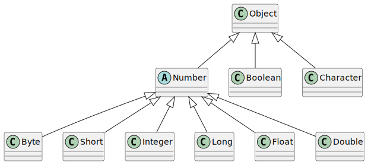

# TODO Primitivní datové typy

## Primitivní datové typy

Programovací jazyk Java obsahuje několik předdefinovaných, tzv. primitivních datových typů, které může programátor využít jako základní při tvorbě vlastních tříd. Tyto primitivní typy **nejsou třídami** - obsahují pouze svou hodnotu, nemají žádné vnitřní proměnné ani metody - proto se označují jako _primitivní_.

Jejich název je klíčovým slovem jazyka.

<table><thead><tr><th width="105">typ</th><th width="106">popis</th><th width="104">velikost</th><th width="149">min. hodnota</th><th width="144">max. hodnota</th></tr></thead><tbody><tr><td>byte</td><td>celé číslo</td><td>8 bitů</td><td>-128</td><td>+127</td></tr><tr><td>short</td><td>celé číslo</td><td>16 bitů</td><td>-32768</td><td>+32767</td></tr><tr><td>int</td><td>celé číslo</td><td>32 bitů</td><td>-2147483648</td><td>+2147483647</td></tr><tr><td>long</td><td>celé číslo</td><td>64 bitů</td><td>-9223372036854775808</td><td>+9223372036854775807</td></tr><tr><td>float</td><td>reálné číslo</td><td>32 bitů</td><td>-3.40282e+38</td><td>+3.40282e+38</td></tr><tr><td>double</td><td>reálné číslo</td><td>64 bitů</td><td>-1.79769e+308</td><td>+1.79769e+308</td></tr><tr><td>char</td><td>znak UNICODE</td><td>16 bitů</td><td>/u0000</td><td>/uFFFF</td></tr><tr><td>boolean</td><td>logická hodnota</td><td>1 bit</td><td>-</td><td>-</td></tr></tbody></table>

Z výpisu si lze povšimnout, že programovací jazyk Java, oproti jiným programovacím jazykům, nemá neznaménkové typy (typy, které nabývají pouze nezáporných hodnot).

### Celočíselné datové typy

Java nabízí základní celočíselné datové typy `byte`, `short`, `int` a `long`.

Ve zdrojovém kódu je zapsané celé číslo vždy chápáno jako datový typ `int`, při přiřazení konstanty do proměnné se ale automaticky převádí na odpovídající datový typ a kontroluje se jeho rozsah. Stejně tak všechny základní matematické operace se provádějí nad datovým typem `int`, není-li specifikováno jinak.

Speciálními prefixy nebo postfixy lze ale docílit odlišného chování, kdy můžeme explicitně říci, že číslo je `long`, případně jiné změny - že číslo je v jiné číselné soustavě. Možné varianty jsou:

* Postfix `l` (malé písmeno L) nebo `L` uvádí, že číslo je `long`.
* Prefix `0` (nula) znamená, že číslo je v osmičkové soustavě (lze použít pouze cifry `01234567`).
* Prefix `0x` znamená, že číslo je v šestnáctkové soustavě (lze použít cifry `0123456789ABCDEF` - na velikosti písmen nezáleží).
* Prefix `0b` znamená, že číslo je ve dvojkové soustavě (pouze cifry `01`).

```java
// následující nelze vytvořit, 250 je velká hodnota na byte
// byte tooBigForByte = 250;
byte b = 10;
short s = 10123;
int i = 10;
long l = 10;
long otherL = 10L;
int octa = 02751;
int hexa = 0x2FA23;
int binary = 0b01101011101;
```

Pozor při matematických operacích s celými čísly. Jak bylo řečeno, pokud jsou operandy (například sčítance při sčítání) typu `byte`, `short` nebo `int`, operandy se sečtou jako hodnoty `int`. Pokud je jeden ze sčítanců `long`, operandy se sečtou jako `long`. V obou případech ale **nedojde k chybě, pokud výsledná hodnota přeteče nebo podteče rozsah typu**. Hodnota pouze jakoby „přepadne" na druhou stranu (z minima na maximum nebo naopak) a ve výpočtu se pokračuje dále!

```java
int a = 1_500_000_000;
int b = 1_500_000_000;
System.out.println("Sum as int: " + (a + b));
System.out.println("Sum as long: " + ( (long) a + b));
System.out.println("Sum as int: " + (1_500_000_000 + 1_500_000_000));
System.out.println("Sum as long: " + (1_500_000_000 + 1_500_000_000L));
```

Výše uvedený kód realizuje postupně sčítání jako:

* Proměnná `int` + proměnná `int` = výsledek `int`
* Proměnná `int` přetypovaná na `long` + proměnný `int` = výsledek `long`
* Konstanta `int` + konstanta `int` = výsledek `int`
* Konstanta `int` + konstanta **`long`** = výsledek `long`

Výstupem tedy bude:

```
run:
Sum as int: -1294967296
Sum as long: 3000000000
Sum as int: -1294967296
Sum as long: 3000000000
BUILD SUCCESSFUL (total time: 1 second)
```

Výsledek výpočtu se nevejde do rozsahu typu `int`, díky tomu **operace nad `int` přetečou přes rozsah typu a program pokračuje dále bez chyby a vrátí špatný výsledek.**


Zápis velkých čísel s oddělovači tisíců pomocí podtržítka je vlastností jazyka Java 7 a v dřívějších verzích nebude fungovat.


### Reálné datové typy

Pro reprezentaci čísel s desetinnou částí slouží datové typy `float` a `double`. Stejně jako v předchozích případech, pro deklaraci hodnoty lze použít postfixy:

* Postfix `d` nebo `D` reprezentuje `double`.
* Postfix `f` nebo `F` reprezentuje `float`.
* Postfix `e` nebo `E` pro specifikaci desítkového exponentu (znak `p` / `P` pro čísla v šestnáctkové soustavě).

Tyto postfixy fungují i na celočíselné konstantní hodnoty, takže například `1000` je `int`, ale `1000d` je `double`. Lze používat i přidání nulové desetinné části, například `1000.0` je také `double`.

Exponent `E` lze využít pro zadání velkých čísel, například `1E5 = 10000`, obdobně `1E-5 = 0.00001`.

Operace nad reálnými typy ještě mohou nabývat speciálních hodnot `positive_infinity`, `negative_infinity` a `NaN` (not a number). Tyto možnosti budou vysvětleny později.

### Logický typ

Java definuje jeden logický typ `boolean`, který může nabývat hodnot `true` a `false`.

### Znakový typ

Java definuje typ `char` jako dvoubajtový typ pro reprezentaci znaku ve formátu unicode. Díky tomu může znaková hodnota obsahovat i množství znaků z různých abeced (plně včetně češtiny. Hodnota znakové konstanty se uzavírá do apostrofů ('a'), případně ji lze zadat v šestnáctkovém tvaru - například \u0014.

**Pozor na záměnu "a" a 'a' - uvozovky definují řetězec, tedy datový typ `String`, kdežto pro `char` je nutno použít pouze jednoduchých uvozovek - apostrofů.**

## Wrapovací typy

Primitivní typy, jak bylo zmíněno, nejsou o sobě třídami. Stojí mimo hierarchii tříd a v mnohých případech mají odlišné chování, zejména:

* Předávají se hodnotou - při přiřazení mezi dvěma proměnnými se pro druhou proměnnou vytvoří v paměti nové místo se stejnou hodnotou a přiřadí se toto nově vytvořené místo;
* Neinicializují se pomocí konstruktorů - nepíše se `x = new int(5)` nebo něco podobného, ale pouze `x = 5`;
* Nemají žádné členy - nemají žádné metody ani instanční proměnné.

V jazyce Java je však někdy vhodné a někdy dokonce nutné používat doménu realizovanou pomocí těchto primitivních typů (tj. čísla, znaky, nebo příznaky true/false) jako objekty - instance tříd. Proto pro každý primitivní datový typ existuje obdobný typ, který je ale realizován jako třída a zabaluje - _wrapuje_ - tak původní primitivní typ.



Tyto typy oproti primitivním typům přinášejí několik výhod, přičemž ty aktuálně důležité pro nás jsou:

* Hodnotu původně primitivního typu lze předat do funkce, která přijímá argument typu `Object`.
* Tyto wrapovací typy - jako každé jiné třídy - mohou mít vlastní členy tříd. Typicky mají typy definované konstanty pro minimální a maximální hodnotu a sadu metod pro práci s typem (různé konverze, operace apod.)

Výše uvedený obrázek (Obrázek 14 - Wrapovací typy k primitivním typům) neobsahuje úplný výčet použitelných wrapovacích typů. Všimněte si také, že třídy `Boolean` a `Character` nejsou potomky předka všech číselných wrapovacích typů, třídy `Number`.

S wrapovacími typy se pracuje v základu stejně jako s primitivními typy. Překladač jazyka Java (od verze 1.5) automaticky převádí wrapovací typy na primitivní typy a zpět podle potřeby.

```java
int i = 5;
Integer w = 5;
Integer otherW = new Integer (5); // dlouhá alternativa, neužívá se
i = w;
w = i;
```

Základní operace, které wrapovací typy přinášejí, umožňují například zajistit, zda je vkládaná hodnota v daném rozsahu, vše pomocí konstant daného typu. Specifickými hodnotami jsou hodnoty záporného nekonečna, kladného nekonečna a hodnota `NaN` - not a number. Tyto hodnoty lze získat u operací s reálným číslem.

```java
int intMinimum = Integer.MIN_VALUE;
int intMaximum = Integer.MAX_VALUE;
double doubleMinimum = Double.MIN_VALUE;
double doubleMaximum = Double.MAX_VALUE;
double negativeInfinity = Double.NEGATIVE_INFINITY;
double positiveInfinity = Double.POSITIVE_INFINITY;
double nan = Double.NaN;
```


Kladné nekonečno je například výsledkem operace `1.0 / 0.0`, hodnota `NaN` je výsledkem operace `0.0 / 0.0`. Všimněte si, že dělení hodnotou nula u reálných typů nevyhazuje výjimku, kdežto u celých čísel ano.


## Převod řetězce na číslo

Wrapovací typy mají nejen určité konstanty, definované v předchozí kapitole, ale také metody. Základní metody, které typicky používá každý programátor, je převod řetězce (typicky zadaného od uživatele) na číslo. Nelze provést jednoduché přetypování (například `int x = (int) „ahoj";`), protože jak lze vidět, řetězec „ahoj" nelze převést na celé číslo.

Proto pro převod (tzv. parsování) řetězce je třeba využít metody, které jsou deklarovány jako statické právě u wrapovacích typů. Metoda se vždy nazývá `parseXXX`, kde XXX je název cílového typu. Přehledněji to ukazuje následující příklad.

```java
String input = "242";
double d = Double.parseDouble(input);
int i = Integer.parseInt(input);
```

Chceme-li převádět zpět číselnou hodnotu na řetězec, odlišujeme následující případy:

* i) Hodnota je primitivní typ
  * a) Hodnota se přiřazuje osamoceně
  * b) Hodnota je v rámci skládání s jiným řetězcem
* ii) Hodnota je referenční typ
  * a) Hodnota se přiřazuje osamoceně
  * b) Hodnota je v rámci skládání s jiným řetězcem

Ad jednotlivé varianty:

* i.-a. - při osamoceném přiřazení hodnoty musíme primitivní typ převést na řetězec. Využijeme statickou metodu odpovídajícího wrapovacího typu `toString()`, které jako argument předáme převáděnou hodnotu.
* i.-b. - při skládání s jiným řetězcem není třeba již provádět explicitní volání metody `toString()`; při jejím volání se však program bude chovat stejně (lze tedy použít obě varianty).
* ii.-a. - při osamoceném přiřazení instance wrapovacího typu využijeme přímo jeho **instanční** metodu `toString()`, která již nepřijímá žádné parametry.
* ii.-b. - stejné jako u i.-a.

Varianty ukazuje následující příklad.

```java
double primitiveDouble = 1241.51;
Double wrappedDouble = 1241.51;
String s;

// primitivní datový typ
s = Double.toString(primitiveDouble);
s = "Hodnota je " + primitiveDouble;

// wrapovací typ
s = wrappedDouble.toString();
s = "Hodnota je " + wrappedDouble;

// Metoda println() má přetížení na primitivní typy
// Není třeba nic přidávat
System.out.println(primitiveDouble);
System.out.println(wrappedDouble);
```
