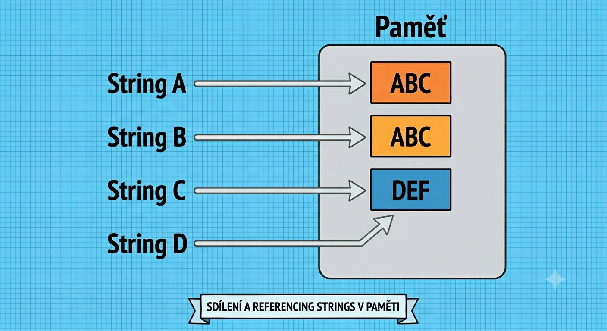

# String, StringBuilder

## Datový typ String

Základním datovým typem realizujícím práci s řetězcem je typ `String`. Jedná se o třídu, její název tedy začíná velkým písmenem a řetězec `String` není klíčovým slovem.

Vytvoření proměnné obsahující řetězec je velmi jednoduché. Řetězce se v jazyce Java uzavírají do klasických (anglických) uvozovek.!**!**

```java
String a = "první";
String b = "b"; // uvozovky značí řetězec
char c = 'b'; // apostrofy značí znak, nikoliv řetězec
```

Základní a velmi důležitou vlastností instance typu `String` je, že `String` **je neměnný!** To znamená, že vytvořenou instanci v paměti již nemůžete změnit a pokud například potřebujete v řetězci nahradit určitý znak jiným, nebo řetězec rozšířit/zkrátit, musíte vytvořit novou instanci v paměti požadovaného tvaru - existující instance se již nedá změnit.

Před představením operací s řetězcem je třeba ještě odlišit dva důležité stavy:

* Řetězec může nabývat hodnotu `null` - tehdy v proměnné není uložena žádná hodnota, proměnná nikam neukazuje a **nad takovou proměnnou nelze volat žádné metody** (volání metod způsobí chybu). Nastavením takové hodnoty může být volání „String a = null;".
* Řetězec může nabývat hodnotu prázdného řetězce - tehdy je v proměnné uložena instance třídy `String`, jenom je prázdná - neobsahuje žádný text, její délka je rovna nule. Nad takovou proměnnou lze volat metody. Nastavením takové hodnoty může být volání „String a = "";".

### Práce s typem String

Spojení dvou řetězců provedeme pomocí operátoru „+".

Třída `String` dále obsahuje velké množství metod, které umožňují základní operace s řetězci. Nejběžnější funkce, které lze využít, ukazuje následující tabulka. Některé funkce pracují s indexy - `String` je chápán jako pole znaků (pozor ale, že nelze jej přímo přetypovat na pole znaků) a indexování se používá stejně, jako u polí - tedy první index má hodnotu 0, poslední index má hodnotu o jedna menší, než je délka řetězce.

| Signatura funkce                                | Popis                                                                                                                                             |
| ----------------------------------------------- | ------------------------------------------------------------------------------------------------------------------------------------------------- |
| int length()                                    | Vrací délku řetězece.                                                                                                                             |
| boolean isEmpty()                               | Vrací TRUE, pokud je řetězec prázdný (obsahuje hodnotu ""). Pozor - nelze volat u proměnných, které obsahují hodnotu null.                        |
| String trim()                                   | Ořeže řetězec z obou stran o „bílé" znaky - mezery, tabulátory apod.                                                                              |
| char charAt(int index)                          | Vrací znak na zadaném indexu.                                                                                                                     |
| boolean startsWith(String prefix)               | Vrací true, pokud řetězec začíná na zadaný podřetězec.                                                                                            |
| boolean endsWith(String sufix)                  | Vrací true, pokud řetězec končí na zadaný podřetězec.                                                                                             |
| int indexOf(char znak)                          | Vrací index, na kterém je nalezen daný znak. Vyhledávání postupuje zleva doprava. Obsahuje přetížení, mj. i pro vyhledání podřetězce v řetězci.   |
| Int lastIndexOf(char znak)                      | Vrací index, na kterém je nalezen daný znak. Vyhledávání postupuje zprava doleva. Obsahuje přetížení, mj. i pro vyhledávání podřetězce v řetězci. |
| String substring( int beginIndex, int endIndex) | Vrací podřetězec z řetězce mezi zadanými indexy.                                                                                                  |
| String \[] split(String regex)                  | Rozdělí řetězec podle zadaného výrazu a vrací pole rozdělených řetězců.                                                                           |
| String replace( char oldChar, char newChar)     | Nahradí znak původního řetězce novým znakem.                                                                                                      |

Povšimněte si, že u všech funkcí, které pracují se instancí řetězce, se vždy výsledek vrací jako nová hodnota funkce. Volání funkce proto nikdy nemění původní instanci (viz **string je neměnný** výše), ale vždy vytvoří novou, upravenou instanci. Proto nikdy nelze zavolat například:

```java
a.replace('a', 'b');
```

protože výsledná hodnota se v původní proměnné **nezmění**. Následující kód ukazuje příklady volání funkcí na proměnnou typu `String`.

```java
String a = "Seven";
boolean jeNull = a == null; // pozor, test na null provádíme takto
boolean jePrazdny = a.isEmpty(); // prázdný řetězec nemusí být null!
// výpis po znacích
int delka = a.length();
for (int i = 0; i < delka; i++){
char c = a.charAt(i);
System.out.println(c);
}
boolean zacinaNaS = a.startsWith("S");
boolean konciNaN = a.endsWith("n");
// ořez o krajní písmena
String orezaneA = a.substring(1, delka-1);
System.out.println("Ořezané: " + orezaneA);
// nahrazení písmen 'v'
// výsledek musím vložit do proměnné, byť stejné
// jako je ta, nad kterou se funkce volá !
a = a.replace('v', '7');
System.out.println("Nahrazené: " + a);
// výpis věty po slovech
String veta = "Toto je věta.";
String \[] slova = veta.split(" ");
for(String s : slova)
System.out.println(s);
```

Výše uvedený kód dá následující výstup:

```
S
e
v
e
n
Ořezané: eve
Nahrazené: Se7en
Toto
je
věta.
```

Povšimněte si volání řádku s funkcí `replace()`. Opravdu, i když chceme změnit přímo hodnotu v proměnné `a`, musíme si novou, upravenou hodnotu vrátit zpět do této proměnné. Pokud bychom přiřazení neprovedli (chybělo by v příkazu „a = "), operace by se sice provedla, ale výsledek by se nikam nevrátil a hodnota v proměnné `a` by zůstala nezměněna.

Je vhodné si také uvědomit, že samotný řetězec je chápán jako instance třídy `String`, proto i přímo nad řetězcem můžeme volat metody, například:

```java
int delkaVety = "Toto je poměrně dlouhá věta".length();
```

K funkcím třídy `String` ještě jedna velmi důležitá poznámka. Je třeba se věnovat pojmenovávání parametrů funkcí třídy `String` - některé funkce využívají parametry pojmenované jako `regex` (například funkce `split()`). Tyto funkce využívají jako parametry tzv. regulární výrazy - což je (zjednodušeně řečeno) pseudojazyk určeny pro definici obecného vzhledu řetězce. V této kapitole regulární výrazy vysvětleny nebudou, je však mít na paměti minimum - že určité znaky v regulárních výrazech mají speciální význam a nebudou běžně fungovat. Následuje velmi krátký příklad.

```java
String data =
"Ano. Takto jsem to řekl. Řekl jsem to jasně. Tak už to víte.";
// korektně rozdělí sadu vět na slova
// parametr " " reprezentuje správně mezeru
String \[] slova = data.split(" ");
// má rozdělit sadu vět na věty
\*\*// nebude ale fungovat
\*\*// znak tečky "." má v regulárních výrazech zvláštní význam
String \[]vety = data.split(".");
```

Bližší informace o regulárních výrazech lze najít například na [www.regularnivyrazy.info](http://www.regularnivyrazy.info).

### Porovnávání řetězců

Důležitou operací je porovnávání řetězců. **Řetězce v Javě nikdy nelze porovnávat pomocí operátoru ==.** V Javě operátor „==" slouží pro porovnání referencí mezi objekty, zjišťuje tedy, zda dvě proměnné ukazují do paměti na stejné místo. U řetězců tento případ však velmi jednoduše nastat nemusí - pokud máme dvě proměnné, mohou ukazovat do paměti na různá místa, ale tyto místa mohou obsahovat stejný řetězec.



Pokud chceme jednoduše porovnat hodnoty proměnných na shodnost řetězců, využijeme funkci `equals()`, která vrací příznak true/false, zda jsou hodnoty v obou řetězcích shodné. Můžeme využít také funkce `equalsIgnoreCase()`, která porovná řetězce bez ohledu na malá/velká písmena.

### Skládání řetězců vs. paměť

Již byla zmíněna problematika neměnnosti řetězců. Její negativní dopad se velmi projeví při hromadném skládání řetězců. Kolik instancí proměnné `String` vytvoří následující příklad na řádku, kde se vytváří hodnota pro proměnnou `dohromady`?

```java
String a = "Toto";
String b = "je";
String c = "sestavená";
String d = "věta";
String dohromady =
a + " " + b + " " + c + " " + d + ".";
System.out.println(dohromady);
```

Celkem se vytvoří následující instance: „Toto „, „Toto je", „Toto je „, „Toto je sestavená", „Toto je sestavená „, „Toto je sestavená věta" a nakonec „Toto je sestavená věta." - a pouze tato poslední instance se předá do proměnné `dohromady`, ostatní proměnné (celkem 6) se předají garbage collectoru téměř ihned po vytvoření. Toto má samozřejmě značný negativní výkonnostní dopad.

## Datový typ StringBuilder

Právě kvůli výše uvedené problematice existuje typ StringBuilder. Třída je, stejně jako `String`, v balíčku `java.lang`.

Oproti `String`u nenabízí takový komfort jako instance klasického řetězce (například je nelze řetězit pomocí operátoru „+"), ale hlavně **umožňuje změnu již vytvořené hodnoty** řetězce, což klasický `String`, jak již bylo několikráte zdůrazněno, neumí.

Vytvoření nové prázdné instance, stejně jako převedení existujícího řetězce do proměnné `StringBuilder` a převedení zpět, z instance `StringBuilder` na řetězec, je, s využitím konstruktoru a metody `toString()` velmi jednoduché.

```java
StringBuilder a = new StringBuilder();
// převod řetězce na StringBuilder
StringBuilder b = new StringBuilder("první");
// převod StringBuilderu na řetězec
String s = b.toString();
```

Je třeba si však vždy uvědomit, že `StringBuilder` a `String` jsou vzájemně nekompatibilní typy, takže je nelze například řetězit dohromady pomocí operátoru „+".


V prostředí jazyka Java ještě existuje velmi podobná třída, nazvaná `StringBuffer`. Tato třída nabízí stejné metody jako `StringBuilder`, oproti němu je však bezpečná při použití vícevláknových operací, v důsledku je však o trochu pomalejší. My se problematice vícevláknových operací věnovat nebudeme, proto tato třída nebude dále vysvětlena.


### Operace typu StringBuilder

Třída `StringBuilder` také nabízí množství metod, většinu z nich orientovaných na editaci svého obsahu. Některé funkce mají stejné názvy, signatury i chování jako u typu `String`, například `charAt(), indexOf(), lastIndexOf()`. Následující tabulka ukazuje další funkce.

| Signatura funkce                                    | Popis                                                                                                                                                                                             |
| --------------------------------------------------- | ------------------------------------------------------------------------------------------------------------------------------------------------------------------------------------------------- |
| StringBuilder appends(String s)                     | Přidá k existujícímu řetězci na konec další řetězec zadaný jako parametr. Tato funkce má množství přetížení i pro různé další typy. Přidávaná hodnota se zařadí vždy na konec řetězce v proměnné. |
| StringBuilder insert(int offset, String s)          | Vloží na zadaný index _offset_ hodnotu parametru _s_. Tato funkce slouží pro vložení řetězce jinam, než na konec řetězce.                                                                         |
| StringBuilder delete(int start, int end)            | Smaže znaky od indexu _start_ do indexu _end_ (v rozsahu _start - (end-1)_.                                                                                                                       |
| StringBuilder reverse()                             | Otočí pořadí znaků v řetězci.                                                                                                                                                                     |
| StringBuilder replace(int start, int end, String s) | Vyjme řetězec mezi indexy _start_ (včetně) a _end_ (nevčetně) a vloží místo vyjmutého obsahu zadaný řetězec _s_.                                                                                  |

Pozor na funkci `replace()` - má stejný název, jako funkce u typu `String`, ale provádí zcela odlišnou operaci!

Všimněte si také, že všechny funkce vrací instanci `StringBuilder` - zde je to bohužel trochu matoucí. Všechny vrácené hodnoty jsou **instance stejné proměnné, která funkci vyvolala**. Hodnota se mění tedy přímo v proměnné, nad kterou se hodnota volá, a hodnot vrácených z těchto funkcí **si vůbec nemusíme všímat**.

Nejčastější metodou je metoda `append()`, která slouží pro sestavení řetězce. Výše uvedený problémový případ použití řetězce `String` lze přepsat pomocí třídy `StringBuilder`.

```java
String a = "Toto";
String b = "je";
String c = "sestavená";
String d = "věta";
StringBuilder sb = new StringBuilder();
sb.append(a);
sb.append(" ");
sb.append(b);
sb.append(" ");
sb.append(c);
sb.append(" ");
sb.append(d);
sb.append(".");
String dohromady = sb.toString();
System.out.println(dohromady);
```

Přestože je zdrojový kód delší, toto volání bude mnohem rychlejší než volání nad typem `String`, protože se vytvoří pouze jedna instance (typu `StringBuilder`), v ní se odehrají všechny operace skládání a výsledný řetězec se vrátí jako `String`.
