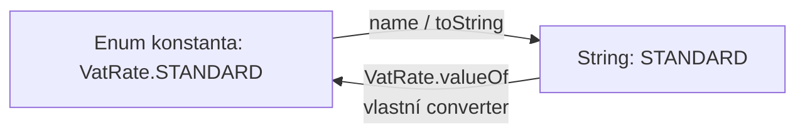

# Výčtové typy

Výčtové typy (neboli Enumy, z angl. _enumeration_) jsou v Javě mnohem mocnějším nástrojem než v mnoha jiných programovacích jazycích (např. C++ nebo C#). Zatímco v jiných jazycích jde v podstatě jen o „pohlednější pojmenování pro celá čísla“, v Javě je `enum` plnohodnotnou třídou.

Každá konstanta výčtového typu představuje unikátní, statickou a neměnnou (`public static final`) instanci této třídy.

## Základní výčtový typ

V nejjednodušší podobě slouží `enum` k definici pevně dané množiny konstant. Používá se všude tam, kde proměnná může nabývat pouze několika předem známých hodnot (např. dny v týdnu, stav objednávky, barvy semaforu).

```java
public enum OrderStatus {
    CREATED,
    PROCESSING,
    SHIPPED,
    DELIVERED,
    CANCELLED
}
```

Enumy přinášejí typovou bezpečnost – do proměnné nelze přiřadit libovolný text nebo číslo, ale pouze definovanou hodnotu. Hodnota se navíc přiřazuje přes název výčtového typu:

```
OrderStatus orderStatusOne = OrderStatus.CREATED;
OrderStatus orderStatusTwo = "CREATED"; // <-- nelze
```

Při vyčítání lze použít varianty `if/else` či `switch`.&#x20;

```java
if (orderStatus == OrderStatus.CREATED) ...
```

Zvláště elegantní je jejich použití v nové konstrukci `switch`:

```java
OrderStatus status = OrderStatus.PROCESSING;

switch (status) {
    case CREATED -> System.out.println("Objednávka byla vytvořena.");
    case PROCESSING -> System.out.println("Na objednávce se pracuje.");
    case SHIPPED -> System.out.println("Zásilka je na cestě.");
    case DELIVERED, CANCELLED -> System.out.println("Vyřízeno nebo zrušeno.");
}
```

## Pokročilé možnosti: Vnitřní členy (Atributy, Konstruktory, Metody)

Protože je `enum` v Javě speciálním typem třídy, může obsahovat:

* Atributy (fieldy): Doporučuje se je dělat `private final`, aby byla zachována neměnnost (immutability).
* Konstruktory: Jsou vždy privátní (`private`) nebo balíčkově soukromé. Nelze zavolat `new OrderStatus()` zvenčí – instance vznikají výhradně při načtení třídy.
* Metody: Běžné i statické metody pro práci s daty dané konstanty.

**Příklad: Enum s atributy a metodou**

Mějme výčtový typ pro účetní sazby DPH, kde každá hodnota nese svou procentuální výši a český popis:

```java
public enum VatRate {
    // Definice konstant s voláním privátního konstruktoru
    STANDARD(21, "Základní sazba"),
    REDUCED(12, "Snížená sazba"),
    ZERO(0, "Osvobozeno od DPH");

    // Vnitřní členy (atributy)
    private final int percentage;
    private final String description;

    // Privátní konstruktor (slovo private lze vynechat, je implicitní)
    VatRate(int percentage, String description) {
        this.percentage = percentage;
        this.description = description;
    }

    // Gettery
    public int getPercentage() {
        return percentage;
    }

    public String getDescription() {
        return description;
    }

    // Vlastní pomocná metoda
    public double calculatePriceWithVat(double basePrice) {
        return basePrice * (1 + this.percentage / 100.0);
    }
}
```

Následně lze instanci výčtového typu používat jako běžnou třídu.

```java
VatRate rate = VatRate.STANDARD;

System.out.println(rate.getDescription()); // Vytiskne: Základní sazba
System.out.println(rate.getPercentage());  // Vytiskne: 21

double base = 1000.0;
double withVat = rate.calculatePriceWithVat(base);
System.out.println("Cena s DPH: " + withVat); // Vytiskne: 1210.0
```

## Převod Enumu na String a zpátky

Převod mezi objektovou reprezentací v Javě a řetězcem (`String`) je klíčový při práci s databázemi, rozhraními API (JSON/XML) nebo uživatelským vstupem.



### Převod Enumu na String

Pro převod konstanty na text máme v Javě dvě základní možnosti:

1. `name()`: Vrátí přesný název konstanty tak, jak je zapsán v kódu (např. `"STANDARD"`). Metoda je `final` a nelze ji přepsat. Pro účely ukládání do databáze nebo serializace je to nejstabilěnšjí volba.
2. `toString()`: Ve výchozím stavu dělá totéž co `name()`. Můžeme ji však přepsat (`@Override`), pokud chceme, aby enum v textové podobě vracel např. uživatelsky přívětivý název.

```java
@Override
public String toString() {
    return this.description + " (" + this.percentage + " %)";
}

// Použití:
VatRate rate = VatRate.REDUCED;
System.out.println(rate.name());     // Vytiskne: REDUCED
System.out.println(rate.toString()); // Vytiskne: Snížená sazba (12 %)
```


Pozor však, že většinou se stejně dostaneme do stavu, kdy potřebujeme "uživatelsky přívětivý název" překládat do jazyka uživatele (AJ/CZ/DE/...) a tyto hodnoty není vhodné dávat jako tvrdé konstanty v kódu.


### Převod Stringu na Enum

Pro opačný proces (získání objektu na základě textového řetězce) nabízí Java dvě hlavní cesty:

**1. Vestavěná metoda `valueOf(Class, String)` nebo `Enum.valueOf()`**

Každý enum má kompilátorem automaticky vygenerovanou statickou metodu `valueOf(String name)`.

```java
// Převod přesně odpovídajícího řetězce na konstantu
VatRate rate = VatRate.valueOf("STANDARD"); 
System.out.println(rate == VatRate.STANDARD); // true
```


Pozor na chybové stavy:

* Pokud předáte text, který v enumu neexistuje (např. `VatRate.valueOf("EXEMPT")`), Java vyhodí výjimku `IllegalArgumentException`.
* Pokud předáte `null`, vyhodí se `NullPointerException`.


**2. Vlastní bezpečná vyhledávací metoda (Factory Method)**

V praxi (např. při zpracování REST API nebo formulářů) často potřebujeme převod, který:

* Není citlivý na velká/malá písmena (case-insensitive).
* Vrací např. `Optional` nebo výchozí hodnotu místo vyhození výjimky.
* Umí vyhledávat podle vnitřního atributu (např. podle procentní výměry).

K tomu využijeme vestavěnou metodu `values()`, která vrací pole všech konstant daného enumu.

```java
public enum VatRate {
    STANDARD(21, "Základní sazba"),
    REDUCED(12, "Snížená sazba"),
    ZERO(0, "Osvobozeno od DPH");

    private final int percentage;
    private final String description;

    VatRate(int percentage, String description) {
        this.percentage = percentage;
        this.description = description;
    }

    // Bezpečný převod z textu podle názvu (ignoruje velká/malá písmena)
    public static Optional<VatRate> fromString(String text) {
        if (text == null || text.isBlank()) {
            return Optional.empty();
        }

        for (VatRate rate : VatRate.values()) {
            if (rate.name().equalsIgnoreCase(text.trim())) {
                return Optional.of(rate);
            }
        }
        return Optional.empty();
    }

    // Vyhledání podle vnitřního atributu (procenta)
    public static VatRate fromPercentage(int percentage) {
        for (VatRate rate : VatRate.values()) {
            if (rate.percentage == percentage) {
                return rate;
            }
        }
        throw new IllegalArgumentException("Neznámá sazba DPH pro procento: " + percentage);
    }
}
```

Použití v praxi:

```java
// Bezpečné načtení z uživatelského vstupu
Optional<VatRate> rateOpt = VatRate.fromString("reduced");

rateOpt.ifPresentOrElse(
    rate -> System.out.println("Nalezena sazba: " + rate.getDescription()),
    () -> System.out.println("Sazba nenalezena!")
);

// Načtení podle procenta
VatRate rateByValue = VatRate.fromPercentage(21); // Vrací VatRate.STANDARD
```

## Shrnutí užitečných pravidel

1.  Identita a porovnávání: Konstanty enumů jsou singletony. Můžete (a doporučuje se) je porovnávat pomocí operátoru `==` místo `.equals()`. Je to bezpečné vůči `NullPointerException`.

    Java

    ```
    if (status == OrderStatus.SHIPPED) { ... }
    ```
2. Ukládání do DB / DTO: Pro převod na String pro databáze preferujte `name()` před `toString()`, protože `toString()` se často mění kvůli přívětivějšímu zobrazení v UI.
3. Konstruktory jsou privátní: Nikdy nezkoušejte vytvářet instance pomocí `new MyEnum()`.
4. Rozhraní: Enum nemůže dědit z jiné třídy (protože implicitně dědí z `java.lang.Enum`), ale může implementovat rozhraní (interfaces).
